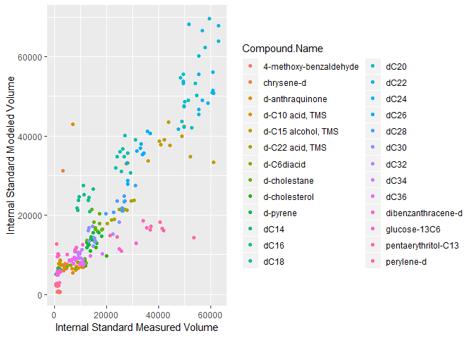

Characterizing Amazonian Organic Aerosols through Mass Spectral Library Analysis
================
Emily Barnes
March 21, 2019

*Project Desctiption*:
----------------------

During the 'Wet Season' of early 2014 and the 'Dry Season' of mid 2015, a team of researchers from the Goldstein Lab traveled to a semi-remote site in the center of the Amazon Rainforest to participate in the GoAmazon Field Campaign. Throughout both of these visits, researchers collected fine particulate in the air on quartz fiber filters, which were subsequently frozen and transported back to UC Berkeley. In late 2018, I processed the majority of these filters on a *TD-GCxGC-EI-HRToF-MS*. This instrument thermally desorbs organic components of the trapped aerosols (ranging in mass from C12-C36 n-alkane equivalents), separates them in two dimensions by both volatility and polarity, and generates a mass spectra for each separated species using an EI-HR-ToF mass spec. While a few of the separated compounds may be difinitively identified by matching their mass spectra to those of known standards processed on similar instruments, the vast majority have no authentic standards. My challenge is to glean as much information as possible about the compounds that cannot be definitively identified, including VOC source group, chemical functional group, and sensitivity to anthropogenic influence. My ultimate goal is to better understand the differences between wet season and dry season amazon, and to contribute to answering the question of why dry season aerosol loadings are so much higher that wet season loadings.

*Data Description*:
-------------------

The output of the *TD-GCxGC-EI-HRToF-MS* is an .h5 file which contains the location (based on retention times in the two columns), response (known as 'blob volume'), and mass spectrum of each compound within the instrument's detection limitations. Using a software called 'GC Image', I search all of these spectra against three libraries of mass spectra that I have generated from previous images. These three libraries are 1) a library of the 27 internal standard compounds that I injected on each filter, 2) a library of all of the contamination compounds identified by running field blanks using the full preparation protocol, and 3) a library of 1,799 amazonian aerosol compounds identified in 12 samples representing key periods of differing climatic conditions throughout the campaign. My ultimate goal is to generate robust time series of each of these compounds which will allow me to identify each one's sources and sensitivity to differing oxidative conditions. The output of the GC-Image analysis is a CSV file containing the following key pieces of information:

-   Compound Name (as assigned by library match)
-   Compound Library (name of library from which identity was determined)
-   Compound Linear Retention Index
    -   position of the compound in the first dimension (volatility) relative to an alkane standard series
-   Linear Retention Index of Library Entry
    -   position of the **library** compound that was identified as a match to the current compound. This is critical, as compounds are often misidentified based on solely mass spectrum, and ensuring that Library LRI and Compound LRI are close vastly improves the odds of making a correct match
-   Library Match Factor
    -   A measure of how closely the mass spectrum of the image compound matches that of the compound saved in the library
-   Volume
    -   A measure of response

I ran approximately 200 filters and will ultimately generate 200 CSV's, each containing ~1000-2500 compounds. My data source for this project is a selected subset of these CSV's specifically nine filters corresponding to 5 consecutive days of measurement during the wet season, along with a CSV tying each data file to the time the filter was collected and how many segments of filter were run.

*Analysis tasks*
----------------

My four analysis objectives are as follows:

1.  Develop a set of functions to import and tidy the data tables exported from GC Image, associating metadata regarding the time and conditions of each sample with the measurements of each individual analyte

2.  Separate the compounds into categories of field blank, internal standard, analyte matched by library, and other (assumed to be analyte not matched by library)
    -   GC Image library matching software assigns each compound in a sample to the most similar compound in any of the applied libraries. This means that even in cases where the match is extremely poor, a match will be assigned. Additionally, one library compound may be matched to multiple sample compounds, which is physically impossible given the design of the instrument: while many compounds are similar (and could therefore 'match' a single library entry), a maximum of one true match exists in each sample. In order to create accurate timelines of my sample analytes, I must separate the analyte compounds from the contamination and the internal standard, and restrict the "true match" category to good matches that are the best matches observed.
    -   GC Image generates a variety of metrics describing how well the library mass spectrum matches the sample mass spectrum. The most relevant for my purposes are the **Library Match Factor** and the **Reverse Match Factor**, scores out of 1000. A compound with a **Library Match Factor** of &gt;750 or a **Reverse Match Factor** of &gt;800 is considered a very good match, as long as it falls within 10 of the **Linear Retention Index** of the library entry.
3.  Assess the performance of the analyte library

    -   Given the chemical complexity and diversity of the samples I am studying, it is impossible that a library of unique compounds compiled from fewer than the entire number of samples collected will contain all of the analytes detected throughout both campaigns
    -   There exists a tradeoff between a smaller, definitively unique library and a larger library more able to trace a large fraction of the measured compounds but potentially containing duplicate entries of compounds (as slight changes in instrument or collection conditions may cause the mass spectrum of a compound to appear slightly different)
    -   My goal is to explain ~90% of the mass in each sample while maintaining as high a degree of certainty as possible that my library contains no duplicate entries
    -   I plan to investigate how well my 12-sample library has accomplished these tasks to determine if the library needs to be analysed for possible replicates or whether more samples must be added

4.  Determine which internal standard species are most reliable and best suited for normalization of analyte response; develop methods for normalizing by the internal standard

    -   The internal standard is a mixture of compounds spanning a representative spectrum of volatilities and polarities added to each filter such that the same amount of each compound is present in each instrument run. The purpose of the internal standard is to correct the percieved blob volume for something closer to mass of a particular analyte run, as the instrument is more sensitive to some areas of the 2D GC space than others, instrument condition changes over the course of an intensive run campaign, and high filter loading leads to better recovery of all species (a phenomenon known as *matrix effects*).

    -   However, some of the internal standard species are frequently misidentified, frequently coellute with analyte blobs, or are for other reasons poor options for normalization. I plan to assess which internal standards are appropriate choices for use in correcting analyte blob volumes by visualizing how each varies throughout the campaign (as the same quantity of internal standard was utilized in each sample, significant outliers or an abnormally large spread likely indicates misidentification)

    -   As I am actively utilizing this project in support of my research, I will leave a few unfinished portions that I hope to develop in the future (particularly with respect to developing methods for normalizing by the internal standard)

*Skills*:
---------

-   5+ dplyr verbs
-   Writing and using custom R functions
-   Expansion of ggplot uses

``` r
library(dplyr)
library(tidyverse)

library(scales)

library(akima)
#library(asbio)
#library(tmap)         # raster + vector layers
#library(raster)       # Main raster library
#library(tidyverse)    # our old friend
#library(sf)           # to work with simple features data
#library(mapview)
library(openxlsx)
```

### **Analysis Task 1: Importing and Tidying GC-Image Data**

In this section, I write a series of functions to import my files based on a table of contents that lists each file name along with descriptive data regarding each sample, such as the time at which it was collected, the quantity of filter material used, and the type of sample (field blank, calibration curve, or sample). I associate the information in the index table with each measurement of each analyte in every sample and vertically concatenate to create a long dataframe such that each row is a single observation of a single analyte.

``` r
#reading in the index of the blob tables
bt_sum <- read_csv("data_timeline_test/Blob_table_summary_timeline_test.csv")
```

    ## Parsed with column specification:
    ## cols(
    ##   File_num = col_character(),
    ##   Category = col_character(),
    ##   Filter_num = col_double(),
    ##   Filter_punches = col_double(),
    ##   IOP = col_double(),
    ##   AMZ_date = col_character(),
    ##   T_O_D = col_character(),
    ##   Date_num = col_double(),
    ##   Internal_load = col_double(),
    ##   External_load = col_double()
    ## )

``` r
#adding a date column that R will recognize
bt_sum <- bt_sum %>% mutate(r_date = convertToDateTime(Date_num))

# making a function that will make the correct file names from the table of samples so that my actual sample files can be read in
make_file_name <- function(date_string) {
  file_start <- "data_timeline_test/timeline_testingtables/"
  file_end <- ".h5_tt_Blob_Table_full.csv"
  full_name <- paste(file_start,date_string,file_end, sep = "")
  return(full_name)
  
}

# function to read in files 
read_bt_files <- function(fi_name_short) {
  
  fi_name <- make_file_name(fi_name_short)
  temp_bt <<- read_csv(file = fi_name)
  temp_bt <- temp_bt %>% mutate(File_num = fi_name_short)
  temp_bt <<- temp_bt
  return(temp_bt)
}

#reading in all of the blob tables and turning them into one big blob table- creating a long table
make_massive_table <- function(summary_table){
 
  M <- read_bt_files(as.character(summary_table$File_num[1]))

  for(i in 2:length(summary_table$File_num)){
    t <- read_bt_files(as.character(summary_table$File_num[i]))
    Mnew <- rbind(M, t)
    M <- Mnew
    print(i)
  }
  M_t <<- M
}

make_massive_table(bt_sum)
```

    ## Parsed with column specification:
    ## cols(
    ##   .default = col_double(),
    ##   `Compound Name` = col_character(),
    ##   Description = col_logical(),
    ##   `Group Name` = col_logical(),
    ##   `Constellation Name` = col_logical(),
    ##   Inclusion = col_logical(),
    ##   `Library Name` = col_character(),
    ##   `Review Status` = col_logical(),
    ##   `Quantifier(1)` = col_logical(),
    ##   `Quantifier(2)` = col_logical()
    ## )

    ## See spec(...) for full column specifications.

    ## Parsed with column specification:
    ## cols(
    ##   .default = col_double(),
    ##   `Compound Name` = col_character(),
    ##   Description = col_logical(),
    ##   `Group Name` = col_logical(),
    ##   `Constellation Name` = col_logical(),
    ##   Inclusion = col_logical(),
    ##   `Library Name` = col_character(),
    ##   `Review Status` = col_logical(),
    ##   `Quantifier(1)` = col_logical(),
    ##   `Quantifier(2)` = col_logical()
    ## )

    ## See spec(...) for full column specifications.

    ## [1] 2

    ## Parsed with column specification:
    ## cols(
    ##   .default = col_double(),
    ##   `Compound Name` = col_character(),
    ##   Description = col_logical(),
    ##   `Group Name` = col_logical(),
    ##   `Constellation Name` = col_logical(),
    ##   Inclusion = col_logical(),
    ##   `Library Name` = col_character(),
    ##   `Review Status` = col_logical(),
    ##   `Quantifier(1)` = col_logical(),
    ##   `Quantifier(2)` = col_logical()
    ## )
    ## See spec(...) for full column specifications.

    ## [1] 3

    ## Parsed with column specification:
    ## cols(
    ##   .default = col_double(),
    ##   `Compound Name` = col_character(),
    ##   Description = col_logical(),
    ##   `Group Name` = col_logical(),
    ##   `Constellation Name` = col_logical(),
    ##   Inclusion = col_logical(),
    ##   `Library Name` = col_character(),
    ##   `Review Status` = col_logical(),
    ##   `Quantifier(1)` = col_logical(),
    ##   `Quantifier(2)` = col_logical()
    ## )
    ## See spec(...) for full column specifications.

    ## [1] 4

    ## Parsed with column specification:
    ## cols(
    ##   .default = col_double(),
    ##   `Compound Name` = col_character(),
    ##   Description = col_logical(),
    ##   `Group Name` = col_logical(),
    ##   `Constellation Name` = col_logical(),
    ##   Inclusion = col_logical(),
    ##   `Library Name` = col_character(),
    ##   `Review Status` = col_logical(),
    ##   `Quantifier(1)` = col_logical(),
    ##   `Quantifier(2)` = col_logical()
    ## )
    ## See spec(...) for full column specifications.

    ## [1] 5

    ## Parsed with column specification:
    ## cols(
    ##   .default = col_double(),
    ##   `Compound Name` = col_character(),
    ##   Description = col_logical(),
    ##   `Group Name` = col_logical(),
    ##   `Constellation Name` = col_logical(),
    ##   Inclusion = col_logical(),
    ##   `Library Name` = col_character(),
    ##   `Review Status` = col_logical(),
    ##   `Quantifier(1)` = col_logical(),
    ##   `Quantifier(2)` = col_logical()
    ## )
    ## See spec(...) for full column specifications.

    ## [1] 6

    ## Parsed with column specification:
    ## cols(
    ##   .default = col_double(),
    ##   `Compound Name` = col_character(),
    ##   Description = col_logical(),
    ##   `Group Name` = col_logical(),
    ##   `Constellation Name` = col_logical(),
    ##   Inclusion = col_logical(),
    ##   `Library Name` = col_character(),
    ##   `Review Status` = col_logical(),
    ##   `Quantifier(1)` = col_logical(),
    ##   `Quantifier(2)` = col_logical()
    ## )
    ## See spec(...) for full column specifications.

    ## [1] 7

    ## Parsed with column specification:
    ## cols(
    ##   .default = col_double(),
    ##   `Compound Name` = col_character(),
    ##   Description = col_logical(),
    ##   `Group Name` = col_logical(),
    ##   `Constellation Name` = col_logical(),
    ##   Inclusion = col_logical(),
    ##   `Library Name` = col_character(),
    ##   `Review Status` = col_logical(),
    ##   `Quantifier(1)` = col_logical(),
    ##   `Quantifier(2)` = col_logical()
    ## )
    ## See spec(...) for full column specifications.

    ## [1] 8

    ## Parsed with column specification:
    ## cols(
    ##   .default = col_double(),
    ##   `Compound Name` = col_character(),
    ##   Description = col_character(),
    ##   `Group Name` = col_logical(),
    ##   `Constellation Name` = col_logical(),
    ##   Inclusion = col_logical(),
    ##   `Library Name` = col_character(),
    ##   `Review Status` = col_logical(),
    ##   `Quantifier(1)` = col_logical(),
    ##   `Quantifier(2)` = col_logical()
    ## )
    ## See spec(...) for full column specifications.

    ## [1] 9

    ## Parsed with column specification:
    ## cols(
    ##   .default = col_double(),
    ##   `Compound Name` = col_character(),
    ##   Description = col_logical(),
    ##   `Group Name` = col_logical(),
    ##   `Constellation Name` = col_logical(),
    ##   Inclusion = col_logical(),
    ##   `Library Name` = col_character(),
    ##   `Review Status` = col_logical(),
    ##   `Quantifier(1)` = col_logical(),
    ##   `Quantifier(2)` = col_logical()
    ## )
    ## See spec(...) for full column specifications.

    ## [1] 10

``` r
#adding in all information from the summary table
M_t_full <- M_t %>% left_join(bt_sum)
```

    ## Joining, by = "File_num"

``` r
# tidying column names
names(M_t_full) <- make.names(names(M_t_full),unique = TRUE)
```

### **Analysis Task 2: Library Match Identification and Filtration**

In the external processing software GCimage, each blob in each data file is assigned to its closest match within the template library, the field blank library, or the internal standard library, no matter how poor this match might be. Given the chemical complexity and diversity of the samples analyzed, many sample blobs in any individual image are likely not legitimate matches to any of the established library. In this section, the analytes are separated from the internal standard and field blank compounds, and poorly matched analytes are separated from well matched analytes. Furthermore, as it is impossible for a single compound to appear more than once within a chromatogram (with the exception of tailing issues which create an artifact of an extremely small blob directly above a high volume blob), it is necessary that only the best match for each compound is preserved for time series analysis.

``` r
# filtering out bad LRI matches
Match_factor_floor <- 750
Reverse_match_factor_floor <- 800
LRI_diff_floor <- 10

fb_match_factor_floor <- 600
fb_reverse_match_factor_floor <- 700
IS_lib_name <- "amzi0503_b"
FB_lib_name <- "fb_amz_compiled_t"

rt2_floor <- .5 # note: check on this, but for purposes of indexing retention times in 2d this is important

# creating a column of the differences in linear retention indecies so that poor matches can be screened out
M_t_LRI <- M_t_full %>% mutate(LRI_diff = abs(Library.RI-LRI.I)) 

# identifying the internal standard
IS_goodmatch <- M_t_LRI %>% 
  filter(Library.Name == IS_lib_name) %>% 
  filter(LRI_diff < LRI_diff_floor-5) %>% 
  filter(Library.Match.Factor > Match_factor_floor || Library.Reverse.Match.Factor > Reverse_match_factor_floor)  

FB_goodmatch <- M_t_LRI %>% 
  filter(Library.Name == FB_lib_name) %>% 
  filter(LRI_diff < LRI_diff_floor) %>% 
  filter(Library.Match.Factor > fb_match_factor_floor || Library.Reverse.Match.Factor > fb_reverse_match_factor_floor)

M_t_all_analytes <- M_t_LRI %>% 
  anti_join(IS_goodmatch) %>% 
  anti_join(FB_goodmatch)

  
M_t_analyte_unique <- M_t_all_analytes %>% 
  filter(Library.Name != "amzi0503_b") %>% 
  filter(Library.Name != "fb_amz_compiled_t") %>% 
  filter(LRI_diff < LRI_diff_floor) %>% 
  filter(Library.Match.Factor > Match_factor_floor || Library.Reverse.Match.Factor > Reverse_match_factor_floor) %>% 
  arrange(desc(Volume)) %>% 
  arrange(Compound.Name) %>% 
  arrange(File_num) %>% 
  distinct(Compound.Name, File_num, .keep_all = TRUE)
```

### **Analysis Task 3: Evaluating Library Performance**

In the following section, I evaluate how the library of 1,799 compounds from 12 samples performs in reliably tracing individual compounds over the course of the campaign. A library which is too small and needs to have more compounds added will track a low percentage of the total mass in each sample. The stated goal is to track an average of 90% of the analyte mass in each image. A library which is too large and needs to be pruned will have duplicate entries of compounds which appear slightly different in different samples. This will cause incomplete timelines, meaning that many compounds will appear to be identified in only a few samples.

``` r
# tracking the mass of all of the analytes before bad matches are screened out for later analysis of library performance
M_t_all_analytes_volcount <- M_t_all_analytes %>% 
  group_by(File_num) %>% 
  summarise(rawvol = sum(Volume))

# tracking the number of all analutes in
M_t_all_analytes_ncount <- M_t_all_analytes %>% 
  count(File_num) %>% 
  rename(total_num_analyte = n)

M_t_match_analytes_volcount <- M_t_analyte_unique %>% 
  group_by(File_num) %>% 
  summarise(rawvol_match = sum(Volume))

M_t_match_analytes_ncount <- M_t_analyte_unique %>% 
  count(File_num) %>% 
  rename(total_num_analyte_match = n)

M_t_analyte_summary <- M_t_all_analytes_volcount %>% 
  left_join(M_t_all_analytes_ncount) %>% 
  left_join(M_t_match_analytes_volcount) %>% 
  left_join(M_t_match_analytes_ncount) %>% 
  mutate(perct_nfound = (total_num_analyte_match/total_num_analyte)*100) %>% 
  mutate(perct_volfound = (rawvol_match/rawvol)*100)
```

    ## Joining, by = "File_num"
    ## Joining, by = "File_num"
    ## Joining, by = "File_num"

``` r
compound_pop <- M_t_analyte_unique %>% 
  count(Compound.Name) %>% 
  rename(comp.n = n) %>% 
  mutate(pct_of_samp = (comp.n/max(comp.n)*100))

#table(compound_pop$comp.n)
#hist(compound_pop$comp.n)

# 
# #note: potential issue with screening out bad fb matches eek
# M_t_analyte_count <- M_t_full %>%
#   filter(Library.Name != "amzi0503_b") %>%
#   filter(Library.Name != "fb_amz_compiled_t") %>%
#   count(File_num) %>%
#   rename(total_num_analyte = n)

M_t_analyte_count <- M_t_all_analytes %>% 
  count(File_num) %>%
  rename(total_num_analyte = n)
# 
# # counting the number of unique analytes in each image
num_analyte_unique <- M_t_analyte_unique %>%
  count(File_num) %>%
  rename(unique.analyte = n)

# counting the number based percent of compounds being traced in all 
perct_comps_traced <- num_analyte_unique %>% 
   left_join(M_t_analyte_count) %>% 
   mutate(pct_found = unique.analyte/total_num_analyte)
```

    ## Joining, by = "File_num"

``` r
# 
#perct_comps_traced %>%
#  ggplot(aes(y = pct_found))+
#  geom_boxplot()

summary(perct_comps_traced$pct_found)
```

    ##    Min. 1st Qu.  Median    Mean 3rd Qu.    Max. 
    ##  0.5105  0.5280  0.5498  0.5515  0.5645  0.6357

``` r
M_t_analyte_unique <- M_t_analyte_unique %>% left_join(num_analyte_unique)
```

    ## Joining, by = "File_num"

``` r
compound_pop <- M_t_analyte_unique %>% 
  count(Compound.Name) %>% 
  rename(comp.n = n) %>% 
  mutate(pct_of_samp = (comp.n/max(comp.n)*100))

table(compound_pop$comp.n)
```

    ## 
    ##   1   2   3   4   5   6   7   8   9 
    ## 141 124 128 133 153 123 155 171 323

``` r
hist(compound_pop$pct_of_samp, 
     main = paste("Histogram of", nrow(compound_pop), "Traced Compounds\nOver 5 Day Test Period"),
     xlab = "Percent Occurence Above Detection Limits",
     col = "grey")
```


``` r
M_t_analyte_unique <- M_t_analyte_unique %>% 
  left_join(compound_pop)
```

    ## Joining, by = "Compound.Name"

``` r
M_t_analyte_unique %>% 
  mutate(char_comp_n = as.integer(round(pct_of_samp, 0))) %>% 
  group_by(char_comp_n) %>% 
  summarise(avg_vol_byn = mean(Volume)) %>% 
  ggplot(aes(x = char_comp_n, y = avg_vol_byn)) +
  geom_col()+
  labs(title = "Average Blob Volume by Library Match Frequency")+
  xlab("Percent of Samples with Positive Library Match")+
  ylab("Average Blob Volume")
```


``` r
M_t_analyte_summary %>% 
  ggplot(aes(y = perct_nfound))+
  geom_boxplot(fill = "pink") + 
  theme_bw()+
  ylab("Percent of Analytes Assigned to \nLibrary Match")
```


``` r
M_t_analyte_summary %>% 
  ggplot(aes(y = perct_volfound))+
  geom_boxplot(fill = "pink") + 
  theme_bw()+
  ylab("Percent of Analyte Volume Assigned to \nLibrary Match")
```


``` r
#weighted average of distances
#leave one out cross validation

#kriging- from geography
#GAM to build 2d surface 
# try predict with GAM or loess surface, 
# link function for GAM
# could use a moving window 
```

The results of the library evaluation are promising, but reveal room for improvement. Despite the fact that only 55% of the analyte compounds in each image match the library, the highest volume compounds are well traced- an average of 86% of total instrument response (used as a proxy for recovered mass) is traced in each image, and even the least well described file has 82% coverage. The goal of 90% coverage has not been achieved, but as a first draft the library has exceeded expectations for achieving broad coverage. The histogram reveals that continuous tracking of compounds across the entire time series has not been fully achieved- while ~300 compounds were identified in all of the samples, another ~300 were identified in only 1 or 2 samples. While samples are inconsistent and it is unsurprising that many compounds are either not present or present below detection limits in certain samples, the high number of compounds occuring in only one or two samples may indicate that there may be duplicate entries in the compound library. Additionally, as the graph *Average Blob Volume by Match Frequency* and the histogram of matched blobs llustrate, there are are a relatively high number of high volume peaks that appear to be present in ~half or fewer of the samples. While it is possible for a compound to be present in high quantities in some samples and below detection limits in others, the frequency of these samples occuring at around half of the number of samples tested points to the possibility that some high volume blobs are being split between multiple duplicate mass spectral entries in the library. The compounds that occur in only a few samples should be investigated to determine whether they are low abundance compounds which are not present in other samples or whether there are duplicate entries of compounds leading to split assignments.

### **Analysis Task 4: Internal Standard Organisation and Normalization**

``` r
# note: unlike sample analytes, internal standard compounds are frequently split vertically into multiple blobs because of the high volume.  In order to account for this, I am summing all blobs together that meet the high match criteria and are very close in the first dimension.
IS_unique <- IS_goodmatch %>% 
  group_by(Compound.Name, File_num) %>% 
  summarise(Volume_tot = sum(Volume))

IS_positions <- IS_goodmatch %>% 
  group_by(Compound.Name, File_num) %>% 
  summarise(LRI_avg = mean(LRI.I), RI2 = min(Retention.II..sec.-rt2_floor))

IS_unique_pos <- IS_unique %>% 
  left_join(IS_positions)
```

    ## Joining, by = c("Compound.Name", "File_num")

``` r
IS_test1 <- IS_unique_pos %>% 
  filter(File_num == "GCxGC_20181201_0136")

IS_1_vol <- IS_test1$Volume_tot
RI1 <- IS_test1$LRI_avg
RI2 <- IS_test1$RI2

# IS_1_pos <- IS_test1 %>% 
#   ungroup() %>% 
#   dplyr::select("LRI_avg", "RI2")
```

In the future, I hope to test multiple methods for normalizing the response of each analyte by the internal standard. One of these is creating a smothed surface of internal standard responses for each image and normalizing each analyte by interpolating a surface internal value for its position in GCxGC space. The following smoothed loess surface approach is not yet fully functional and causes travis to fail and is therefore not evaluated.

``` r
# I would like to work on normalizing by interpolation based on a loess surface, but this method is causing problems and will be pursued more later- causing travis problems
IS_1_surf <- loess.surf(IS_1_vol, cbind(IS_test1$RI2, IS_test1$LRI_avg), span = 1, degree = 2)

surfIS1.loess <- loess(IS_1_vol ~ IS_test1$RI2 + IS_test1$LRI_avg, span=0.3)
```

Another option for normalizing analytes by the internal standard is to create a generalized additive model which uses the recovery of each internal standard in each of the images to create a model of how compound recovery is affected by the sample in which each compound is measured, the position in terms of retention index (a proxy for volatility), and the position in terms of RI2 (a proxy for polarity). The advantage of this method is that it more easily allows analyte compounds which fall outside of the bounds of the positions of the internal standards to be normalized, and it diminishes the impact of one incorrect assignment of an internal standard species in a single image, as modeled recoveries will be informed by the typical recovery of each compound rather than being informed only by the range of recoveries within a single sample. Below I test a few options for modeling internal standard recovery using a GAM.

``` r
# trying IS by GAM
library(gam)
```

    ## Loading required package: splines

    ## Loading required package: foreach

    ## 
    ## Attaching package: 'foreach'

    ## The following objects are masked from 'package:purrr':
    ## 
    ##     accumulate, when

    ## Loaded gam 1.16

``` r
library(mgcv)
```

    ## Loading required package: nlme

    ## 
    ## Attaching package: 'nlme'

    ## The following object is masked from 'package:dplyr':
    ## 
    ##     collapse

    ## This is mgcv 1.8-26. For overview type 'help("mgcv-package")'.

    ## 
    ## Attaching package: 'mgcv'

    ## The following objects are masked from 'package:gam':
    ## 
    ##     gam, gam.control, gam.fit, s

``` r
# using a generalized additive model to identify what internal standard recovery would be expected at each point in the GCxGC space and for each file
IS_unique_pos_f <- IS_unique_pos %>% 
  mutate(F_num_f = as.factor(File_num)) 

y <- IS_unique_pos_f$Volume_tot
Fac <- IS_unique_pos_f$F_num_f
x <- IS_unique_pos_f$LRI_avg
z <- IS_unique_pos_f$RI2

# IS_gam <- gam(IS_unique_pos_f$Volume_tot~ as.factor(IS_unique_pos_f$F_num_f) + s(IS_unique_pos_f$LRI_avg)+s(IS_unique_pos_f$RI2))
# 
# summary(IS_gam)
# plot(IS_gam, residuals = TRUE)

IS_gam2 <- gam(y ~ Fac + s(x)+s(z), family = quasi())
summary(IS_gam2) 
```

    ## 
    ## Family: quasi 
    ## Link function: identity 
    ## 
    ## Formula:
    ## y ~ Fac + s(x) + s(z)
    ## 
    ## Parametric coefficients:
    ##                        Estimate Std. Error t value Pr(>|t|)    
    ## (Intercept)               16255       1651   9.843  < 2e-16 ***
    ## FacGCxGC_20181202_0046     6163       2367   2.604  0.00982 ** 
    ## FacGCxGC_20181202_0239     3466       2329   1.488  0.13798    
    ## FacGCxGC_20181202_0430     3577       2318   1.543  0.12422    
    ## FacGCxGC_20181202_0621     3311       2319   1.428  0.15478    
    ## FacGCxGC_20181202_0811     4392       2338   1.879  0.06155 .  
    ## FacGCxGC_20181202_1221     5573       2345   2.376  0.01830 *  
    ## FacGCxGC_20181202_1412     4033       2343   1.722  0.08646 .  
    ## FacGCxGC_20181202_1602     1291       2315   0.557  0.57773    
    ## FacGCxGC_20181202_1753     1269       2326   0.546  0.58578    
    ## ---
    ## Signif. codes:  0 '***' 0.001 '**' 0.01 '*' 0.05 '.' 0.1 ' ' 1
    ## 
    ## Approximate significance of smooth terms:
    ##        edf Ref.df     F p-value    
    ## s(x) 7.650  8.497 52.21  <2e-16 ***
    ## s(z) 7.758  8.540 53.03  <2e-16 ***
    ## ---
    ## Signif. codes:  0 '***' 0.001 '**' 0.01 '*' 0.05 '.' 0.1 ' ' 1
    ## 
    ## R-sq.(adj) =  0.778   Deviance explained = 79.9%
    ## GCV = 7.5573e+07  Scale est. = 6.8101e+07  n = 257

``` r
#IS_gam3 <- gam(y ~ Fac + s(x)+s(z), family = poisson())
#summary(IS_gam3)

#vis.gam(IS_gam3)


# testing gam on a single file
test_gam_1 <- IS_unique_pos_f %>% 
  filter(File_num == "GCxGC_20181201_0136") %>% 
  rename(Volume_tot_inst = Volume_tot) %>% 
  mutate(F_num_f = as.factor(F_num_f))

#test_gam_1a <- data.frame(Fac = test_gam_1$F_num_f, x=test_gam_1$LRI_avg, z=test_gam_1$RI2)

#pred_gam <- predict.gam(IS_gam2, data.frame(Fac = as.factor("GCxGC_20181201_0136"), x = test_gam_1a$test_gam_1.LRI_avg, z = test_gam_1a$test_gam_1.RI2))

# visualizing IS_gam2 and how it would predict internal standard volumes in one fil
test_gam_1b <- test_gam_1 %>% 
  mutate(Volume_tot_model = predict.gam(IS_gam2, data.frame(Fac = as.factor(F_num_f), x = LRI_avg, z = RI2)))

test_gam_1b %>% 
  ggplot(aes(x = LRI_avg, y = RI2, color = Volume_tot_inst)) +
  geom_point()
```


``` r
test_gam_1b %>% 
  ggplot(aes(x = LRI_avg, y = RI2, color = Volume_tot_model)) +
  geom_point()
```


``` r
test_gam_all_b <- IS_unique_pos_f %>% 
  mutate(Volume_total_model =  predict.gam(IS_gam2, data.frame(Fac = as.factor(F_num_f), x = LRI_avg, z = RI2)))

### note that the output of the following plot indicates that the IS_gam2 is not appropriate for my data; it is impossible for signal to be less than zero, meaning that the low concentration compounds are not being modeled well. a solution for this is to try a log transformation to improve modeling of low concentration internal standards
test_gam_all_b %>% 
  ggplot(aes(x = Volume_tot, y = Volume_total_model, color = Compound.Name))+
  geom_point()
```


``` r
#### gam with a log transform of volumes
#y <- log(IS_unique_pos_f$Volume_tot)
y <- IS_unique_pos_f$Volume_tot
Fac <- IS_unique_pos_f$F_num_f
x <- IS_unique_pos_f$LRI_avg
z <- IS_unique_pos_f$RI2

#IS_gam2b <- gam(y ~ Fac + s(x)+s(z), family = gaussian())
IS_gam2b <- gam(y ~ Fac + s(x)+s(z), family = poisson())
summary(IS_gam2b)
```

    ## 
    ## Family: poisson 
    ## Link function: log 
    ## 
    ## Formula:
    ## y ~ Fac + s(x) + s(z)
    ## 
    ## Parametric coefficients:
    ##                        Estimate Std. Error  z value Pr(>|z|)    
    ## (Intercept)            9.383961   0.001549 6059.701  < 2e-16 ***
    ## FacGCxGC_20181202_0046 0.268698   0.002012  133.552  < 2e-16 ***
    ## FacGCxGC_20181202_0239 0.125795   0.002084   60.371  < 2e-16 ***
    ## FacGCxGC_20181202_0430 0.160167   0.002036   78.660  < 2e-16 ***
    ## FacGCxGC_20181202_0621 0.149555   0.002044   73.172  < 2e-16 ***
    ## FacGCxGC_20181202_0811 0.128264   0.002055   62.402  < 2e-16 ***
    ## FacGCxGC_20181202_1221 0.242586   0.001990  121.913  < 2e-16 ***
    ## FacGCxGC_20181202_1412 0.182076   0.002024   89.967  < 2e-16 ***
    ## FacGCxGC_20181202_1602 0.041130   0.002085   19.727  < 2e-16 ***
    ## FacGCxGC_20181202_1753 0.013771   0.002113    6.516 7.23e-11 ***
    ## ---
    ## Signif. codes:  0 '***' 0.001 '**' 0.01 '*' 0.05 '.' 0.1 ' ' 1
    ## 
    ## Approximate significance of smooth terms:
    ##        edf Ref.df  Chi.sq p-value    
    ## s(x) 8.987      9 1086567  <2e-16 ***
    ## s(z) 8.997      9  939813  <2e-16 ***
    ## ---
    ## Signif. codes:  0 '***' 0.001 '**' 0.01 '*' 0.05 '.' 0.1 ' ' 1
    ## 
    ## R-sq.(adj) =  0.781   Deviance explained = 79.1%
    ## UBRE = 3173.1  Scale est. = 1         n = 257

``` r
plot(IS_gam2b) # first graph illustrating how recovery varies with volatility, second graph illustrating how recovery varies with polarity. Moral of the story is that recovery is best around the middle and drops off in all directions
```


``` r
# visualizing the IS response surface in GCxGC space implied by the internal standards from the 9 test filters
vis.gam(IS_gam2b, view = c("x", "z"), theta = -45, phi = 45, type = "response")
```


``` r
test_gam_all <- IS_unique_pos_f %>% 
  mutate(Vol_inst_log = log(Volume_tot)) %>% 
  #mutate(Volume_total_model_log =  (predict.gam(IS_gam2b, data.frame(Fac = as.factor(F_num_f), x = LRI_avg, z = RI2)))) %>% 
  #mutate(Volume_total_model = exp(Volume_total_model_log))
  mutate(Volume_total_IS_model = (predict.gam(IS_gam2b, data.frame(Fac = as.factor(F_num_f), x = LRI_avg, z = RI2), type = "response")))
  
#test_gam_all %>% 
#  ggplot(aes(x = Vol_inst_log, y = Volume_total_model_log, color = Compound.Name))+
#  geom_point()

test_gam_all %>% 
  ggplot(aes(x = Volume_tot, y = Volume_total_IS_model, color = Compound.Name))+
  geom_point()+
  xlab("Internal Standard Measured Volume")+
  ylab("Internal Standard Modeled Volume")
```



``` r
test_gam_all %>% 
  ggplot(aes(x = Compound.Name, y = Volume_tot))+
  geom_boxplot()+
  theme(axis.text.x = element_text(angle = 90, hjust = 1))+
  ylab("Volume")+
  xlab("Internal Standard Compound")
```


Each sample was doped with the same quantity of internal standard at the same concentration. While matrix effects may cause greater recovery of internal standard compounds on the more highly loaded samples, these effects should not cause the recovery of any compound to vary beyond a certain tolerance. Some compounds, such as 13C glucose, are chemically similar to analyte compounds that are frequently present in high concentrations. The possibility of eliminating outliers of individual measurements as well as discarding compounds with inconsistent recovery (most likely 13C glucose or C15 alcohol based on the spreads illustrated in the boxplot) should be assessed.

``` r
## add a column to the master list of unique analytes which is the internal standard normalized volume at each point in time
M_t_analyte_unique_IS <- M_t_analyte_unique %>% 
  mutate(IS_glm =  exp(predict.gam(IS_gam2b, data.frame(Fac = as.factor(File_num), x = LRI.I, z = Retention.II..sec.)))) %>% 
  mutate(Vol_norm_GLM = Volume/IS_glm)

lev_check <- M_t_analyte_unique_IS %>% 
  filter(Compound.Name == "1202_1412_blob_1")

M_t_total_vol_date <- bt_sum %>% 
  left_join(M_t_all_analytes_volcount)
```

    ## Joining, by = "File_num"

``` r
lev_check %>% ggplot(aes(x = r_date, y = Volume/max(Volume), color = "blue"))+
  geom_line()+
  geom_line(aes(x = r_date, y = Vol_norm_GLM/max(Vol_norm_GLM), color = "red"))+
  geom_line(data = M_t_total_vol_date, aes(x = r_date, y = rawvol/max(rawvol), color = "black"))+
  xlab(NULL)+
  ylab("Instrument Response- Fraction of Max")+
  labs(title = "Comparison of Raw and GLM-normalized Timelines of Levoglucosan")+
  scale_colour_manual( name = '',
         values =c('blue'='blue', 'red' = 'red', 'black'='black'), labels = c('Total Analyte Volume', 'Raw Instrument Response','GLM-normalized Instrument Response'), guide = 'legend')+
  ylim(.2, 1.1)
```

    ## Warning: Removed 1 rows containing missing values (geom_path).


``` r
# not sure whether I trust the GLM method yet so will be proceeding with raw volumes for farther analysis, but raw volumes are good to know
```

This graph highlights one of the purposes of the internal standard- correcting for matrix effects. The overall aerosol concentration is anticorrelated with the levoglucosan concentration- overall aerosol concentrations tend to be slightly higher during the day, while levoglucosan is highest at night. This means that instrument recovery of levoglucosan during the day is artificially enhanced by the presence of a high abundance of other compounds, while recovery at night is suppressed by the scarcity of other compounds. The GLM method of internal standard corrects for this- the profile stays the same, but the peaks and valleys are slightly enhanced to more accurately reflect variations in levoglucosan throughout the test period.

### **Bonus: Visualizing Data, Illustrating How Time-Series Will Be Utilized in Future**

In this section I play with different ways of visualizing the data. As I have created timelines for 1,400+ compounds varying in response over multiple orders of magnitude, illustrating all timelines in one graph provides little useful information. In this section I subset compounds into those which occur in all of the samples and examine those which display a high degree of diurnal variation. I also associate information regarding which compounds are known to serve as a point of reference for unknown compounds.

``` r
Known_comp <- read_csv("Known_compounds.csv")
```

    ## Parsed with column specification:
    ## cols(
    ##   Compound.Name = col_character(),
    ##   Compound = col_character()
    ## )

``` r
# adding column to indicate the compounds for which we know the identity
M_t_analyte_unique <- M_t_analyte_unique %>% 
  left_join(Known_comp) %>% 
  replace_na(list(Compound = "Unknown")) 
```

    ## Joining, by = "Compound.Name"

``` r
# subset of compounds that appear in every sample
Only_all <- M_t_analyte_unique %>% 
  filter(comp.n == max(comp.n))

avg_vols <- Only_all %>% 
  group_by(Compound.Name) %>% 
  summarise(avgvol = mean(Volume))

avg_day_vol <- Only_all %>% 
  filter(T_O_D == "Day") %>% 
  group_by(Compound.Name) %>% 
  summarise(avgdayvol = mean(Volume))

avg_night_vol <- Only_all %>% 
  filter(T_O_D == "Night") %>% 
  group_by(Compound.Name) %>% 
  summarise(avgnightvol = mean(Volume))

Max_vol <- Only_all %>% 
  group_by(Compound.Name) %>% 
  summarize(max_vol = max(Volume))

# creating dataframe with only the compounds that appeared in all samples, also creating columns tracking whether compounds are more prevalent in the day or at night as well as the degree to which they show a diurnal pattern
Only_all <- Only_all %>% 
  left_join(avg_vols) %>% 
  left_join(avg_day_vol) %>% 
  left_join(avg_night_vol) %>% 
  left_join(Max_vol) %>% 
  mutate(Day_dom = avgdayvol - avgnightvol) %>% 
  mutate(Day_night_diff = abs(Day_dom)) %>% 
  mutate(Day_night_diff_pct = Day_night_diff/avgdayvol) %>% 
  mutate(n_Volume = Volume / max_vol)
```

    ## Joining, by = "Compound.Name"

    ## Joining, by = "Compound.Name"
    ## Joining, by = "Compound.Name"
    ## Joining, by = "Compound.Name"

``` r
# filtering for only compounds with high volumes
Only_all_high <- Only_all %>% 
  filter(avgvol > 8000)

# Only_all_high %>% 
#   ggplot(aes(x = r_date, y = Volume, colour = Compound.Name)) +
#   geom_line()


Only_all_low <- Only_all %>% 
  filter(avgvol < 400)
 
# Only_all_low %>% 
#   ggplot(aes(x = r_date, y = Volume, color = Compound.Name)) +
#   geom_line()

Only_all_low_dndiff <- Only_all_low %>% 
  filter(Day_night_diff_pct > .5)

Only_all_high_dndiff <- Only_all_high %>% 
  filter(Day_night_diff_pct > .4)

Only_all_low_dndiff %>% 
  ggplot(aes(x = r_date, y = Volume, colour = Compound.Name)) +
  geom_line()+
  xlab(NULL)+
  ylab("Raw Response")+
  labs(title = "Timelines of Low Abundance Compounds Exhibiting Strong Diurnal Variability")
```


``` r
Only_all_high_dndiff %>% 
  ggplot(aes(x = r_date, y = Volume, colour = Compound.Name)) +
  geom_line()+
  xlab(NULL)+
  ylab("Raw Response")+
  labs(title = "Timelines of  High Abindance Compounds Exhibiting Strong Diurnal Variability")
```


``` r
High_dndiff_2 <- Only_all_high_dndiff
  
High_dndiff_2 <- High_dndiff_2 %>% 
  mutate(r_date = convertToDateTime(Date_num)) %>% 
  mutate(bar_2 = 3.5e5)

High_dndiff_2 %>% 
  ggplot(aes(x = r_date, y = Volume, group = Compound.Name)) +
  geom_line() +
  geom_col(data = High_dndiff_2, aes(x = r_date, y = bar_2, fill = T_O_D)) +
  scale_fill_grey(start = .8, end = .6, name = NULL) +
  ylim(0, 3.5e5) +
  geom_line(data = High_dndiff_2, aes(x = r_date, y = Volume, group = Compound.Name, colour = Compound), size = 1.1)+
  xlab(NULL) +
  ylab("Raw Response") + 
  labs(title = "Timeline of High Abundance Compounds") +
  theme_bw()+
  theme(panel.border = element_blank())
```

    ## Warning: Removed 63 rows containing missing values (geom_col).


``` r
# creating new data frame strong diurnal that has only compounds present in all samples displaying a high day/night difference
Strong_diurnal <- Only_all %>% 
  filter(Day_night_diff_pct > .75)


Lev_scaled_down <- Strong_diurnal %>% 
  filter(Compound == "Levoglucosan") %>% 
  mutate(Compound = "Levoglucosan/100") %>% 
  mutate(Volume = Volume/100) 

# creating a data frame for visualization in which levoglucosan has been scaled down by a factor of 100 to fit on page
Strong_diurnal_2 <- rbind(Lev_scaled_down, Strong_diurnal) %>% 
  filter(Compound != "Levoglucosan")
```

A key aspect of my future investigations will include examining the correlations between unknown compounds and known tracers of specific BVOC sources in order to categorize unknown compounds. In this section I examine the correlations between a selected few known/unknown compounds and Levoglucosan, the known tracer for biomass burning.

``` r
# visualizing compounds with strong diurnal variation
sd_graph <- Strong_diurnal_2 %>% 
  ggplot(aes(x = r_date, y = Volume, group = Compound.Name)) +
  geom_line() +
  geom_col(data = Strong_diurnal_2, aes(x = r_date, y = max(Volume)/20, fill = T_O_D))+
  scale_fill_grey(start = .8, end = .6, name = NULL) +
  #scale_y_continuous(trans='log2') +
  #ylim(0, 1000) +
  geom_line(data = Strong_diurnal_2, aes(x = r_date, y = Volume, group = Compound.Name, colour = Compound), size = 1.1)+
  #ylim(0, 1000) +
  #geom_line(size = 1.5) +
  #geom_line(data = num_analyte_unique_vols, aes(x = r_date, y = normalized_totalvol)) +
  scale_color_manual(values=c("red", "green", "blue", "purple", "black")) +
  xlab(NULL) +
  ylab("Instrument Response") + 
  labs(title = "Example Timeline of Selected Known and Unknown Compounds") +
  theme_bw()+
  theme(panel.border = element_blank())

 
sd_graph
```


``` r
sd_lev <- Strong_diurnal %>% 
   filter(Compound == "Levoglucosan") %>% 
   rename(Volume_lev = Volume) %>% 
   dplyr::select(Volume_lev, r_date)

  
sd_levcorr <- Strong_diurnal %>% 
  left_join(sd_lev)
```

    ## Joining, by = "r_date"

``` r
## now creating a dataframe of a subset of compounds I am interested in

sd_lev_2 <- sd_levcorr %>% 
  filter(Compound.Name == "1202_1412_blob_1")# %>% 

lev_cor_plot <- sd_levcorr %>% ggplot(aes(x = Volume_lev, y = Volume)) +
  geom_point() +
  geom_smooth(method = "lm")

fit_lev <- lm(Volume ~ Volume_lev, data = sd_lev_2)
summary(fit_lev)
```

    ## Warning in summary.lm(fit_lev): essentially perfect fit: summary may be
    ## unreliable

    ## 
    ## Call:
    ## lm(formula = Volume ~ Volume_lev, data = sd_lev_2)
    ## 
    ## Residuals:
    ##        Min         1Q     Median         3Q        Max 
    ## -1.653e-12  1.007e-13  1.761e-13  1.846e-13  6.386e-13 
    ## 
    ## Coefficients:
    ##              Estimate Std. Error   t value Pr(>|t|)    
    ## (Intercept) 0.000e+00  5.595e-13 0.000e+00        1    
    ## Volume_lev  1.000e+00  2.975e-18 3.361e+17   <2e-16 ***
    ## ---
    ## Signif. codes:  0 '***' 0.001 '**' 0.01 '*' 0.05 '.' 0.1 ' ' 1
    ## 
    ## Residual standard error: 6.875e-13 on 7 degrees of freedom
    ## Multiple R-squared:      1,  Adjusted R-squared:      1 
    ## F-statistic: 1.13e+35 on 1 and 7 DF,  p-value: < 2.2e-16

``` r
lev2_r2<-summary(fit_lev)$r.squared
```

    ## Warning in summary.lm(fit_lev): essentially perfect fit: summary may be
    ## unreliable

``` r
sd_lev_2 <- sd_lev_2 %>% 
  mutate(levcorr_label = paste(Compound, ", r2 =", round(lev2_r2, 2)))

Lev_corr_table <- sd_lev_2


##
sd_uk1 <- sd_levcorr %>% 
  filter(Compound.Name == "1221_0832_blob_912") %>% 
  mutate(Compound = "Unknown 1")

fit_uk1 <- lm(Volume ~ Volume_lev, data = sd_uk1)
summary(fit_uk1)
```

    ## 
    ## Call:
    ## lm(formula = Volume ~ Volume_lev, data = sd_uk1)
    ## 
    ## Residuals:
    ##      Min       1Q   Median       3Q      Max 
    ## -1240.97  -351.61    87.92   175.24  1395.05 
    ## 
    ## Coefficients:
    ##               Estimate Std. Error t value Pr(>|t|)    
    ## (Intercept) -435.45902  607.24946  -0.717 0.496537    
    ## Volume_lev     0.02077    0.00323   6.432 0.000356 ***
    ## ---
    ## Signif. codes:  0 '***' 0.001 '**' 0.01 '*' 0.05 '.' 0.1 ' ' 1
    ## 
    ## Residual standard error: 746.2 on 7 degrees of freedom
    ## Multiple R-squared:  0.8553, Adjusted R-squared:  0.8346 
    ## F-statistic: 41.37 on 1 and 7 DF,  p-value: 0.0003562

``` r
uk1_r2<-summary(fit_uk1)$r.squared

sd_uk1 <- sd_uk1 %>% 
  mutate(levcorr_label = paste(Compound, ", r2 =", round(uk1_r2, 2)))

# lev_cor_plot <- lev_cor_plot +
#   geom_point(data = sd_uk1, aes(x = Volume_lev, y = Volume)) +
#   geom_smooth(data = sd_uk1, formula = Volume ~ Volume_lev, method = "lm")
# 
# lev_cor_plot
Lev_corr_table <- rbind(Lev_corr_table, sd_uk1)

##
sd_uk2 <- sd_levcorr %>% 
  filter(Compound.Name == "1221_0832_blob_823") %>% 
  mutate(Compound = "Unknown 2")

fit_uk2 <- lm(Volume ~ Volume_lev, data = sd_uk2)
summary(fit_uk2)
```

    ## 
    ## Call:
    ## lm(formula = Volume ~ Volume_lev, data = sd_uk2)
    ## 
    ## Residuals:
    ##     Min      1Q  Median      3Q     Max 
    ## -5066.0 -1852.5   202.5  2054.6  4976.9 
    ## 
    ## Coefficients:
    ##               Estimate Std. Error t value Pr(>|t|)   
    ## (Intercept) 9679.19049 2683.16526   3.607  0.00865 **
    ## Volume_lev    -0.03392    0.01427  -2.377  0.04910 * 
    ## ---
    ## Signif. codes:  0 '***' 0.001 '**' 0.01 '*' 0.05 '.' 0.1 ' ' 1
    ## 
    ## Residual standard error: 3297 on 7 degrees of freedom
    ## Multiple R-squared:  0.4466, Adjusted R-squared:  0.3676 
    ## F-statistic:  5.65 on 1 and 7 DF,  p-value: 0.0491

``` r
uk2_r2<-summary(fit_uk2)$r.squared

sd_uk2 <- sd_uk2 %>% 
  mutate(levcorr_label = paste(Compound, ", r2 =", round(uk2_r2, 2)))

Lev_corr_table <- rbind(Lev_corr_table, sd_uk2)

##

sd_c31alk <- sd_levcorr %>% 
  filter(Compound.Name == "1221_0832_blob_785")

fit_C31 <- lm(Volume ~ Volume_lev, data = sd_c31alk)
summary(fit_C31)
```

    ## 
    ## Call:
    ## lm(formula = Volume ~ Volume_lev, data = sd_c31alk)
    ## 
    ## Residuals:
    ##    Min     1Q Median     3Q    Max 
    ## -566.5 -255.0 -222.7  232.4 1268.2 
    ## 
    ## Coefficients:
    ##              Estimate Std. Error t value Pr(>|t|)
    ## (Intercept) 7.998e+02  4.734e+02   1.689    0.135
    ## Volume_lev  3.131e-03  2.518e-03   1.243    0.254
    ## 
    ## Residual standard error: 581.8 on 7 degrees of freedom
    ## Multiple R-squared:  0.1809, Adjusted R-squared:  0.06391 
    ## F-statistic: 1.546 on 1 and 7 DF,  p-value: 0.2537

``` r
C31_r2<-summary(fit_C31)$r.squared

sd_c31alk <- sd_c31alk %>% 
  mutate(levcorr_label = paste(Compound, ", r2 =", round(C31_r2, 2)))

Lev_corr_table <- rbind(Lev_corr_table, sd_c31alk)

##

sd_uk3 <- sd_levcorr %>% 
  filter(Compound.Name == "1221_0832_blob_717") %>% 
  mutate(Compound = "Unknown 3")

fit_uk3 <- lm(Volume ~ Volume_lev, data = sd_uk3)
summary(fit_uk3)
```

    ## 
    ## Call:
    ## lm(formula = Volume ~ Volume_lev, data = sd_uk3)
    ## 
    ## Residuals:
    ##     Min      1Q  Median      3Q     Max 
    ## -2000.7 -1198.2  -264.2  1900.5  2032.7 
    ## 
    ## Coefficients:
    ##               Estimate Std. Error t value Pr(>|t|)  
    ## (Intercept)  2.839e+03  1.413e+03   2.009   0.0845 .
    ## Volume_lev  -5.395e-03  7.515e-03  -0.718   0.4961  
    ## ---
    ## Signif. codes:  0 '***' 0.001 '**' 0.01 '*' 0.05 '.' 0.1 ' ' 1
    ## 
    ## Residual standard error: 1737 on 7 degrees of freedom
    ## Multiple R-squared:  0.06856,    Adjusted R-squared:  -0.0645 
    ## F-statistic: 0.5153 on 1 and 7 DF,  p-value: 0.4961

``` r
uk3_r2<-summary(fit_uk3)$r.squared

sd_uk3 <- sd_uk3 %>% 
  mutate(levcorr_label = paste(Compound, ", r2 =", round(uk3_r2, 2)))

Lev_corr_table <- rbind(Lev_corr_table, sd_uk3)

Lev_corr_table %>% 
  ggplot(aes(x = Volume_lev, y = Volume, color = levcorr_label)) +
  geom_point()+
  geom_smooth(method = "lm", se = FALSE) +
  ylim(0, 12200) +
  xlab("Levoglucosan Signal")+
  ylab("Analyte Signal")+
  labs(title = "Correlations with Biomass Burning Tracer for Selected Analytes")+
  theme_bw()
```

    ## Warning: Removed 9 rows containing non-finite values (stat_smooth).

    ## Warning: Removed 9 rows containing missing values (geom_point).

    ## Warning: Removed 13 rows containing missing values (geom_smooth).

 While additional tests would be required to confirm source categories, based upon the preceeding graph I would propose that Unknown 1 is associated with biomass burning, while unknowns 2 and 3 are not. Definitive categorization will be much more robust with a full timeline rather than a short test period and will require both strong correlation with a tracer of one source group and poor correlations with tracers of alternate source groups.

``` r
# additional exploratory graphs- unpolished
Strong_diurnal %>% 
  ggplot(aes(x = r_date, y = n_Volume, colour = Compound.Name)) +
  geom_line(size = 1.5)

 
#boxplot(M_t_analyte_summary$perct_nfound)
#boxplot(M_t_analyte_summary$perct_volfound)


# summed_vols <- M_t_analyte_unique %>% 
#   group_by(File_num) %>% 
#   summarise(total_rawvol = sum(Volume))
# 
# num_analyte_unique_vols <- num_analyte_unique %>% 
#   left_join(bt_sum) %>% 
#   left_join(summed_vols)
# 
# max_allvols <- num_analyte_unique_vols %>% 
#   summarise(max_all_vols = max(total_rawvol))
# 
# num_analyte_unique_vols <- num_analyte_unique_vols %>% 
#   mutate(normalized_totalvol = total_rawvol/max_allvols[[1]])
# 
# num_analyte_unique_vols %>% ggplot(aes(x = r_date, y = total_rawvol))+
#   geom_col() + 
#   geom_line(data = num_analyte_unique_vols, aes(x = r_date, y = unique.analyte*1000))
```

thing that I pulled at yml document adons: apt: packages: -tcl8.6-dev -tk8.6-dev

Note that the `echo = FALSE` parameter was added to the code chunk to prevent printing of the R code that generated the plot.
