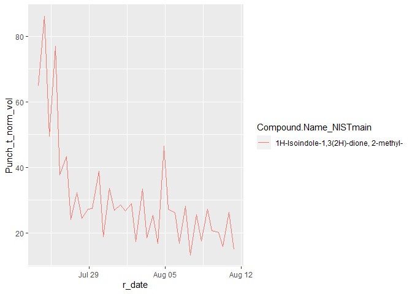
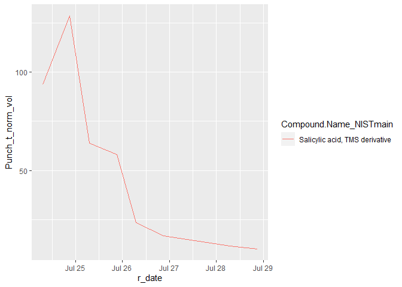
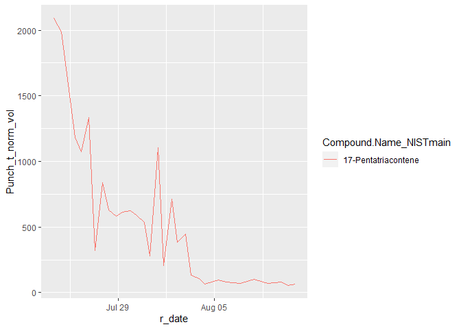
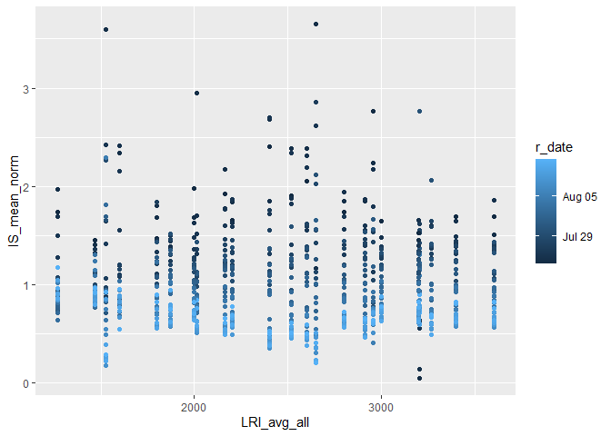
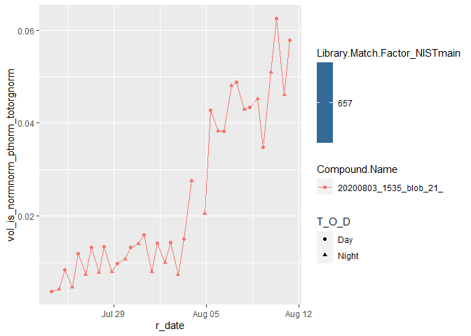
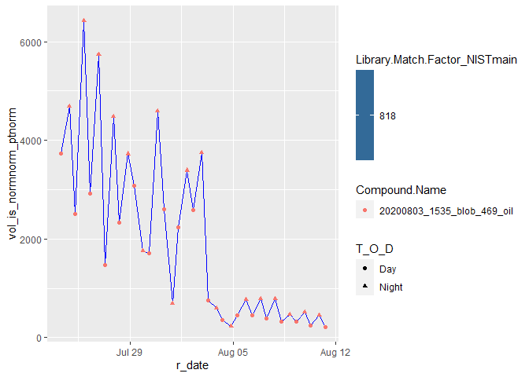
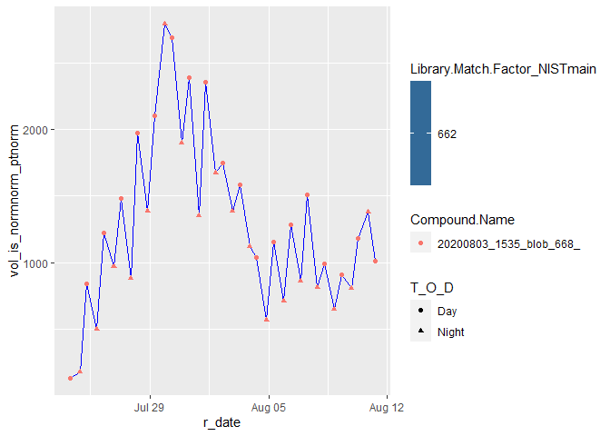
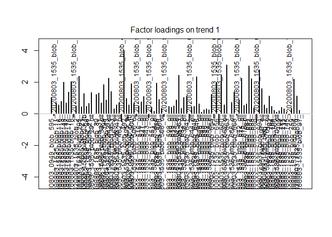
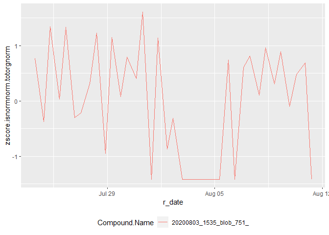
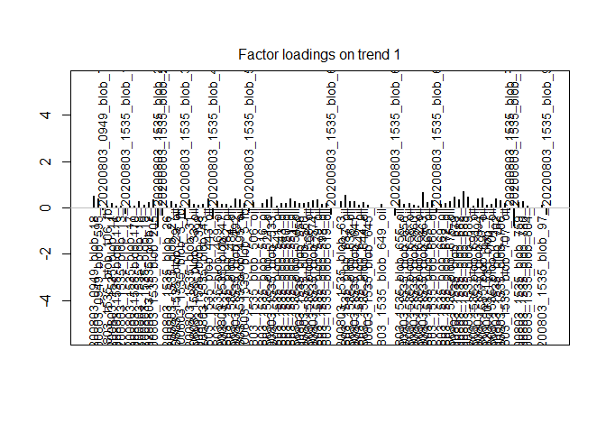

GCxGC Processing: Blob Tables to Timelines. SeaScape Aerosol Example
================
Emily Barnes
September 10, 2020

``` r
library(dplyr)
library(tidyverse)

library(scales)

library(akima)
#library(asbio)
#library(tmap)         # raster + vector layers
#library(raster)       # Main raster library
#library(tidyverse)    # our old friend
#library(sf)           # to work with simple features data
#library(mapview)
library(openxlsx)
library(class)
library(RANN)
library("survival")
library("Hmisc")

library(MARSS)
library(utils)


#install.packages("survival")

library(lattice)
#install.packages("latticeExtra")


library(survival)
library(Hmisc)
library(lubridate)
#install.packages("installr")
#library(installr)
```

## Importing and Tidying GC Image Data

Background: GC image pre-processing - All images must be RI configured
and searched against 1) a custom library of internal standard compounds
2) a custom library of field blank compounds 3) one or more custom
libraries of template compounds to be traced over campaign. Libraries
need not be compiled into one and can remain separated by source file. -
Note: manually checking for appropriate internal standard assignments
strongly advised

Required files: - Blob table summary. See example for formatting; match
exactly to avoid bugs. Note: if GCxGC file name convention differs from
that in example blob table summary, adjust the date and file parsing
code accordingly - Folder with all blob tables to be parsed - all blob
tables from pre-processed GC image files in csv format

``` r
bt_sum_bloom3 <- read_csv("Blob_table_summary_CAICESample.csv") %>% 
  filter(Bloom == 3)

bt_sum_bloom <- read_csv("Blob_table_summary_CAICESample.csv") %>% 
  filter(Category == "Sample")

bt_sum_bloom3 <- bt_sum_bloom3 %>% mutate(r_date =    mdy_hm(SS_startdate)) %>% 
  mutate(run_date = as.Date(gsub("GCxGC_","",File_num), "%Y%m%d"))

make_file_name <- function(date_string) {
  file_start <- "CAICE_blobtables/"
  file_end <- ".h5_img01_Blob_Table.csv"
  full_name <- paste(file_start,date_string,file_end, sep = "")
  return(full_name)
  
}

read_bt_files <- function(fi_name_short) {
  
  fi_name <- make_file_name(fi_name_short)
  temp_bt <<- read_csv(file = fi_name)
  temp_bt <- temp_bt %>% mutate(File_num = fi_name_short)
  temp_bt <<- temp_bt
  return(temp_bt)
}

make_massive_table <- function(summary_table){
 
  M <- read_bt_files(as.character(summary_table$File_num[1]))

  for(i in 2:length(summary_table$File_num)){
    t <- read_bt_files(as.character(summary_table$File_num[i]))
    Mnew <- rbind(M, t)
    M <- Mnew
    print(i)
  }
  M_t <<- M
}

make_massive_table(bt_sum_bloom3)
```

    ## [1] 2
    ## [1] 3
    ## [1] 4
    ## [1] 5
    ## [1] 6
    ## [1] 7
    ## [1] 8
    ## [1] 9
    ## [1] 10
    ## [1] 11
    ## [1] 12
    ## [1] 13
    ## [1] 14
    ## [1] 15
    ## [1] 16
    ## [1] 17
    ## [1] 18
    ## [1] 19
    ## [1] 20
    ## [1] 21
    ## [1] 22
    ## [1] 23
    ## [1] 24
    ## [1] 25
    ## [1] 26
    ## [1] 27
    ## [1] 28
    ## [1] 29
    ## [1] 30
    ## [1] 31
    ## [1] 32
    ## [1] 33
    ## [1] 34
    ## [1] 35
    ## [1] 36
    ## [1] 37

``` r
M_t_full3 <- M_t %>% 
  left_join(bt_sum_bloom3, by = "File_num") %>% 
  mutate(Punch_t_norm_vol = Volume/Punch_num_sample_time_norm)

names(M_t_full3) <- make.names(names(M_t_full3),unique = TRUE) 

make_massive_table(bt_sum_bloom)
```

    ## [1] 2
    ## [1] 3
    ## [1] 4
    ## [1] 5
    ## [1] 6
    ## [1] 7
    ## [1] 8
    ## [1] 9
    ## [1] 10
    ## [1] 11
    ## [1] 12
    ## [1] 13
    ## [1] 14
    ## [1] 15
    ## [1] 16
    ## [1] 17
    ## [1] 18
    ## [1] 19
    ## [1] 20
    ## [1] 21
    ## [1] 22
    ## [1] 23
    ## [1] 24
    ## [1] 25
    ## [1] 26
    ## [1] 27
    ## [1] 28
    ## [1] 29
    ## [1] 30
    ## [1] 31
    ## [1] 32
    ## [1] 33
    ## [1] 34
    ## [1] 35
    ## [1] 36
    ## [1] 37
    ## [1] 38
    ## [1] 39
    ## [1] 40
    ## [1] 41
    ## [1] 42
    ## [1] 43
    ## [1] 44
    ## [1] 45
    ## [1] 46
    ## [1] 47
    ## [1] 48
    ## [1] 49
    ## [1] 50
    ## [1] 51
    ## [1] 52
    ## [1] 53
    ## [1] 54
    ## [1] 55
    ## [1] 56
    ## [1] 57
    ## [1] 58
    ## [1] 59

``` r
M_t_full <- M_t %>% 
  left_join(bt_sum_bloom, by = "File_num") %>% 
  mutate(Punch_t_norm_vol = Volume/Punch_num_sample_time_norm)

names(M_t_full) <- make.names(names(M_t_full),unique = TRUE) 

btz1 <- M_t_full3 %>% 
  filter(Compound.Name == "20200803_1535_blob_958_")
# its here
```

condensing to unique plots

``` r
Match_factor_floor <- 750
Reverse_match_factor_floor <- 100
LRI_diff_floor <- 6


fb_match_factor_floor <- 600
fb_reverse_match_factor_floor <- 100
IS_lib_name <- "caice_ssi"
lib_remove_1 <- "caice_ssa_0805_0612"
lib_remove_2 <- "caice_ssa_0803_1728"
lib_remove_3 <- "caice_ssa_0803_oil_1728"
lib_remove_4 <- "amzi0503_b"
#FB_lib_name <- "amz_fb_trimmed_esrem"

rt2_floor <- .2 # note: check on this, but for purposes of indexing retention times in 2d this is important

# creating a column of the differences in linear retention indecies so that poor matches can be screened out
M_t_LRI <- M_t_full3 %>% mutate(LRI_diff = abs(Library.RI-LRI.I)) %>% 
  mutate(LRI_diff = replace_na(LRI_diff, -999))

btz2 <- M_t_LRI %>% 
  filter(Compound.Name == "20200803_1535_blob_958_")
# its here too

# getting rid of things that should be removed
remove_match <- M_t_LRI %>% 
  filter(Library.Name == lib_remove_1 | Library.Name == lib_remove_2 | Library.Name == lib_remove_3 | Library.Name == lib_remove_4)

btz3 <- remove_match %>% 
  filter(Compound.Name == "20200803_1535_blob_958_")
# not here, good

# identifying the internal standard
IS_goodmatch <- M_t_LRI %>% 
  filter(Library.Name == IS_lib_name | Library.Name == "-") %>% 
  filter(LRI_diff < LRI_diff_floor) %>% 
  filter(Library.Match.Factor > Match_factor_floor| Description== "match")  

# FB_goodmatch <- M_t_LRI %>% 
#   filter(Library.Name == FB_lib_name) %>% 
#   filter(LRI_diff < LRI_diff_floor) %>% 
#   filter(Library.Match.Factor > fb_match_factor_floor)
# 
# FB_okmatch <- M_t_LRI %>% 
#   filter(Library.Name == FB_lib_name) %>% 
#   filter(Library.Match.Factor> fb_match_factor_floor-100) %>% 
#   anti_join(FB_goodmatch)
  
IS_okmatch <- M_t_LRI %>% 
  filter(Library.Name == IS_lib_name | Library.Name == "-") %>%
  filter(Library.Match.Factor > Match_factor_floor-100)  %>% 
  anti_join(IS_goodmatch)

small_poorlymatched <- M_t_LRI %>% 
  filter(Library.Match.Factor < Match_factor_floor) %>% 
  filter(Volume < 200)

btz4 <- small_poorlymatched %>% 
  filter(Compound.Name == "20200803_1535_blob_958_")
# 33/70 in here, makes sense

M_t_all_analytes <- M_t_LRI %>% 
  #anti_join(FB_goodmatch) %>% 
  anti_join(IS_goodmatch) %>% 
  #anti_join(FB_okmatch) %>% 
  anti_join(IS_okmatch) %>% 
  anti_join(remove_match) %>% 
  anti_join(small_poorlymatched) %>% 
  filter(LRI.I > 1200) 

btz1 <- M_t_all_analytes %>% 
  filter(Compound.Name == "20200803_1535_blob_958_")

## Getting rid of things that existed and were well matched in the tap water blank


tap_water_blank <- read_csv("CAICE_tapwater_ssasearched.csv")

names(tap_water_blank) <- make.names(names(tap_water_blank),unique = TRUE) 

tap_water_blank_matches <- tap_water_blank %>% 
  filter(Library.Match.Factor > 750) %>% 
  filter(Library.Name != "caice_ssi") %>% 
  filter(Volume > 10000) %>% 
  dplyr::select(Compound.Name) %>% 
  mutate(in_background = 1)

M_t_all_analytes <- M_t_all_analytes %>% 
  left_join(tap_water_blank_matches) %>% 
  filter(is.na(in_background))

  
M_t_analyte_unique <- M_t_all_analytes %>% 
  arrange((r_date)) %>% 
  filter(Library.Name != IS_lib_name) %>% 
  filter(LRI_diff < LRI_diff_floor) %>% 
  filter(Library.Match.Factor > Match_factor_floor | Description == "match") %>% 
  #filter(Library.Reverse.Match.Factor > Reverse_match_factor_floor) %>% 
  arrange(desc(Volume)) %>% 
  arrange(Compound.Name) %>% 
  arrange(r_date) %>% 
  distinct(Compound.Name, r_date, .keep_all = TRUE) 
```

Important to note: the blob names are messed up for the template from
0805- still listed as from 0803

Tracing Library Performance

``` r
# tracking the mass of all of the analytes before bad matches are screened out for later analysis of library performance
M_t_all_analytes_volcount <- M_t_all_analytes %>% 
  group_by(File_num) %>% 
  summarise(rawvol = sum(Volume))
```

    ## `summarise()` ungrouping output (override with `.groups` argument)

``` r
# tracking the number of all analutes in
M_t_all_analytes_ncount <- M_t_all_analytes %>% 
  count(File_num) %>% 
  rename(total_num_analyte = n)

M_t_match_analytes_volcount <- M_t_analyte_unique %>% 
  group_by(File_num) %>% 
  summarise(rawvol_match = sum(Volume))
```

    ## `summarise()` ungrouping output (override with `.groups` argument)

``` r
M_t_match_analytes_ncount <- M_t_analyte_unique %>% 
  count(File_num) %>% 
  rename(total_num_analyte_match = n)

M_t_analyte_summary <- M_t_all_analytes_volcount %>% 
  left_join(M_t_all_analytes_ncount) %>% 
  left_join(M_t_match_analytes_volcount) %>% 
  left_join(M_t_match_analytes_ncount) %>% 
  mutate(perct_nfound = (total_num_analyte_match/total_num_analyte)*100) %>% 
  mutate(perct_volfound = (rawvol_match/rawvol)*100)
```

    ## Joining, by = "File_num"

    ## Joining, by = "File_num"
    ## Joining, by = "File_num"

``` r
compound_pop <- M_t_analyte_unique %>% 
  count(Compound.Name) %>% 
  rename(comp.n = n) %>% 
  mutate(pct_of_samp = (comp.n/max(comp.n)*100))

#table(compound_pop$comp.n)
#hist(compound_pop$comp.n)

# 
# #note: potential issue with screening out bad fb matches eek
# M_t_analyte_count <- M_t_full %>%
#   filter(Library.Name != "amzi0503_b") %>%
#   filter(Library.Name != "fb_amz_compiled_t") %>%
#   count(File_num) %>%
#   rename(total_num_analyte = n)

M_t_analyte_count <- M_t_all_analytes %>% 
  count(File_num) %>%
  rename(total_num_analyte = n)
# 
# # counting the number of unique analytes in each image
num_analyte_unique <- M_t_analyte_unique %>%
  count(File_num) %>%
  rename(unique.analyte = n)

# counting the number based percent of compounds being traced in all 
perct_comps_traced <- num_analyte_unique %>% 
   left_join(M_t_analyte_count) %>% 
   mutate(pct_found = unique.analyte/total_num_analyte)
```

    ## Joining, by = "File_num"

``` r
# 
#perct_comps_traced %>%
#  ggplot(aes(y = pct_found))+
#  geom_boxplot()

summary(perct_comps_traced$pct_found)
```

    ##    Min. 1st Qu.  Median    Mean 3rd Qu.    Max. 
    ##  0.4250  0.5875  0.6211  0.6291  0.6971  0.7575

``` r
M_t_analyte_unique <- M_t_analyte_unique %>% left_join(num_analyte_unique)
```

    ## Joining, by = "File_num"

``` r
compound_pop <- M_t_analyte_unique %>% 
  count(Compound.Name) %>% 
  rename(comp.n = n) %>% 
  mutate(pct_of_samp = (comp.n/max(comp.n)*100))

table(compound_pop$comp.n)
```

    ## 
    ##   1   2   3   4   5   6   7   8   9  10  11  12  13  14  15  16  17  18  19  20 
    ##  85  17  20  11  16   6   8  20  15  11  22  15  12  17  27  23  25  25  36  28 
    ##  21  22  23  24  25  26  27  28  29  30  31  32  33  34  35  36  37 
    ##  32  20  11  10  19  14  13   7   8  13   9  12   8  11  11  15 102

``` r
hist(compound_pop$pct_of_samp, 
     main = paste("Histogram of", nrow(compound_pop), "Traced Compounds\nOver Seascape Bloom 3"),
     xlab = "Percent Occurence Above Detection Limits",
     col = "grey")
```

<!-- -->

``` r
SeaScape_sample_cumcum <- M_t_analyte_unique %>% 
  group_by(File_num) %>% 
  summarise(File_vol = sum(Volume))
```

    ## `summarise()` ungrouping output (override with `.groups` argument)

``` r
M_t_analyte_unique <- M_t_analyte_unique %>% 
  left_join(compound_pop) %>% 
  left_join(SeaScape_sample_cumcum) %>% 
  mutate(Volume_Fraction = Volume/File_vol)
```

    ## Joining, by = "Compound.Name"
    ## Joining, by = "File_num"

``` r
M_t_analyte_unique %>% 
  mutate(char_comp_n = as.integer(round(pct_of_samp, 0))) %>% 
  group_by(char_comp_n) %>% 
  summarise(avg_vol_byn = mean(Volume)) %>% 
  ggplot(aes(x = char_comp_n, y = avg_vol_byn)) +
  geom_col()+
  labs(title = "Average Blob Volume by Library Match Frequency")+
  xlab("Percent of Samples with Positive Library Match")+
  ylab("Average Blob Volume")
```

    ## `summarise()` ungrouping output (override with `.groups` argument)

<!-- -->

``` r
M_t_analyte_summary %>% 
  ggplot(aes(y = perct_nfound))+
  geom_boxplot(fill = "pink") + 
  theme_bw()+
  ylab("Percent of Analytes Assigned to \nLibrary Match")
```

<!-- -->

``` r
M_t_analyte_summary %>% 
  ggplot(aes(y = perct_volfound))+
  geom_boxplot(fill = "pink") + 
  theme_bw()+
  ylab("Percent of Analyte Volume Assigned to \nLibrary Match")
```

<!-- -->

``` r
summary(M_t_analyte_summary$perct_volfound)
```

    ##    Min. 1st Qu.  Median    Mean 3rd Qu.    Max. 
    ##   72.68   84.93   87.16   86.63   89.18   94.24

``` r
#weighted average of distances
#leave one out cross validation

#kriging- from geography
#GAM to build 2d surface 
# try predict with GAM or loess surface, 
# link function for GAM
# could use a moving window 
```

Tracking appearance of new compounds

``` r
unique_tracing <- M_t_analyte_unique %>% 
  arrange(r_date)

unique_tag <- 
  unique_tracing %>% 
  filter(File_num == bt_sum_bloom3$File_num[1]) %>% 
  mutate(is_unique_prior = NA) %>% 
  dplyr::select(Compound.Name, File_num, is_unique_prior)


for(i in 2:nrow(bt_sum_bloom3)){
  
  
  
  previous_file_i <- bt_sum_bloom3$File_num[i-1]
  file_i <- bt_sum_bloom3$File_num[i]
  
  prev_compounds <- unique_tracing %>% 
    filter(File_num == previous_file_i) %>% 
    mutate(is_unique_prior = FALSE) %>% 
    dplyr::select(Compound.Name, is_unique_prior)
  
  compounds_i <- unique_tracing %>% 
    filter(File_num== file_i)
  
  
  unique_tag_t <- compounds_i %>% 
    left_join(prev_compounds, by = "Compound.Name") %>% 
    dplyr::select(Compound.Name, File_num, is_unique_prior)
  
  unique_tag <- rbind(unique_tag, unique_tag_t)
    
  
}

unique_tracing_c <- unique_tracing %>% 
  left_join(unique_tag, by = c("Compound.Name", "File_num")) %>% 
  mutate(unique_log = is.na(is_unique_prior)) %>% 
  mutate(unique_vol = unique_log * Volume/(Punch_num_sample_time_norm)) 


avg_unique = sum(unique_tracing_c$unique_vol)/sum(unique_tracing_c$Volume)
```

more unique tracing

``` r
unique_tracing_c %>% 
  #filter(IOP == 2) %>% 
  mutate(ones = 1) %>% 
  ggplot(aes(fill = unique_log, y = ones, x = r_date))+
  geom_bar(position = "stack", stat = "identity")+
  ylab("Analyte Count")
```

<!-- -->

``` r
unique_tracing_c %>% 
  #filter(IOP == 2) %>% 
  mutate(ones = 1) %>% 
  ggplot(aes(fill = unique_log, y = Punch_t_norm_vol, x = r_date))+
  geom_bar(position = "stack", stat = "identity")+
  ylab("Analyte Raw Volume")+
  xlab("Dry Season GoAmazon Date")+
  scale_fill_manual(name = "Unique Compared\n to Previous Sample", values=c("blue", "green"))+
  theme(axis.text.x = element_text(size=14), axis.text.y = element_text(size=14), axis.text=element_text(size=12),
        axis.title=element_text(size=14))
```

<!-- -->
Adding in cumsum and pct found to analyte unique for raw timelines

``` r
compiled_comp_info <- read_csv("Compiled_Compoundinfo_Blobtable_SS.csv")
```

    ## Parsed with column specification:
    ## cols(
    ##   .default = col_double(),
    ##   Compound.Name = col_character(),
    ##   `Library Name` = col_character(),
    ##   Compound.Name_ES = col_logical(),
    ##   Library.Match.Factor_ES = col_logical(),
    ##   Library.Reverse.Match.Factor_ES = col_logical(),
    ##   Library.RI_ES = col_logical(),
    ##   Compound.Name_NISTmain = col_character(),
    ##   Library.Formula_NISTmain = col_character(),
    ##   Benzothiazole = col_logical(),
    ##   Thiol = col_logical(),
    ##   Library.Reverse.Match.Factor_chamber = col_logical(),
    ##   Library.RI_chamber = col_logical()
    ## )

    ## See spec(...) for full column specifications.

``` r
compiled_comp_info.findable <- compiled_comp_info %>% 
  filter(Library.Match.Factor_NISTmain> 800) %>% 
  mutate(Identifiable = TRUE) %>% 
  dplyr::select(Compound.Name, Identifiable)

#id.tags <- data.frame("Identifiable"= c(TRUE, NA), ID)

compiled_comp_info <- compiled_comp_info %>% 
  left_join(compiled_comp_info.findable) %>% 
  mutate(tic = 1)
```

    ## Joining, by = "Compound.Name"

``` r
compiled_comp_info %>% 
  ggplot(aes(x = "", y = tic, fill = Identifiable)) + 
  geom_col()+
  coord_polar("y", start = 0)+
  theme_classic() +
  theme(plot.title = element_text(hjust=0.5),
        axis.line = element_blank(),
        axis.text = element_blank(),
        axis.ticks = element_blank()) +
  labs(fill = "",
       x = NULL,
       y = NULL) + 
  ggtitle("765 Novel and Identifiable Submicron SSA Compounds- SeaScape")
```

<!-- -->

``` r
SeaScape_cumsum_raw <- M_t_analyte_unique %>% 
  mutate(tic = 1) %>% 
  group_by(Compound.Name) %>% 
  summarise(raw_cumsum = sum(Punch_t_norm_vol), num_obs = sum(tic)) %>% 
  mutate(pct_obs = num_obs/nrow(bt_sum_bloom3)) %>% 
  arrange(desc(raw_cumsum))
```

    ## `summarise()` ungrouping output (override with `.groups` argument)

``` r
M_t_analyte_unique_info <- M_t_analyte_unique %>% 
  left_join(SeaScape_cumsum_raw, by = "Compound.Name") %>% 
  left_join(compiled_comp_info, by = "Compound.Name") %>% 
  left_join(compiled_comp_info.findable, by = "Compound.Name")

for(i in 1:nrow(compiled_comp_info.findable)){
  findable_c <- compiled_comp_info$Compound.Name[i]
  
  f1 <- M_t_analyte_unique_info %>% 
    filter(Compound.Name == findable_c) %>% 
    ggplot(aes(x = r_date, y = Punch_t_norm_vol, color = Compound.Name_NISTmain))+
    geom_line()
  
  print(f1)
  
  
  
  
}
```

<!-- --><!-- --><!-- --><!-- --><!-- --><!-- --><!-- --><!-- --><!-- --><!-- --><!-- --><!-- --><!-- --><!-- --><!-- --><!-- --><!-- --><!-- --><!-- --><!-- --><!-- --><!-- --><!-- --><!-- --><!-- --><!-- --><!-- --><!-- --><!-- --><!-- --><!-- --><!-- --><!-- --><!-- --><!-- --><!-- --><!-- --><!-- --><!-- --><!-- --><!-- --><!-- --><!-- --><!-- --><!-- --><!-- --><!-- --><!-- --><!-- --><!-- --><!-- --><!-- --><!-- --><!-- --><!-- --><!-- --><!-- --><!-- --><!-- --><!-- --><!-- --><!-- --><!-- --><!-- --><!-- --><!-- --><!-- --><!-- --><!-- --><!-- --><!-- --><!-- --><!-- --><!-- --><!-- --><!-- --><!-- --><!-- --><!-- --><!-- --><!-- --><!-- --><!-- --><!-- --><!-- --><!-- --><!-- --><!-- --><!-- --><!-- --><!-- --><!-- --><!-- --><!-- --><!-- --><!-- --><!-- --><!-- --><!-- --><!-- --><!-- --><!-- --><!-- --><!-- --><!-- --><!-- --><!-- --><!-- --><!-- --><!-- --><!-- --><!-- --><!-- --><!-- --><!-- --><!-- --><!-- --><!-- --><!-- --><!-- --><!-- --><!-- --><!-- --><!-- --><!-- --><!-- --><!-- --><!-- --><!-- --><!-- --><!-- --><!-- --><!-- --><!-- --><!-- --><!-- --><!-- --><!-- --><!-- --><!-- --><!-- --><!-- --><!-- --><!-- -->

``` r
# for(i in 1:100){
#   big_c <- SeaScape_cumsum_raw$Compound.Name[i]
#   
#   f2 <- M_t_analyte_unique_info %>% 
#     filter(Compound.Name == big_c) %>% 
#     ggplot(aes(x = r_date, y = Volume_Fraction, color = Compound.Name_NISTmain))+
#     geom_line()+
#     geom_point(aes(x = r_date, y = Volume_Fraction, shape = T_O_D, fill = Library.Match.Factor_NISTmain))
#   
#   print(f2)
#   
#   
#   
#   
# }

# for(i in 1:100){
#   big_c <- SeaScape_cumsum_raw$Compound.Name[i]
#   
#   f3 <- M_t_analyte_unique_info %>% 
#     filter(Compound.Name == big_c) %>% 
#     ggplot(aes(x = r_date, y = Punch_t_norm_vol, color = Compound.Name_NISTmain))+
#     geom_line()+
#     geom_point(aes(x = r_date, y = Punch_t_norm_vol, shape = T_O_D, fill = Library.Match.Factor_NISTmain))
#   
#   print(f3)
#   
#   
# }
```

Internal Standard Mapping

``` r
# note: unlike sample analytes, internal standard compounds are frequently split vertically into multiple blobs because of the high volume.  In order to account for this, I am summing all blobs together that meet the high match criteria and are very close in the first dimension.
IS_unique <- IS_goodmatch %>% 
  group_by(Compound.Name, File_num) %>% 
  summarise(Volume_tot = sum(Volume)) %>% 
  filter(Compound.Name != "glucose-13C6") %>% 
  filter(Compound.Name != "dC14") 
```

    ## `summarise()` regrouping output by 'Compound.Name' (override with `.groups` argument)

``` r
fixing <- data.frame(table(IS_unique$Compound.Name)) %>% 
  mutate(Compound.Name = Var1)

IS_tofix <- IS_unique %>% 
  left_join(fixing) %>% 
  filter(Freq < 37) %>% 
  left_join(bt_sum_bloom3, by = "File_num")
```

    ## Joining, by = "Compound.Name"

``` r
IS_unique_c <- IS_unique %>% 
  mutate(tic = 1) %>% 
  group_by(File_num) %>% 
  summarise(ticsum = sum(tic))
```

    ## `summarise()` ungrouping output (override with `.groups` argument)

``` r
c<- data.frame(table(IS_unique$Compound.Name))

# note: this is not knitting, not sure why but did temporary work around
# IS_positions <- IS_goodmatch %>% 
#   filter(Compound.Name != "glucose-13C6") %>% 
#   filter(Compound.Name != "dC14") %>% 
#   group_by(Compound.Name, File_num) %>% 
#   #summarise(LRI_avg = mean(LRI.I), RI2 = min(Retention.II..sec.-rt2_floor))
#   summarise(LRI_avg = mean(LRI.I), RI2 = min(Retention.II..sec. - rt2_floor))
# 
# IS_positions_knit <- write.csv(IS_positions, "IS.pos.knit.csv")

IS_positions <- read.csv("IS.pos.knit.csv") %>% 
  dplyr::select(-X)
  

IS_avg_vols_toadd <- IS_unique %>% 
  group_by(Compound.Name) %>% 
  summarise(IS_avgvol = mean(Volume_tot), IS_medvol = median(Volume_tot)) %>% 
  left_join(IS_unique) %>% 
  mutate(IS_mean_norm = Volume_tot / IS_avgvol) %>%
  mutate(IS_med_norm = Volume_tot / IS_medvol) %>% 
  dplyr::select(Compound.Name, File_num, IS_mean_norm)
```

    ## `summarise()` ungrouping output (override with `.groups` argument)

    ## Joining, by = "Compound.Name"

``` r
IS_unique_pos <- IS_unique %>% 
  left_join(IS_positions) %>% 
  left_join(IS_avg_vols_toadd)
```

    ## Joining, by = c("Compound.Name", "File_num")

    ## Joining, by = c("Compound.Name", "File_num")

``` r
IS_test1 <- IS_unique_pos %>% 
  filter(File_num == "GCxGC_20200803_1001")

IS_1_vol <- IS_test1$Volume_tot
RI1 <- IS_test1$LRI_avg
RI2 <- IS_test1$RI2

# IS_1_pos <- IS_test1 %>% 
#   ungroup() %>% 
#   dplyr::select("LRI_avg", "RI2")
IS_positions_202008061332 <- read.csv("GCxGC_20200806_1332.h5_img01_IS_selected_positions_Blob_Table.csv")
IS_rt2 <- IS_positions_202008061332 %>% 
  dplyr::select(Compound.Name, Retention.II..sec.)

IS_positions <- IS_goodmatch %>% 
  filter(Compound.Name != "glucose-13C6") %>% 
  filter(Compound.Name != "dC14") %>% 
  group_by(Compound.Name, File_num) %>% 
  #summarise(LRI_avg = mean(LRI.I), RI2 = min(Retention.II..sec.-rt2_floor))
  summarise(LRI_avg = mean(LRI.I), RI2 = min(Retention.II..sec. - rt2_floor))
```

    ## `summarise()` regrouping output by 'Compound.Name' (override with `.groups` argument)

``` r
IS_positions_avg <- IS_positions %>% 
  group_by(Compound.Name) %>% 
  summarise(LRI_avg_all = mean(LRI_avg, na.rm = TRUE), Retention.II..sec. = mean(RI2, na.rm = TRUE)) 
```

    ## `summarise()` ungrouping output (override with `.groups` argument)

``` r
write.csv(IS_positions_avg, "IS_positions_avg.csv")


IS_avg_vols <- IS_unique %>% 
  group_by(Compound.Name) %>% 
  summarise(IS_avgvol = mean(Volume_tot), IS_medvol = median(Volume_tot)) %>% 
  left_join(IS_unique) %>% 
  mutate(IS_mean_norm = Volume_tot / IS_avgvol) %>%
  mutate(IS_med_norm = Volume_tot / IS_medvol) %>% 
  left_join(bt_sum_bloom3)
```

    ## `summarise()` ungrouping output (override with `.groups` argument)

    ## Joining, by = "Compound.Name"

    ## Joining, by = "File_num"

``` r
IS_cat <- read.csv("IS_withcat.csv")
IS_cat <- IS_cat %>% 
  dplyr::select(-X)

IS_avg_vols <- IS_avg_vols %>% 
  left_join(IS_cat)
```

    ## Joining, by = "Compound.Name"

``` r
IS_just_one_IS <- IS_avg_vols %>% 
  filter(Compound.Name == "dC24") %>% 
  dplyr::select(File_num, dalk_norm=IS_mean_norm) 

IS_stability <- IS_avg_vols %>% 
  left_join(IS_just_one_IS) %>% 
  left_join(IS_positions_avg)
```

    ## Joining, by = "File_num"

    ## Joining, by = "Compound.Name"

``` r
IS_stability %>% 
  ggplot(aes(x = dalk_norm, y = IS_mean_norm, color = F_group_cat))+
  geom_point()+
  ylim(0, 2) +
  xlim(0,2)
```

    ## Warning: Removed 79 rows containing missing values (geom_point).

<!-- -->

``` r
IS_avg_vols %>% ggplot(aes(x = r_date, y = IS_med_norm, color = Compound.Name)) +
  geom_point()
```

<!-- -->

``` r
IS_avg_vols %>% ggplot(aes(x = r_date, y = Volume_tot, color = Compound.Name)) +
  geom_point()
```

<!-- -->

``` r
IS_stability %>% 
  ggplot(aes(x = LRI_avg_all, y = IS_mean_norm, color = r_date))+
  geom_point()
```

<!-- -->

``` r
IS_stability %>% 
  ggplot(aes(x = LRI_avg_all, y = Volume_tot, color = r_date))+
  geom_point()
```

<!-- -->

``` r
IS_stability %>% 
  ggplot(aes(x = Retention.II..sec., y = IS_mean_norm, color = r_date))+
  geom_point()
```

<!-- -->

``` r
IS_stability %>% 
  ggplot(aes(x = Retention.II..sec., y = Volume_tot, color = r_date))+
  geom_point()
```

<!-- -->

``` r
IS_stability %>% 
  ggplot(aes(x = LRI_avg_all, y = IS_mean_norm, color = F_group_cat))+
  geom_point()
```

<!-- -->

``` r
IS_stability %>% 
  ggplot(aes(x = LRI_avg_all, y = Volume_tot, color = F_group_cat))+
  geom_point()
```

<!-- -->

``` r
IS_stability %>% 
  ggplot(aes(x = Retention.II..sec., y = IS_mean_norm, color = F_group_cat))+
  geom_point()
```

<!-- -->

``` r
IS_stability %>% 
  ggplot(aes(x = Retention.II..sec., y = Volume_tot, color = F_group_cat))+
  geom_point()
```

<!-- -->
Conclusion: Normalizing by the nearest mean or median normalized
internal standard volume is most appropriate, as the responses of
different internal standard on a raw volume basis are a function of
chemical characteristics rather than purely instrument response (itself
a function of matrix effects and instrument condition, which cannot be
effectively deconvoluted). As the quantification model takes into
account chemical characteristics through a machine learning model
trained on the mass spectrum, normalization by raw internal standard
volume introduces covarying factors.

``` r
LRI_weight = 2
LRII_weight = 1

LRI1_avg = mean(IS_positions_avg$LRI_avg_all, na.rm = TRUE)
LRI2_avg = mean(IS_positions_avg$Retention.II..sec.)

IS_positions_avg <- IS_positions_avg %>% 
  mutate(relative_LRI = (LRI_avg_all/LRI1_avg)*LRI_weight) %>% 
  mutate(relative_LRI2 = (Retention.II..sec./LRI2_avg)*LRII_weight)

write.csv(IS_positions_avg, "IS_positions_avg_rel.csv")

Analyte_positions_trial <- M_t_analyte_unique %>% 
  group_by(Compound.Name, File_num) %>% 
  summarise(LRI_avg = mean(LRI.I), RI2 = min(Retention.II..sec. - rt2_floor))
```

    ## `summarise()` regrouping output by 'Compound.Name' (override with `.groups` argument)

``` r
# note filtering out three small blobs outside of RI window

Analyte_positions <- M_t_analyte_unique %>% 
  filter(!is.na(LRI.I)) %>% 
  group_by(Compound.Name) %>% 
  summarise(LRI_avg = mean(LRI.I, na.rm = TRUE), RI2 = (mean(Retention.II..sec.) - rt2_floor))
```

    ## `summarise()` ungrouping output (override with `.groups` argument)

``` r
Analyte_positions <- Analyte_positions %>% 
  mutate(relative_LRI = (LRI_avg/LRI1_avg)*LRI_weight) %>% 
  mutate(relative_LRI2 = (RI2/LRI2_avg)*LRII_weight)

# checking to make sure that the ranges match up, eg back end checking that same norm method used on moth IS and analyte positions
summary(IS_positions_avg$relative_LRI)
```

    ##    Min. 1st Qu.  Median    Mean 3rd Qu.    Max. 
    ##   1.035   1.578   2.055   2.000   2.428   2.936

``` r
summary(Analyte_positions$relative_LRI)
```

    ##    Min. 1st Qu.  Median    Mean 3rd Qu.    Max. 
    ##   1.004   1.512   1.702   1.706   1.882   2.668

``` r
summary(IS_positions_avg$relative_LRI2)
```

    ##     Min.  1st Qu.   Median     Mean  3rd Qu.     Max. 
    ## -0.08964  0.08952  0.41409  1.00000  1.69677  3.34406

``` r
summary(Analyte_positions$relative_LRI2)
```

    ##    Min. 1st Qu.  Median    Mean 3rd Qu.    Max. 
    ## -0.2828  0.5273  1.4023  1.6576  2.3336  7.1287

``` r
Analyte_pos_short <- Analyte_positions %>% 
  dplyr::select(relative_LRI, relative_LRI2)

IS_pos_short <- IS_positions_avg %>% 
  dplyr::select(relative_LRI, relative_LRI2)

#knn(IS_pos_short, Analyte_pos_short, cl=IS_pos_short$Compound.Name, k=1, l=0)

#Old method, only using 1 nearest
#testnn <- nn2(IS_pos_short, query = Analyte_pos_short, treetype = "kd", searchtype = "standard", k=1)

# note 1.19 is the min radius at which every compound has at least one nearest
testnn <- nn2(IS_pos_short, query = Analyte_pos_short, treetype = "kd", searchtype = "radius", k=3, radius = 3.9)


Analyte_IS_Index <- data.frame(testnn$nn.idx)
# old method only using 1 nearest
# Analyte_pos_ad <- data.frame(Compound.Name = Analyte_positions$Compound.Name, IS_index = Analyte_IS_Index)

Analyte_pos_ad <- data.frame(Compound.Name = Analyte_positions$Compound.Name, IS_index1 = Analyte_IS_Index$X1, IS_index2 = Analyte_IS_Index$X2, IS_index3 = Analyte_IS_Index$X3)

# old method with only 1 IS
# Analyte_with_IS <- Analyte_pos_ad %>% 
#   mutate(IS_appropriate = IS_positions_avg$Compound.Name[IS_index])

# Analyte_with_IS <- Analyte_pos_ad %>% 
#   mutate(IS_appropriate1 = IS_positions_avg$Compound.Name[IS_index1]) %>% 
#   mutate(IS_appropriate2 = IS_positions_avg$Compound.Name[IS_index2]) %>% 
#   mutate(IS_appropriate3 = IS_positions_avg$Compound.Name[IS_index3])

Analyte_with_IS <- Analyte_pos_ad %>% 
  mutate(IS_appropriate1 = NA) %>% 
  mutate(IS_appropriate2 = NA) %>% 
  mutate(IS_appropriate3 = NA)

for(i in 1:nrow(Analyte_with_IS)){
  t_isind_1 <- Analyte_with_IS$IS_index1[i]
  t_isind_2 <- Analyte_with_IS$IS_index2[i]
  t_isind_3 <- Analyte_with_IS$IS_index3[i]
  
  if(t_isind_1 > 0){
  t_isap_1 <- IS_positions_avg$Compound.Name[t_isind_1]
  }else{
    t_isap_1 <- NA
  }
  
  if(t_isind_2 > 0){
  t_isap_2 <- IS_positions_avg$Compound.Name[t_isind_2]
  }else{
    t_isap_2 <- NA
  }
  
  if(t_isind_3 > 0){
  t_isap_3 <- IS_positions_avg$Compound.Name[t_isind_3]
  }else{
    t_isap_3 <- NA
  }
  
  
  
  Analyte_with_IS$IS_appropriate1[i] <- t_isap_1
  Analyte_with_IS$IS_appropriate2[i] <- t_isap_2
  Analyte_with_IS$IS_appropriate3[i] <- t_isap_3
  
}

# Analyte_with_IS_positions <- Analyte_with_IS %>% 
#   left_join(Analyte_positions) %>% 
#   left_join(IS_positions_avg, by = c("IS_appropriate"= "Compound.Name"))

Analyte_with_IS_positions <- Analyte_with_IS %>% 
  left_join(Analyte_positions) %>% 
  left_join(IS_positions_avg, by = c("IS_appropriate1"= "Compound.Name")) %>% 
  left_join(IS_positions_avg, by = c("IS_appropriate2"= "Compound.Name")) %>% 
  left_join(IS_positions_avg, by = c("IS_appropriate3"= "Compound.Name"))
```

    ## Joining, by = "Compound.Name"

``` r
M_t_analyte_withIS <- M_t_analyte_unique %>% 
  left_join(Analyte_with_IS) %>% 
  mutate(IS_vol1= -999*(LRI.I/LRI.I)) %>% 
  mutate(IS_mean_norm1= -999*(LRI.I/LRI.I)) %>% 
  mutate(IS_vol2= -999*(LRI.I/LRI.I)) %>% 
  mutate(IS_mean_norm2= -999*(LRI.I/LRI.I)) %>% 
  mutate(IS_vol3= -999*(LRI.I/LRI.I)) %>% 
  mutate(IS_mean_norm3= -999*(LRI.I/LRI.I)) %>% 
  mutate(IS_vol_dalk= -999*(LRI.I/LRI.I)) %>% 
  mutate(IS_mean_norm_dalk= -999*(LRI.I/LRI.I))
```

    ## Joining, by = "Compound.Name"

``` r
# old- only 1 IS
# M_t_analyte_withIS <- M_t_analyte_unique %>% 
#   left_join(Analyte_with_IS) %>% 
#   mutate(IS_vol= -999*(LRI.I/LRI.I)) %>% 
#   mutate(IS_mean_norm= -999*(LRI.I/LRI.I)) 


# for(i in 1:nrow(M_t_analyte_withIS)){
#   
#   
#   IS_name = M_t_analyte_withIS$IS_appropriate[i]
#   File_num_t = M_t_analyte_withIS$File_num[i]
#   
#   IS_indicated <- IS_stability %>% 
#     filter(Compound.Name == IS_name) %>% 
#     filter(File_num == File_num_t)
#   
#   M_t_analyte_withIS$IS_vol[i] <-IS_indicated$Volume_tot[1]
#   M_t_analyte_withIS$IS_mean_norm[i] <-IS_indicated$IS_mean_norm[1]
#   
#   
# }

for(i in 1:nrow(M_t_analyte_withIS)){
  
  
  
  IS_name1 = M_t_analyte_withIS$IS_appropriate1[i]
  IS_name2 = M_t_analyte_withIS$IS_appropriate2[i]
  IS_name3 = M_t_analyte_withIS$IS_appropriate3[i]
  
  
  
  
  File_num_t = M_t_analyte_withIS$File_num[i]
  
  IS_indicated1 <- IS_stability %>% 
    filter(Compound.Name == IS_name1) %>% 
    filter(File_num == File_num_t)
  
  M_t_analyte_withIS$IS_vol1[i] <-IS_indicated1$Volume_tot[1]
  M_t_analyte_withIS$IS_mean_norm1[i] <-IS_indicated1$IS_mean_norm[1]
  
  IS_indicated2 <- IS_stability %>% 
    filter(Compound.Name == IS_name2) %>% 
    filter(File_num == File_num_t)
  
  M_t_analyte_withIS$IS_vol2[i] <-IS_indicated2$Volume_tot[1]
  M_t_analyte_withIS$IS_mean_norm2[i] <-IS_indicated2$IS_mean_norm[1]
  
  IS_indicated3 <- IS_stability %>% 
    filter(Compound.Name == IS_name3) %>% 
    filter(File_num == File_num_t)
  
  M_t_analyte_withIS$IS_vol3[i] <-IS_indicated3$Volume_tot[1]
  M_t_analyte_withIS$IS_mean_norm3[i] <-IS_indicated3$IS_mean_norm[1]
  
}

# 
# M_t_analyte_withIS <- M_t_analyte_withIS %>% 
#   mutate(vol_is_normnorm = Volume/IS_mean_norm) %>% 
#   mutate(vol_is_rawnorm = Volume/IS_vol)
#   

# note- this step is not working
# M_t_analyte_withIS <- M_t_analyte_withIS %>% 
#   mutate(IS_vol = mean(c(IS_vol1, IS_vol2, IS_vol3), na.rm = TRUE)) %>% 
#   mutate(IS_mean_norm = mean(c(IS_mean_norm1, IS_mean_norm2, IS_mean_norm3), na.rm = TRUE))

for(i in 1:nrow(M_t_analyte_withIS)){
  
  isvols_raw <- c(M_t_analyte_withIS$IS_vol1[i], M_t_analyte_withIS$IS_vol2[i], M_t_analyte_withIS$IS_vol3[i])
  
  M_t_analyte_withIS$IS_vol[i] = mean(isvols_raw, na.rm = TRUE)
  
  isvols_norm <- c(M_t_analyte_withIS$IS_mean_norm2[i], M_t_analyte_withIS$IS_mean_norm2[i], M_t_analyte_withIS$IS_mean_norm3[i])
  
  M_t_analyte_withIS$IS_mean_norm[i] = mean(isvols_norm, na.rm = TRUE)
  
}
```

    ## Warning: Unknown or uninitialised column: `IS_vol`.

    ## Warning: Unknown or uninitialised column: `IS_mean_norm`.

``` r
M_t_analyte_withIS <- M_t_analyte_withIS %>% 
  mutate(vol_is_normnorm = Volume/IS_mean_norm) %>% 
  mutate(vol_is_rawnorm = Volume/IS_vol) %>%
  mutate(vol_is_normnorm_ptnorm = vol_is_normnorm/(Punch_num_sample_time_norm)) %>% 
  mutate(vol_is_rawnorm_ptnorm = vol_is_rawnorm/(Punch_num_sample_time_norm))


IS_problems <- M_t_analyte_withIS %>% 
  filter(is.na(IS_appropriate1))

File_norm_totorg <- M_t_analyte_withIS %>% 
  group_by(r_date) %>% 
  summarise(vol_normnorm_total = sum(vol_is_normnorm_ptnorm), vol_rawnorm_total = sum(vol_is_rawnorm_ptnorm))
```

    ## `summarise()` ungrouping output (override with `.groups` argument)

``` r
File_norm_totorg %>% 
  ggplot(aes(x = r_date, y = vol_rawnorm_total))+
  geom_point()
```

<!-- -->

``` r
File_norm_totorg %>% 
  ggplot(aes(x = r_date, y = vol_normnorm_total))+
  geom_point()
```

    ## Warning: Removed 1 rows containing missing values (geom_point).

<!-- -->

``` r
M_t_analyte_withIS <- M_t_analyte_withIS %>% 
  left_join(File_norm_totorg) %>% 
  mutate(vol_is_normnorm_ptnorm_totorgnorm = vol_is_normnorm_ptnorm/vol_normnorm_total)
```

    ## Joining, by = "r_date"

Adding fields to cumsum to reflect total org norm and IS normnorm so
that factors can be weighted to equally emphasize things important at
beginning and end of bloom

``` r
SeaScape_normalized_cumsum <- M_t_analyte_withIS %>% 
  group_by(Compound.Name) %>% 
  summarise(totorgnorm_cumsum = sum(vol_is_normnorm_ptnorm_totorgnorm), isnormnormptnorm_cumsum = sum(vol_is_normnorm_ptnorm))
```

    ## `summarise()` ungrouping output (override with `.groups` argument)

# plotting normalized timelines, normalized by both total organic (red) and internal standard (blue) to get a general sense for underlying trends

``` r
for(i in 1:50){
  
  print(i)
  big_c <- SeaScape_cumsum_raw$Compound.Name[i]
  
  f4 <- M_t_analyte_withIS %>% 
    filter(Compound.Name == big_c) %>% 
    left_join(compiled_comp_info, by = "Compound.Name") %>% 
    ggplot(aes(x = r_date, y = vol_is_normnorm_ptnorm_totorgnorm, color = Compound.Name))+
    geom_line()+
    geom_point(aes(x = r_date, y = vol_is_normnorm_ptnorm_totorgnorm, shape = T_O_D, fill = Library.Match.Factor_NISTmain))
  
  print(f4)
  
  f5 <- M_t_analyte_withIS %>% 
    filter(Compound.Name == big_c) %>% 
    left_join(compiled_comp_info, by = "Compound.Name") %>% 
    ggplot(aes(x = r_date, y = vol_is_normnorm_ptnorm, color = Compound.Name))+
    geom_line(color = "blue")+
    geom_point(aes(x = r_date, y = vol_is_normnorm_ptnorm, shape = T_O_D, fill = Library.Match.Factor_NISTmain))
  
  print(f5)
  
  
}
```

    ## [1] 1

    ## Warning: Removed 1 rows containing missing values (geom_point).

<!-- --><!-- -->

    ## [1] 2

    ## Warning: Removed 1 rows containing missing values (geom_point).

<!-- --><!-- -->

    ## [1] 3

    ## Warning: Removed 1 rows containing missing values (geom_point).

<!-- --><!-- -->

    ## [1] 4

    ## Warning: Removed 1 rows containing missing values (geom_point).

<!-- --><!-- -->

    ## [1] 5

    ## Warning: Removed 1 rows containing missing values (geom_point).

<!-- --><!-- -->

    ## [1] 6

<!-- --><!-- -->

    ## [1] 7

    ## Warning: Removed 1 rows containing missing values (geom_point).

<!-- --><!-- -->

    ## [1] 8

    ## Warning: Removed 1 rows containing missing values (geom_point).

<!-- --><!-- -->

    ## [1] 9

    ## Warning: Removed 1 rows containing missing values (geom_point).

<!-- --><!-- -->

    ## [1] 10

    ## Warning: Removed 1 rows containing missing values (geom_point).

<!-- --><!-- -->

    ## [1] 11

    ## Warning: Removed 1 rows containing missing values (geom_point).

<!-- --><!-- -->

    ## [1] 12

    ## Warning: Removed 1 rows containing missing values (geom_point).

<!-- --><!-- -->

    ## [1] 13

    ## Warning: Removed 1 rows containing missing values (geom_point).

<!-- --><!-- -->

    ## [1] 14

    ## Warning: Removed 1 rows containing missing values (geom_point).

<!-- --><!-- -->

    ## [1] 15

    ## Warning: Removed 1 rows containing missing values (geom_point).

<!-- --><!-- -->

    ## [1] 16

    ## Warning: Removed 1 rows containing missing values (geom_point).

<!-- --><!-- -->

    ## [1] 17

    ## Warning: Removed 1 rows containing missing values (geom_point).

<!-- --><!-- -->

    ## [1] 18

    ## Warning: Removed 1 rows containing missing values (geom_point).

<!-- --><!-- -->

    ## [1] 19

    ## Warning: Removed 1 rows containing missing values (geom_point).

<!-- --><!-- -->

    ## [1] 20

    ## Warning: Removed 1 rows containing missing values (geom_point).

<!-- --><!-- -->

    ## [1] 21

<!-- --><!-- -->

    ## [1] 22

    ## Warning: Removed 1 rows containing missing values (geom_point).

<!-- --><!-- -->

    ## [1] 23

    ## Warning: Removed 1 rows containing missing values (geom_point).

<!-- --><!-- -->

    ## [1] 24

    ## Warning: Removed 1 rows containing missing values (geom_point).

<!-- --><!-- -->

    ## [1] 25

    ## Warning: Removed 1 rows containing missing values (geom_point).

<!-- --><!-- -->

    ## [1] 26

<!-- --><!-- -->

    ## [1] 27

    ## Warning: Removed 1 rows containing missing values (geom_point).

<!-- --><!-- -->

    ## [1] 28

    ## Warning: Removed 1 rows containing missing values (geom_point).

<!-- --><!-- -->

    ## [1] 29

<!-- --><!-- -->

    ## [1] 30

<!-- --><!-- -->

    ## [1] 31

    ## Warning: Removed 1 rows containing missing values (geom_point).

<!-- --><!-- -->

    ## [1] 32

    ## Warning: Removed 1 rows containing missing values (geom_point).

<!-- --><!-- -->

    ## [1] 33

<!-- --><!-- -->

    ## [1] 34

<!-- --><!-- -->

    ## [1] 35

    ## Warning: Removed 1 rows containing missing values (geom_point).

<!-- --><!-- -->

    ## [1] 36

<!-- --><!-- -->

    ## [1] 37

    ## Warning: Removed 1 rows containing missing values (geom_point).

<!-- --><!-- -->

    ## [1] 38

    ## Warning: Removed 1 rows containing missing values (geom_point).

<!-- --><!-- -->

    ## [1] 39

    ## Warning: Removed 1 rows containing missing values (geom_point).

<!-- --><!-- -->

    ## [1] 40

<!-- --><!-- -->

    ## [1] 41

<!-- --><!-- -->

    ## [1] 42

<!-- --><!-- -->

    ## [1] 43

    ## Warning: Removed 1 rows containing missing values (geom_point).

<!-- --><!-- -->

    ## [1] 44

    ## Warning: Removed 1 rows containing missing values (geom_point).

<!-- --><!-- -->

    ## [1] 45

<!-- --><!-- -->

    ## [1] 46

    ## Warning: Removed 1 rows containing missing values (geom_point).

<!-- --><!-- -->

    ## [1] 47

    ## Warning: Removed 1 rows containing missing values (geom_point).

<!-- --><!-- -->

    ## [1] 48

<!-- --><!-- -->

    ## [1] 49

<!-- --><!-- -->

    ## [1] 50

    ## Warning: Removed 1 rows containing missing values (geom_point).

<!-- --><!-- -->

Proceeding with DFA on the total organic normalized time series

``` r
n_obs <- 100
n_factors <- 5

cumsum_keep <- SeaScape_cumsum_raw[1:n_obs,] 

cumsum_keep <- cumsum_keep %>% 
  mutate(keep = 1) %>% 
  dplyr::select(Compound.Name, keep)

just_totorg_norm <- M_t_analyte_withIS %>% 
  left_join(cumsum_keep) %>% 
  filter(keep == 1) %>% 
  dplyr::select(Compound.Name, r_date, vol_is_normnorm_ptnorm_totorgnorm) %>% 
  spread(Compound.Name, vol_is_normnorm_ptnorm_totorgnorm, fill = 0) %>% 
  dplyr::select(-r_date)
```

    ## Joining, by = "Compound.Name"

``` r
dfa_totnorm <- t(just_totorg_norm)

N.ts <- nrow(dfa_totnorm)
TT <- ncol(dfa_totnorm)

Sigma <- sqrt(apply(dfa_totnorm, 1, var, na.rm = TRUE))
y.bar <- apply(dfa_totnorm, 1, mean, na.rm = TRUE)
dat.z <- (dfa_totnorm - y.bar) * (1 / Sigma)
rownames(dat.z) <- rownames(dfa_totnorm)

zmat <- matrix(NA, nrow = n_obs, ncol = n_factors)

for(i in 1:n_obs){
  for(j in 1:n_factors){
    if(j>i){
      zmat[i,j] = 0
    }else{
      zmat[i,j]= paste("z", i, j, sep = "")
    }
  }
  
}


Q <- B <- diag(1, n_factors)

rmat <- matrix(NA, nrow = n_obs, ncol = n_obs)

for(i in 1:n_obs){
  row_i = i
  
  for(j in 1:n_obs){
    col_j = j
    
    if(col_j == row_i){
      rmat[i,j]= paste("r", i, j, sep = "")
    }else{
      rmat[i,j]= 0
    }
    
  }
  
}

x0 <- U <- A <- "zero"

V0 <- diag(n_obs, n_factors)
```

Running 4-8 trend solutions to identify optimum solution. Note: not run
in knit due to compile time probelms

``` r
dfa.model <- list(Z = zmat, A = "zero", R = rmat, B = B, U = U,
Q = Q, x0 = x0, V0 = V0)
cntl.list <- list(maxit = 50)

kemz.3 <- MARSS(dat.z, model = dfa.model, control = cntl.list)

model.list <- list(m = 5, R = "diagonal and unequal")
kemz.5 <- MARSS(dfa_totnorm,
model = model.list,
z.score = TRUE, form = "dfa", control = cntl.list
)

model.list <- list(m = 4, R = "diagonal and unequal")
kemz.4 <- MARSS(dfa_totnorm,
model = model.list,
z.score = TRUE, form = "dfa", control = cntl.list
)

print(cbind(
model = c("8 trends", "7 trends", "6 trends", "5 trends", "4 trends"),
AICc = round(c(kemz.8$AICc, kemz.7$AICc, kemz.6$AICc,  kemz.5$AICc, kemz.4$AICc))
),
quote = FALSE
)

ttet <- data.frame(kemz.5$coef)
write.csv(ttet, "dfa_try1.csv")

model.list <- list(m = 6, R = "diagonal and unequal")
kemz.6 <- MARSS(dfa_totnorm,
model = model.list,
z.score = TRUE, form = "dfa", control = cntl.list
)

model.list <- list(m = 7, R = "diagonal and unequal")
kemz.7 <- MARSS(dfa_totnorm,
model = model.list,
z.score = TRUE, form = "dfa", control = cntl.list
)

model.list <- list(m = 8, R = "diagonal and unequal")
kemz.8 <- MARSS(dfa_totnorm,
model = model.list,
z.score = TRUE, form = "dfa", control = cntl.list
)


print(cbind(
model = c("8 trends", "7 trends", "6 trends", "5 trends", "4 trends"),
AICc = round(c(kemz.8$AICc, kemz.7$AICc, kemz.6$AICc,  kemz.5$AICc, kemz.4$AICc))
),
quote = FALSE
)

# 7 trends minimizes the AICc (ask what this is)
```

# now rotating to find trends and loadings

``` r
dat.z <- zscore(dfa_totnorm)

big.maxit.cntl.list <- list(minit = 20, maxit = 50, allow.degen = FALSE)
model.list <- list(m = 7, R = "diagonal and unequal")
the.fit <- MARSS(dat.z, model = model.list, form = "dfa", control = big.maxit.cntl.list)
```

    ## Warning! Reached maxit before parameters converged. Maxit was 50.
    ##  neither abstol nor log-log convergence tests were passed.
    ## 
    ## MARSS fit is
    ## Estimation method: kem 
    ## Convergence test: conv.test.slope.tol = 0.5, abstol = 0.001
    ## WARNING: maxit reached at  50  iter before convergence.
    ##  Neither abstol nor log-log convergence test were passed.
    ##  The likelihood and params are not at the ML values.
    ##  Try setting control$maxit higher.
    ## Log-likelihood: -2698.198 
    ## AIC: 6954.396   AICc: 7370.574   
    ##  
    ##                                                            Estimate
    ## Z.11                                                       1.584301
    ## Z.21                                                      -0.332618
    ## Z.31                                                       0.636677
    ## Z.41                                                       0.285144
    ## Z.51                                                       0.471492
    ## Z.61                                                       1.216683
    ## Z.71                                                       0.919987
    ## Z.81                                                       0.303186
    ## Z.91                                                       1.111413
    ## Z.101                                                     -0.671065
    ## Z.111                                                      0.329826
    ## Z.121                                                      1.317431
    ## Z.131                                                      0.279279
    ## Z.141                                                      0.998476
    ## Z.151                                                      0.280169
    ## Z.161                                                     -0.308140
    ## Z.171                                                      0.140006
    ## Z.181                                                     -0.284967
    ## Z.191                                                      0.897562
    ## Z.201                                                      0.481088
    ## Z.211                                                     -0.122645
    ## Z.221                                                      1.096167
    ## Z.231                                                     -0.000677
    ## Z.241                                                      1.139646
    ## Z.251                                                      0.873322
    ## Z.261                                                     -0.116832
    ## Z.271                                                      0.499008
    ## Z.281                                                      0.274747
    ## Z.291                                                     -0.915257
    ## Z.301                                                      2.258589
    ## Z.311                                                      0.138114
    ## Z.321                                                      0.517659
    ## Z.331                                                      0.903029
    ## Z.341                                                     -0.172786
    ## Z.351                                                     -0.553560
    ## Z.361                                                      0.323691
    ## Z.371                                                     -0.169327
    ## Z.381                                                      1.008547
    ## Z.391                                                      0.105024
    ## Z.401                                                     -0.575776
    ## Z.411                                                      0.296994
    ## Z.421                                                     -0.085798
    ## Z.431                                                      0.807065
    ## Z.441                                                      0.935368
    ## Z.451                                                     -0.276547
    ## Z.461                                                      0.121476
    ## Z.471                                                      0.079796
    ## Z.481                                                     -0.320740
    ## Z.491                                                     -0.215258
    ## Z.501                                                      0.028081
    ## Z.511                                                      0.243652
    ## Z.521                                                      1.243969
    ## Z.531                                                      0.251539
    ## Z.541                                                      0.842460
    ## Z.551                                                      0.739810
    ## Z.561                                                     -0.896247
    ## Z.571                                                     -0.179007
    ## Z.581                                                      0.132473
    ## Z.591                                                      1.299178
    ## Z.601                                                      0.342225
    ## Z.611                                                      0.152175
    ## Z.621                                                     -0.346862
    ## Z.631                                                      0.170341
    ## Z.641                                                     -0.393369
    ## Z.651                                                      1.081658
    ## Z.661                                                     -0.032061
    ## Z.671                                                      1.756919
    ## Z.681                                                     -0.128262
    ## Z.691                                                      1.368389
    ## Z.701                                                     -0.317725
    ## Z.711                                                      1.538290
    ## Z.721                                                      0.033658
    ## Z.731                                                      0.048764
    ## Z.741                                                      1.087626
    ## Z.751                                                     -0.286697
    ## Z.761                                                      0.346471
    ## Z.771                                                      1.220642
    ## Z.781                                                      0.070110
    ## Z.791                                                      0.341881
    ## Z.801                                                      1.567950
    ## Z.811                                                      1.368507
    ## Z.821                                                      0.230017
    ## Z.831                                                     -0.082103
    ## Z.841                                                      1.567895
    ## Z.851                                                      1.178449
    ## Z.861                                                      0.395697
    ## Z.871                                                     -0.039401
    ## Z.881                                                      0.510902
    ## Z.891                                                      0.163113
    ## Z.901                                                     -0.043150
    ## Z.911                                                     -0.144804
    ## Z.921                                                      0.008780
    ## Z.931                                                     -0.056035
    ## Z.941                                                      0.358862
    ## Z.951                                                      0.040013
    ## Z.961                                                      0.091418
    ## Z.971                                                      0.127434
    ## Z.981                                                      1.155903
    ## Z.991                                                      0.351719
    ## Z.1001                                                     0.735971
    ## Z.22                                                       0.200497
    ## Z.32                                                       0.455762
    ## Z.42                                                       0.567066
    ## Z.52                                                       0.568869
    ## Z.62                                                       0.769894
    ## Z.72                                                      -0.161994
    ## Z.82                                                       0.570620
    ## Z.92                                                       1.313272
    ## Z.102                                                     -0.008388
    ## Z.112                                                      0.456009
    ## Z.122                                                      0.777973
    ## Z.132                                                      0.143524
    ## Z.142                                                      0.091293
    ## Z.152                                                      0.062826
    ## Z.162                                                      0.332250
    ## Z.172                                                      1.034248
    ## Z.182                                                     -0.060805
    ## Z.192                                                      0.119056
    ## Z.202                                                      0.954357
    ## Z.212                                                      0.503800
    ## Z.222                                                      1.018113
    ## Z.232                                                      0.558109
    ## Z.242                                                      1.453807
    ## Z.252                                                      0.479746
    ## Z.262                                                      0.269296
    ## Z.272                                                      0.396154
    ## Z.282                                                      0.252376
    ## Z.292                                                      0.071571
    ## Z.302                                                      2.149814
    ## Z.312                                                      0.598087
    ## Z.322                                                      0.461365
    ## Z.332                                                      0.962108
    ## Z.342                                                      0.412125
    ## Z.352                                                      0.007912
    ## Z.362                                                      0.349320
    ## Z.372                                                      0.796886
    ## Z.382                                                      0.547811
    ## Z.392                                                      0.286867
    ## Z.402                                                     -0.077409
    ## Z.412                                                      0.260032
    ## Z.422                                                      0.163828
    ## Z.432                                                      0.813303
    ## Z.442                                                      0.180627
    ## Z.452                                                      0.131937
    ## Z.462                                                     -0.342533
    ## Z.472                                                      0.183863
    ## Z.482                                                      0.478876
    ## Z.492                                                      0.321741
    ## Z.502                                                      0.362493
    ## Z.512                                                      0.471113
    ## Z.522                                                      1.454416
    ## Z.532                                                      0.164503
    ## Z.542                                                      0.535245
    ## Z.552                                                      0.536299
    ## Z.562                                                     -0.036484
    ## Z.572                                                      0.354969
    ## Z.582                                                      0.309595
    ## Z.592                                                      0.684622
    ## Z.602                                                      0.191053
    ## Z.612                                                      0.136027
    ## Z.622                                                      0.136576
    ## Z.632                                                      0.096473
    ## Z.642                                                      0.356625
    ## Z.652                                                      0.015770
    ## Z.662                                                     -0.287469
    ## Z.672                                                      0.466798
    ## Z.682                                                     -0.270577
    ## Z.692                                                      1.252881
    ## Z.702                                                      0.859289
    ## Z.712                                                      1.719678
    ## Z.722                                                     -0.042639
    ## Z.732                                                      0.356909
    ## Z.742                                                      0.077995
    ## Z.752                                                      0.097622
    ## Z.762                                                      0.779964
    ## Z.772                                                      1.440626
    ## Z.782                                                      0.365740
    ## Z.792                                                      0.085272
    ## Z.802                                                      1.497162
    ## Z.812                                                      0.987904
    ## Z.822                                                     -0.179177
    ## Z.832                                                     -0.327337
    ## Z.842                                                      1.111234
    ## Z.852                                                      0.961505
    ## Z.862                                                      0.480609
    ## Z.872                                                      0.353125
    ## Z.882                                                      0.656565
    ## Z.892                                                      0.084408
    ## Z.902                                                      0.031203
    ## Z.912                                                      0.576861
    ## Z.922                                                     -0.017487
    ## Z.932                                                     -0.113628
    ## Z.942                                                     -0.083769
    ## Z.952                                                     -0.182693
    ## Z.962                                                      0.155938
    ## Z.972                                                     -0.006751
    ## Z.982                                                      0.930990
    ## Z.992                                                      0.125244
    ## Z.1002                                                    -0.243739
    ## Z.33                                                       0.852599
    ## Z.43                                                       0.688154
    ## Z.53                                                       0.919874
    ## Z.63                                                       0.676617
    ## Z.73                                                       0.102948
    ## Z.83                                                       0.720284
    ## Z.93                                                       0.979772
    ## Z.103                                                      0.195734
    ## Z.113                                                      0.594841
    ## Z.123                                                      0.580712
    ## Z.133                                                      0.221743
    ## Z.143                                                      0.244283
    ## Z.153                                                      0.245837
    ## Z.163                                                      0.593639
    ## Z.173                                                      1.010433
    ## Z.183                                                      0.147963
    ## Z.193                                                      0.303778
    ## Z.203                                                      0.702871
    ## Z.213                                                      0.652504
    ## Z.223                                                      0.749549
    ## Z.233                                                      0.519645
    ## Z.243                                                      0.875614
    ## Z.253                                                      0.481898
    ## Z.263                                                      0.220544
    ## Z.273                                                      0.836473
    ## Z.283                                                      0.421734
    ## Z.293                                                      0.048268
    ## Z.303                                                      1.819055
    ## Z.313                                                      0.647093
    ## Z.323                                                      0.757851
    ## Z.333                                                      0.786304
    ## Z.343                                                      0.544092
    ## Z.353                                                      0.314841
    ## Z.363                                                      0.329684
    ## Z.373                                                      0.675596
    ## Z.383                                                      0.183892
    ## Z.393                                                      0.372828
    ## Z.403                                                      0.026030
    ## Z.413                                                      0.118374
    ## Z.423                                                      0.122191
    ## Z.433                                                      0.750020
    ## Z.443                                                      0.065354
    ## Z.453                                                      0.268984
    ## Z.463                                                     -0.291973
    ## Z.473                                                      0.054989
    ## Z.483                                                      0.636758
    ## Z.493                                                      0.415834
    ## Z.503                                                      0.316315
    ## Z.513                                                      0.692118
    ## Z.523                                                      0.966239
    ## Z.533                                                     -0.060484
    ## Z.543                                                      0.174418
    ## Z.553                                                      0.376861
    ## Z.563                                                      0.150293
    ## Z.573                                                      0.424205
    ## Z.583                                                      0.061165
    ## Z.593                                                      0.615286
    ## Z.603                                                      0.302305
    ## Z.613                                                      0.085884
    ## Z.623                                                      0.292630
    ## Z.633                                                      0.248132
    ## Z.643                                                      0.435296
    ## Z.653                                                      0.159428
    ## Z.663                                                     -0.212047
    ## Z.673                                                      0.498888
    ## Z.683                                                     -0.317178
    ## Z.693                                                      0.829225
    ## Z.703                                                      0.640090
    ## Z.713                                                      1.165493
    ## Z.723                                                      0.004309
    ## Z.733                                                      0.367325
    ## Z.743                                                      0.150360
    ## Z.753                                                      0.112647
    ## Z.763                                                      0.472384
    ## Z.773                                                      1.211088
    ## Z.783                                                      0.507791
    ## Z.793                                                      0.053161
    ## Z.803                                                      1.244715
    ## Z.813                                                      0.427575
    ## Z.823                                                      0.060250
    ## Z.833                                                     -0.438215
    ## Z.843                                                      0.728603
    ## Z.853                                                      0.735500
    ## Z.863                                                      0.790172
    ## Z.873                                                      0.423999
    ## Z.883                                                      0.245650
    ## Z.893                                                      0.090588
    ## Z.903                                                      0.119582
    ## Z.913                                                      0.320598
    ## Z.923                                                     -0.034184
    ## Z.933                                                      0.229329
    ## Z.943                                                     -0.036599
    ## Z.953                                                      0.099359
    ## Z.963                                                     -0.098349
    ## Z.973                                                      0.088177
    ## Z.983                                                      0.779716
    ## Z.993                                                      0.440268
    ## Z.1003                                                     0.163148
    ## Z.44                                                       0.552530
    ## Z.54                                                       0.383846
    ## Z.64                                                       0.774248
    ## Z.74                                                       0.187434
    ## Z.84                                                       0.566471
    ## Z.94                                                       0.516266
    ## Z.104                                                      0.280458
    ## Z.114                                                      0.422961
    ## Z.124                                                      0.852526
    ## Z.134                                                      0.165438
    ## Z.144                                                      0.455536
    ## Z.154                                                      0.095012
    ## Z.164                                                      0.560889
    ## Z.174                                                      1.101022
    ## Z.184                                                     -0.018013
    ## Z.194                                                      0.612294
    ## Z.204                                                      0.415508
    ## Z.214                                                      0.795161
    ## Z.224                                                      0.590323
    ## Z.234                                                      0.411911
    ## Z.244                                                      1.111053
    ## Z.254                                                      0.484272
    ## Z.264                                                      0.527173
    ## Z.274                                                      0.057004
    ## Z.284                                                      0.604704
    ## Z.294                                                      0.285899
    ## Z.304                                                      1.366872
    ## Z.314                                                      0.662586
    ## Z.324                                                      0.176386
    ## Z.334                                                      0.650447
    ## Z.344                                                      0.681045
    ## Z.354                                                      0.365329
    ## Z.364                                                      0.208333
    ## Z.374                                                      0.650584
    ## Z.384                                                      0.182280
    ## Z.394                                                      0.549597
    ## Z.404                                                      0.353997
    ## Z.414                                                      0.123392
    ## Z.424                                                      0.507816
    ## Z.434                                                      0.652139
    ## Z.444                                                      0.647373
    ## Z.454                                                      0.662235
    ## Z.464                                                      0.011832
    ## Z.474                                                      0.053949
    ## Z.484                                                      0.697449
    ## Z.494                                                      0.631599
    ## Z.504                                                      0.520418
    ## Z.514                                                      0.708172
    ## Z.524                                                      0.637964
    ## Z.534                                                      0.296672
    ## Z.544                                                      0.575998
    ## Z.554                                                      0.281158
    ## Z.564                                                      0.028783
    ## Z.574                                                      0.617533
    ## Z.584                                                      0.138730
    ## Z.594                                                      0.969812
    ## Z.604                                                      0.481270
    ## Z.614                                                      0.076711
    ## Z.624                                                      0.415073
    ## Z.634                                                      0.383689
    ## Z.644                                                      0.429611
    ## Z.654                                                      0.540672
    ## Z.664                                                     -0.030665
    ## Z.674                                                      0.700935
    ## Z.684                                                     -0.079995
    ## Z.694                                                      0.778182
    ## Z.704                                                      0.713628
    ## Z.714                                                      0.898975
    ## Z.724                                                      0.255680
    ## Z.734                                                      0.728496
    ## Z.744                                                      0.323852
    ## Z.754                                                      0.260700
    ## Z.764                                                      0.352045
    ## Z.774                                                      0.784428
    ## Z.784                                                      0.351414
    ## Z.794                                                      0.413353
    ## Z.804                                                      0.974153
    ## Z.814                                                      0.678140
    ## Z.824                                                      0.400738
    ## Z.834                                                     -0.334444
    ## Z.844                                                      1.079916
    ## Z.854                                                      0.574703
    ## Z.864                                                      0.313838
    ## Z.874                                                      0.163439
    ## Z.884                                                      0.376776
    ## Z.894                                                      0.441757
    ## Z.904                                                      0.340285
    ## Z.914                                                      0.082768
    ## Z.924                                                      0.362428
    ## Z.934                                                      0.103048
    ## Z.944                                                      0.161289
    ## Z.954                                                      0.158341
    ## Z.964                                                      0.079651
    ## Z.974                                                      0.382585
    ## Z.984                                                      0.801158
    ## Z.994                                                      0.594237
    ## Z.1004                                                    -0.033523
    ## Z.55                                                       0.278548
    ## Z.65                                                       0.743484
    ## Z.75                                                      -0.297218
    ## Z.85                                                       0.667404
    ## Z.95                                                       0.522914
    ## Z.105                                                      0.130546
    ## Z.115                                                      0.169615
    ## Z.125                                                      1.437143
    ## Z.135                                                     -0.185414
    ## Z.145                                                      0.619536
    ## Z.155                                                     -0.315157
    ## Z.165                                                      0.776320
    ## Z.175                                                      0.701272
    ## Z.185                                                     -0.296782
    ## Z.195                                                      0.413966
    ## Z.205                                                      0.045681
    ## Z.215                                                      0.608378
    ## Z.225                                                      0.405377
    ## Z.235                                                      0.284359
    ## Z.245                                                      0.653514
    ## Z.255                                                      0.430315
    ## Z.265                                                      0.244956
    ## Z.275                                                      0.051512
    ## Z.285                                                      0.430365
    ## Z.295                                                      0.037670
    ## Z.305                                                      1.628198
    ## Z.315                                                      0.389861
    ## Z.325                                                      0.024058
    ## Z.335                                                      0.694825
    ## Z.345                                                      0.601536
    ## Z.355                                                      0.288639
    ## Z.365                                                      0.007670
    ## Z.375                                                      0.303302
    ## Z.385                                                     -0.046308
    ## Z.395                                                      0.450914
    ## Z.405                                                      0.265194
    ## Z.415                                                     -0.122644
    ## Z.425                                                      0.133863
    ## Z.435                                                      0.848475
    ## Z.445                                                      0.206624
    ## Z.455                                                      0.695076
    ## Z.465                                                     -0.018038
    ## Z.475                                                     -0.306978
    ## Z.485                                                      0.530518
    ## Z.495                                                      0.451111
    ## Z.505                                                      0.269100
    ## Z.515                                                      0.625100
    ## Z.525                                                      0.953458
    ## Z.535                                                      0.121164
    ## Z.545                                                      0.081651
    ## Z.555                                                     -0.051072
    ## Z.565                                                     -0.047932
    ## Z.575                                                      0.418043
    ## Z.585                                                      0.439838
    ## Z.595                                                      1.135182
    ## Z.605                                                      0.446307
    ## Z.615                                                     -0.176241
    ## Z.625                                                      0.320303
    ## Z.635                                                      0.238243
    ## Z.645                                                      0.333771
    ## Z.655                                                      0.378629
    ## Z.665                                                      0.003016
    ## Z.675                                                      0.362433
    ## Z.685                                                     -0.477457
    ## Z.695                                                      0.804734
    ## Z.705                                                      0.260062
    ## Z.715                                                      1.531775
    ## Z.725                                                      0.044041
    ## Z.735                                                      0.753361
    ## Z.745                                                      0.510238
    ## Z.755                                                     -0.188799
    ## Z.765                                                      0.014652
    ## Z.775                                                      0.668554
    ## Z.785                                                      0.387081
    ## Z.795                                                      0.556833
    ## Z.805                                                      1.090173
    ## Z.815                                                      1.113670
    ## Z.825                                                      0.441087
    ## Z.835                                                     -0.323329
    ## Z.845                                                      1.684996
    ## Z.855                                                      0.199942
    ## Z.865                                                      0.154026
    ## Z.875                                                     -0.258471
    ## Z.885                                                      0.535179
    ## Z.895                                                      0.509846
    ## Z.905                                                      0.474267
    ## Z.915                                                     -0.577577
    ## Z.925                                                      0.312056
    ## Z.935                                                      0.277151
    ## Z.945                                                      0.201962
    ## Z.955                                                     -0.130820
    ## Z.965                                                     -0.462356
    ## Z.975                                                      0.445550
    ## Z.985                                                      1.162088
    ## Z.995                                                      1.017349
    ## Z.1005                                                    -0.676383
    ## Z.66                                                       0.851526
    ## Z.76                                                       0.482132
    ## Z.86                                                       1.190110
    ## Z.96                                                       0.860515
    ## Z.106                                                      0.289526
    ## Z.116                                                     -0.179579
    ## Z.126                                                      1.078028
    ## Z.136                                                      0.442328
    ## Z.146                                                      0.503635
    ## Z.156                                                      0.739217
    ## Z.166                                                      0.659839
    ## Z.176                                                      0.673291
    ## Z.186                                                      0.671259
    ## Z.196                                                      0.551584
    ## Z.206                                                      1.055819
    ## Z.216                                                      0.376296
    ## Z.226                                                      0.865695
    ## Z.236                                                      0.945784
    ## Z.246                                                      0.913290
    ## Z.256                                                      0.749082
    ## Z.266                                                      0.244663
    ## Z.276                                                     -0.057108
    ## Z.286                                                      0.280681
    ## Z.296                                                      0.017408
    ## Z.306                                                      1.437865
    ## Z.316                                                      0.743515
    ## Z.326                                                     -0.127308
    ## Z.336                                                      1.039108
    ## Z.346                                                      0.482823
    ## Z.356                                                      0.071892
    ## Z.366                                                      0.236964
    ## Z.376                                                      0.561795
    ## Z.386                                                      0.434337
    ## Z.396                                                      0.264243
    ## Z.406                                                      0.021663
    ## Z.416                                                      0.296131
    ## Z.426                                                      0.048475
    ## Z.436                                                      1.329032
    ## Z.446                                                      0.041672
    ## Z.456                                                      0.171034
    ## Z.466                                                     -0.091130
    ## Z.476                                                     -0.096250
    ## Z.486                                                      0.297388
    ## Z.496                                                      0.247189
    ## Z.506                                                      0.265310
    ## Z.516                                                      0.285147
    ## Z.526                                                      1.030559
    ## Z.536                                                      0.126537
    ## Z.546                                                      0.241406
    ## Z.556                                                      0.767633
    ## Z.566                                                      0.168672
    ## Z.576                                                      0.211076
    ## Z.586                                                      0.155261
    ## Z.596                                                      1.229069
    ## Z.606                                                      0.104412
    ## Z.616                                                      0.010269
    ## Z.626                                                      0.454448
    ## Z.636                                                     -0.007333
    ## Z.646                                                      0.321287
    ## Z.656                                                      0.492829
    ## Z.666                                                     -0.211424
    ## Z.676                                                      0.689434
    ## Z.686                                                     -0.352364
    ## Z.696                                                      1.239981
    ## Z.706                                                      0.330479
    ## Z.716                                                      1.218204
    ## Z.726                                                     -0.158900
    ## Z.736                                                      0.240318
    ## Z.746                                                      0.766281
    ## Z.756                                                      0.194963
    ## Z.766                                                      0.548282
    ## Z.776                                                      0.894078
    ## Z.786                                                      0.219735
    ## Z.796                                                      0.225118
    ## Z.806                                                      1.550553
    ## Z.816                                                      0.856404
    ## Z.826                                                      0.160048
    ## Z.836                                                     -0.331988
    ## Z.846                                                      0.969348
    ## Z.856                                                      0.463851
    ## Z.866                                                     -0.106367
    ## Z.876                                                      0.544692
    ## Z.886                                                      0.555182
    ## Z.896                                                      0.177870
    ## Z.906                                                      0.046133
    ## Z.916                                                      0.328226
    ## Z.926                                                      0.104881
    ## Z.936                                                      0.742594
    ## Z.946                                                      0.057329
    ## Z.956                                                      0.219442
    ## Z.966                                                      0.006564
    ## Z.976                                                      0.134880
    ## Z.986                                                      0.853737
    ## Z.996                                                      0.652709
    ## Z.1006                                                     0.155410
    ## Z.77                                                       0.634718
    ## Z.87                                                       1.117335
    ## Z.97                                                       0.176816
    ## Z.107                                                      0.782469
    ## Z.117                                                      0.045242
    ## Z.127                                                      1.185081
    ## Z.137                                                     -0.174458
    ## Z.147                                                     -0.096831
    ## Z.157                                                      0.789759
    ## Z.167                                                      0.942786
    ## Z.177                                                      0.799359
    ## Z.187                                                      0.802264
    ## Z.197                                                     -0.109009
    ## Z.207                                                      1.039411
    ## Z.217                                                      0.862680
    ## Z.227                                                      0.128190
    ## Z.237                                                      1.021353
    ## Z.247                                                      0.655538
    ## Z.257                                                     -0.007258
    ## Z.267                                                      0.830227
    ## Z.277                                                     -0.085911
    ## Z.287                                                      0.650962
    ## Z.297                                                      0.405651
    ## Z.307                                                      0.716532
    ## Z.317                                                      1.236439
    ## Z.327                                                     -0.066348
    ## Z.337                                                      0.339567
    ## Z.347                                                      0.964609
    ## Z.357                                                      0.457368
    ## Z.367                                                      0.537729
    ## Z.377                                                      0.648704
    ## Z.387                                                      0.244428
    ## Z.397                                                      0.868407
    ## Z.407                                                      0.592907
    ## Z.417                                                      0.738011
    ## Z.427                                                      0.629453
    ## Z.437                                                      1.161795
    ## Z.447                                                      0.002989
    ## Z.457                                                      0.512843
    ## Z.467                                                      0.696997
    ## Z.477                                                      0.378934
    ## Z.487                                                      0.598085
    ## Z.497                                                      0.838336
    ## Z.507                                                      0.357823
    ## Z.517                                                      0.609902
    ## Z.527                                                      0.272766
    ## Z.537                                                      0.730674
    ## Z.547                                                      0.395378
    ## Z.557                                                      0.498342
    ## Z.567                                                      0.416626
    ## Z.577                                                      0.804710
    ## Z.587                                                      0.025383
    ## Z.597                                                      1.059778
    ## Z.607                                                      0.450551
    ## Z.617                                                      0.372044
    ## Z.627                                                      0.512391
    ## Z.637                                                      0.399819
    ## Z.647                                                      0.760229
    ## Z.657                                                     -0.065536
    ## Z.667                                                      0.312701
    ## Z.677                                                      0.436422
    ## Z.687                                                      0.133728
    ## Z.697                                                      0.746443
    ## Z.707                                                      0.582106
    ## Z.717                                                      0.549679
    ## Z.727                                                      0.479195
    ## Z.737                                                      0.648391
    ## Z.747                                                      0.447636
    ## Z.757                                                      0.786410
    ## Z.767                                                      0.595484
    ## Z.777                                                      1.005750
    ## Z.787                                                      0.671577
    ## Z.797                                                      0.860756
    ## Z.807                                                      0.901818
    ## Z.817                                                      1.013482
    ## Z.827                                                      0.729247
    ## Z.837                                                     -0.142552
    ## Z.847                                                      0.970753
    ## Z.857                                                      0.721479
    ## Z.867                                                     -0.026170
    ## Z.877                                                      0.346787
    ## Z.887                                                      0.851795
    ## Z.897                                                      0.834126
    ## Z.907                                                      0.596343
    ## Z.917                                                      0.687850
    ## Z.927                                                      0.815474
    ## Z.937                                                      0.556285
    ## Z.947                                                      0.776576
    ## Z.957                                                     -0.441012
    ## Z.967                                                      0.481600
    ## Z.977                                                      0.785357
    ## Z.987                                                      0.030033
    ## Z.997                                                      0.226757
    ## Z.1007                                                     0.120058
    ## R.(20200803_0949_blob_595_,20200803_0949_blob_595_)        0.200703
    ## R.(20200803_1535_blob_106_fb,20200803_1535_blob_106_fb)    0.881111
    ## R.(20200803_1535_blob_11_,20200803_1535_blob_11_)          0.033549
    ## R.(20200803_1535_blob_116_,20200803_1535_blob_116_)        0.264199
    ## R.(20200803_1535_blob_13_,20200803_1535_blob_13_)          0.021041
    ## R.(20200803_1535_blob_143_,20200803_1535_blob_143_)        0.005671
    ## R.(20200803_1535_blob_17_,20200803_1535_blob_17_)          0.148353
    ## R.(20200803_1535_blob_170_,20200803_1535_blob_170_)        0.135138
    ## R.(20200803_1535_blob_18_,20200803_1535_blob_18_)          0.242822
    ## R.(20200803_1535_blob_19_,20200803_1535_blob_19_)          0.285311
    ## R.(20200803_1535_blob_2_,20200803_1535_blob_2_)            0.026180
    ## R.(20200803_1535_blob_205_,20200803_1535_blob_205_)        0.090568
    ## R.(20200803_1535_blob_21_,20200803_1535_blob_21_)          0.048534
    ## R.(20200803_1535_blob_23_fb,20200803_1535_blob_23_fb)      0.283118
    ## R.(20200803_1535_blob_26_,20200803_1535_blob_26_)          0.139941
    ## R.(20200803_1535_blob_27_,20200803_1535_blob_27_)          0.243884
    ## R.(20200803_1535_blob_29_oil,20200803_1535_blob_29_oil)    0.319027
    ## R.(20200803_1535_blob_3_fb,20200803_1535_blob_3_fb)        0.092376
    ## R.(20200803_1535_blob_30_,20200803_1535_blob_30_)          0.036163
    ## R.(20200803_1535_blob_31_,20200803_1535_blob_31_)          0.204829
    ## R.(20200803_1535_blob_33_oil,20200803_1535_blob_33_oil)    0.034016
    ## R.(20200803_1535_blob_398_,20200803_1535_blob_398_)        0.080896
    ## R.(20200803_1535_blob_43_,20200803_1535_blob_43_)          0.280308
    ## R.(20200803_1535_blob_443_oil,20200803_1535_blob_443_oil)  0.368722
    ## R.(20200803_1535_blob_453_,20200803_1535_blob_453_)        0.045449
    ## R.(20200803_1535_blob_469_oil,20200803_1535_blob_469_oil)  0.258380
    ## R.(20200803_1535_blob_47_,20200803_1535_blob_47_)          0.031564
    ## R.(20200803_1535_blob_482_oil,20200803_1535_blob_482_oil)  0.460083
    ## R.(20200803_1535_blob_484_oil,20200803_1535_blob_484_oil)  0.452814
    ## R.(20200803_1535_blob_492_,20200803_1535_blob_492_)        0.156866
    ## R.(20200803_1535_blob_495_oil,20200803_1535_blob_495_oil)  0.177468
    ## R.(20200803_1535_blob_5_fb,20200803_1535_blob_5_fb)        0.011220
    ## R.(20200803_1535_blob_500_,20200803_1535_blob_500_)        0.182527
    ## R.(20200803_1535_blob_506_oil,20200803_1535_blob_506_oil)  0.170016
    ## R.(20200803_1535_blob_514_oil,20200803_1535_blob_514_oil)  0.372634
    ## R.(20200803_1535_blob_516_oil,20200803_1535_blob_516_oil)  0.747137
    ## R.(20200803_1535_blob_521_oil,20200803_1535_blob_521_oil)  0.579409
    ## R.(20200803_1535_blob_541_oil,20200803_1535_blob_541_oil)  0.564146
    ## R.(20200803_1535_blob_543_oil,20200803_1535_blob_543_oil)  0.114001
    ## R.(20200803_1535_blob_550_oil,20200803_1535_blob_550_oil)  0.244192
    ## R.(20200803_1535_blob_551_oil,20200803_1535_blob_551_oil)  0.626669
    ## R.(20200803_1535_blob_554_oil,20200803_1535_blob_554_oil)  0.252193
    ## R.(20200803_1535_blob_556_,20200803_1535_blob_556_)        0.113968
    ## R.(20200803_1535_blob_560_,20200803_1535_blob_560_)        0.389027
    ## R.(20200803_1535_blob_568_oil,20200803_1535_blob_568_oil)  0.343809
    ## R.(20200803_1535_blob_574_,20200803_1535_blob_574_)        0.058085
    ## R.(20200803_1535_blob_579_oil,20200803_1535_blob_579_oil)  0.573959
    ## R.(20200803_1535_blob_598_oil,20200803_1535_blob_598_oil)  0.316785
    ## R.(20200803_1535_blob_619_oil,20200803_1535_blob_619_oil)  0.032728
    ## R.(20200803_1535_blob_623_oil,20200803_1535_blob_623_oil)  0.822954
    ## R.(20200803_1535_blob_625_oil,20200803_1535_blob_625_oil)  0.284377
    ## R.(20200803_1535_blob_63_,20200803_1535_blob_63_)          0.089395
    ## R.(20200803_1535_blob_637_oil,20200803_1535_blob_637_oil)  0.377539
    ## R.(20200803_1535_blob_638_oil,20200803_1535_blob_638_oil)  0.546680
    ## R.(20200803_1535_blob_641_,20200803_1535_blob_641_)        0.334152
    ## R.(20200803_1535_blob_642_oil,20200803_1535_blob_642_oil)  0.557881
    ## R.(20200803_1535_blob_644_oil,20200803_1535_blob_644_oil)  0.033395
    ## R.(20200803_1535_blob_645_,20200803_1535_blob_645_)        0.839764
    ## R.(20200803_1535_blob_646_,20200803_1535_blob_646_)        0.142224
    ## R.(20200803_1535_blob_648_oil,20200803_1535_blob_648_oil)  0.502914
    ## R.(20200803_1535_blob_649_oil,20200803_1535_blob_649_oil)  0.747480
    ## R.(20200803_1535_blob_650_oil,20200803_1535_blob_650_oil)  0.674233
    ## R.(20200803_1535_blob_652_oil,20200803_1535_blob_652_oil)  0.449773
    ## R.(20200803_1535_blob_653_oil,20200803_1535_blob_653_oil)  0.365812
    ## R.(20200803_1535_blob_654_,20200803_1535_blob_654_)        0.040220
    ## R.(20200803_1535_blob_655_oil,20200803_1535_blob_655_oil)  0.532951
    ## R.(20200803_1535_blob_656_,20200803_1535_blob_656_)        0.156888
    ## R.(20200803_1535_blob_658_oil,20200803_1535_blob_658_oil)  0.632571
    ## R.(20200803_1535_blob_660_,20200803_1535_blob_660_)        0.188126
    ## R.(20200803_1535_blob_662_oil,20200803_1535_blob_662_oil)  0.301092
    ## R.(20200803_1535_blob_663_,20200803_1535_blob_663_)        0.116065
    ## R.(20200803_1535_blob_665_oil,20200803_1535_blob_665_oil)  0.199754
    ## R.(20200803_1535_blob_666_oil,20200803_1535_blob_666_oil)  0.279490
    ## R.(20200803_1535_blob_668_,20200803_1535_blob_668_)        0.146199
    ## R.(20200803_1535_blob_669_oil,20200803_1535_blob_669_oil)  0.352494
    ## R.(20200803_1535_blob_672_oil,20200803_1535_blob_672_oil)  0.706110
    ## R.(20200803_1535_blob_675_oil,20200803_1535_blob_675_oil)  0.418472
    ## R.(20200803_1535_blob_678_oil,20200803_1535_blob_678_oil)  0.343334
    ## R.(20200803_1535_blob_681_,20200803_1535_blob_681_)        0.086708
    ## R.(20200803_1535_blob_682_,20200803_1535_blob_682_)        0.054378
    ## R.(20200803_1535_blob_683_,20200803_1535_blob_683_)        0.216565
    ## R.(20200803_1535_blob_688_,20200803_1535_blob_688_)        0.146815
    ## R.(20200803_1535_blob_691_oil,20200803_1535_blob_691_oil)  0.906695
    ## R.(20200803_1535_blob_694_,20200803_1535_blob_694_)        0.158696
    ## R.(20200803_1535_blob_697_oil,20200803_1535_blob_697_oil)  0.368959
    ## R.(20200803_1535_blob_7_,20200803_1535_blob_7_)            0.003449
    ## R.(20200803_1535_blob_701_oil,20200803_1535_blob_701_oil)  0.488400
    ## R.(20200803_1535_blob_702_,20200803_1535_blob_702_)        0.547827
    ## R.(20200803_1535_blob_704_,20200803_1535_blob_704_)        0.066079
    ## R.(20200803_1535_blob_706_,20200803_1535_blob_706_)        0.248436
    ## R.(20200803_1535_blob_707_oil,20200803_1535_blob_707_oil)  0.360908
    ## R.(20200803_1535_blob_709_,20200803_1535_blob_709_)        0.075222
    ## R.(20200803_1535_blob_711_,20200803_1535_blob_711_)        0.155815
    ## R.(20200803_1535_blob_732_,20200803_1535_blob_732_)        0.072851
    ## R.(20200803_1535_blob_745_,20200803_1535_blob_745_)        0.063065
    ## R.(20200803_1535_blob_756_oil,20200803_1535_blob_756_oil)  0.576129
    ## R.(20200803_1535_blob_759_,20200803_1535_blob_759_)        0.088100
    ## R.(20200803_1535_blob_804_,20200803_1535_blob_804_)        0.270970
    ## R.(20200803_1535_blob_9_,20200803_1535_blob_9_)            0.484422
    ## R.(20200803_1535_blob_97_,20200803_1535_blob_97_)          0.164342
    ## Initial states (x0) defined at t=0
    ## 
    ## Standard errors have not been calculated. 
    ## Use MARSSparamCIs to compute CIs and bias estimates.
    ## 
    ## Convergence warnings
    ## 459 warnings. First 10 shown.  Type cat(object$errors) to see the full list.
    ##  Warning: the  Z.41  parameter value has not converged.
    ##  Warning: the  Z.81  parameter value has not converged.
    ##  Warning: the  Z.101  parameter value has not converged.
    ##  Warning: the  Z.111  parameter value has not converged.
    ##  Warning: the  Z.121  parameter value has not converged.
    ##  Warning: the  Z.151  parameter value has not converged.
    ##  Warning: the  Z.161  parameter value has not converged.
    ##  Warning: the  Z.171  parameter value has not converged.
    ##  Warning: the  Z.181  parameter value has not converged.
    ##  Warning: the  Z.201  parameter value has not converged.

``` r
# set R = 0

# get the inverse of the rotation matrix
Z.est <- coef(the.fit, type = "matrix")$Z
H.inv <- 1
if (ncol(Z.est) > 1) H.inv <- varimax(coef(the.fit, type = "matrix")$Z)$rotmat

# rotate factor loadings
Z.rot <- Z.est %*% H.inv
# rotate trends
trends.rot <- solve(H.inv) %*% the.fit$states
```

``` r
# plot the factor loadings
spp <- rownames(dat.z)
minZ <- 0.05
m <- dim(trends.rot)[1]
ylims <- c(-1.1 * max(abs(Z.rot)), 1.1 * max(abs(Z.rot)))
#par(mfrow = c(ceiling(m / 2), 1), mar = c(3, 4, 1.5, 0.5), oma = c(0.4, 1, 1, 1))
for (i in 1:m) {

  plot(c(1:N.ts)[abs(Z.rot[, i]) > minZ], as.vector(Z.rot[abs(Z.rot[, i]) > minZ, i]),
type = "h", lwd = 2, xlab = "", ylab = "", xaxt = "n", ylim = ylims, xlim = c(0, N.ts + 1)
)
for (j in 1:N.ts) {
if (Z.rot[j, i] > minZ) {
text(j, -0.05, spp[j], srt = 90, adj = 1, cex = 0.9)
}
if (Z.rot[j, i] < -minZ) {
text(j, 0.05, spp[j], srt = 90, adj = 0, cex = 0.9)
}
abline(h = 0, lwd = 1, col = "gray")
} # end j loop
mtext(paste("Factor loadings on trend", i, sep = " "), side = 3, line = .5)
} # end i loop
```

<!-- --><!-- --><!-- --><!-- --><!-- --><!-- --><!-- -->
Visualizing the trends

``` r
trends.plot <- t(trends.rot)

r_date <- bt_sum_bloom3$r_date

chla <- bt_sum_bloom3$Extracted_Chla

hb <- bt_sum_bloom3$Bulk_HB

trends.plot.df <- as.data.frame(trends.plot)
trends.plot.df <- cbind(r_date, trends.plot.df, chla, hb)
trends.plot.df.just.trends <- trends.plot.df %>% 
  dplyr::select(-chla, -hb)

maxV3 = max(trends.plot.df$V3, na.rm = TRUE)
maxchla = max(trends.plot.df$chla, na.rm = TRUE)
maxhb = max(trends.plot.df$hb, na.rm = TRUE)

trends.plot.df %>% 
  ggplot(aes(x = r_date, y = V1, color = "Factor 1 \nBiology Associated\n"))+
  geom_line()+
  geom_line(aes(x = r_date, y = V2, color = "Factor 2 \nAnthropogenic Persistent\n"))+
  geom_line(aes(x = r_date, y = V3, color = "Factor 3 \nAnthropogenic Rapid Decay\n"), size = 1.2)+
  geom_line(aes(x = r_date, y = V4, color = "Factor 4 \nBacteria Associated\n"))+
  geom_line(aes(x = r_date, y = V5, color = "Factor 5\nChlorophyll Associated\n"))+
  geom_line(aes(x = r_date, y = V6, color = "Factor 6\nChlorophyll Associated\n"))+
  geom_line(aes(x = r_date, y = V7, color = "Factor 7\nAnthropogenic, Biodegraded\n"))+
  geom_line(data=trends.plot.df[!is.na(trends.plot.df$chla),], aes(x = r_date, y = chla*maxV3/maxchla, color = "Normalized Chlorophyll"), size = 1.2, linetype = "twodash")+
  geom_line(data=trends.plot.df[!is.na(trends.plot.df$hb),], aes(x = r_date, y = hb*maxV3/maxhb, color = "Normalized Bacteria"), size = 1.2, linetype = "twodash")+
  theme_bw()+
  theme(legend.title = element_blank())+
  scale_color_manual(values=c("tan4", "grey20", "orange1", "red3", "green3", "green3", "purple 4", "red1", "green1"))+
  ylab("Dynamic Factor Analysis Factors (Z-scored)")+
  xlab("")+
  ggtitle("Time Series Factors of Top 100\nMost Abundant SeaScape Submicron SSA Organics")
```

<!-- -->

``` r
trends.plot.df %>% 
  ggplot()+
  geom_point(aes(x = r_date, y = chla))+
  geom_line(aes(x = r_date, y = V1, color = "Factor 1"))+
  geom_line(aes(x = r_date, y = V2), color = "orange")+
  geom_line(aes(x = r_date, y = V3), color = "yellow")+
  geom_line(aes(x = r_date, y = V4), color = "green")+
  geom_line(aes(x = r_date, y = V5), color = "blue")+
  geom_line(aes(x = r_date, y = V6), color = "purple")+
  geom_line(aes(x = r_date, y = V7), color = "black")+
  geom_point(aes(x = r_date, y = hb/420000, color = "Het_Bact"), color = "red")
```

    ## Warning: Removed 18 rows containing missing values (geom_point).

    ## Warning: Removed 22 rows containing missing values (geom_point).

<!-- -->

``` r
trends.plot.df.cor <- trends.plot.df %>% 
  dplyr::select(-r_date)

cov_factors_dfa <- data.frame(cor(trends.plot.df.cor, use ="pairwise.complete.obs"))
```

# seven individual plots of factors for visualization

``` r
p_f1 <- trends.plot.df %>% 
  ggplot(aes(x = r_date, y = V1, color = "Factor 1 \nBiology Associated\n"))+
  geom_line(size = 1.2)+
  geom_line(data=trends.plot.df[!is.na(trends.plot.df$chla),], aes(x = r_date, y = chla*maxV3/maxchla, color = "Normalized Chlorophyll"), size = 1.2, linetype = "twodash")+
  geom_line(data=trends.plot.df[!is.na(trends.plot.df$hb),], aes(x = r_date, y = hb*maxV3/maxhb, color = "Normalized Bacteria"), size = 1.2, linetype = "twodash")+
  theme_bw()+
  ggtitle("Factor 1- Biology Associated")+
  theme(legend.title = element_blank(), legend.position = "bottom", axis.text.x = element_text(size = 18), axis.text.y = element_text(size = 18), axis.title.y = element_text(size = 20), plot.title = element_text(size = 20, hjust = .5, margin = margin(b = -20)))+
  scale_color_manual(values=c("purple3", "blue1", "green1"))+
  ylab("Dynamic Factor Analysis \nFactors (Z-scored)")+
  xlab("")+
  #ggtitle("Time Series Factors of Top 100\nMost Abundant SeaScape Submicron SSA Organics")+
  ylim(-4, 6)+
  scale_x_datetime(date_breaks = "6 days", labels = date_format("%b %d"))

p_f2 <- trends.plot.df %>% 
  ggplot()+
  geom_line(aes(x = r_date, y = V2, color = "Factor 2 \nAnthropogenic \nPersistent"), size = 1.2)+
  geom_line(data=trends.plot.df[!is.na(trends.plot.df$chla),], aes(x = r_date, y = chla*maxV3/maxchla, color = "Normalized Chlorophyll"), size = 1.2, linetype = "twodash")+
  geom_line(data=trends.plot.df[!is.na(trends.plot.df$hb),], aes(x = r_date, y = hb*maxV3/maxhb, color = "Normalized Bacteria"), size = 1.2, linetype = "twodash")+
  theme_bw()+
  ggtitle("Factor 2- Anthropogenic Persistent")+
  theme(legend.title = element_blank(), legend.position = "bottom", axis.text.x = element_text(size = 18), axis.text.y = element_text(size = 18), axis.title.y = element_text(size = 20), plot.title = element_text(size = 20, hjust = .5, margin = margin(b = -20)))+
  scale_color_manual(values=c("grey20", "blue1", "green1"))+
  ylab("Dynamic Factor Analysis \nFactors (Z-scored)")+
  xlab("")+
  #ggtitle("Time Series Factors of Top 100\nMost Abundant SeaScape Submicron SSA Organics")+
  ylim(-4, 6)+
  scale_x_datetime(date_breaks = "6 days", labels = date_format("%b %d"))

p_f3 <- trends.plot.df %>% 
  ggplot()+
  geom_line(aes(x = r_date, y = V3, color = "Factor 3 \nAnthropogenic \nRapid Decay"), size = 1.2)+
  geom_line(data=trends.plot.df[!is.na(trends.plot.df$chla),], aes(x = r_date, y = chla*maxV3/maxchla, color = "Normalized Chlorophyll"), size = 1.2, linetype = "twodash")+
  geom_line(data=trends.plot.df[!is.na(trends.plot.df$hb),], aes(x = r_date, y = hb*maxV3/maxhb, color = "Normalized Bacteria"), size = 1.2, linetype = "twodash")+
  theme_bw()+
  ggtitle("Factor 3- Anthropogenic Rapid Decay")+
  theme(legend.title = element_blank(), legend.position = "bottom", axis.text.x = element_text(size = 18), axis.text.y = element_text(size = 18), axis.title.y = element_text(size = 20), plot.title = element_text(size = 20, hjust = .5, margin = margin(b = -20)))+
  scale_color_manual(values=c("orange1", "blue1", "green1"))+
  ylab("Dynamic Factor Analysis \nFactors (Z-scored)")+
  xlab("")+
  #ggtitle("Time Series Factors of Top 100\nMost Abundant SeaScape Submicron SSA Organics")+
  ylim(-4, 6)+
  scale_x_datetime(date_breaks = "6 days", labels = date_format("%b %d"))

p_f4 <- trends.plot.df %>% 
  ggplot()+
  geom_line(aes(x = r_date, y = V4, color = "Factor 4 \nBacteria Associated\n"), size = 1.2)+
  geom_line(data=trends.plot.df[!is.na(trends.plot.df$chla),], aes(x = r_date, y = chla*maxV3/maxchla, color = "Normalized Chlorophyll"), size = 1.2, linetype = "twodash")+
  geom_line(data=trends.plot.df[!is.na(trends.plot.df$hb),], aes(x = r_date, y = hb*maxV3/maxhb, color = "Normalized Bacteria"), size = 1.2, linetype = "twodash")+
  theme_bw()+
  ggtitle("Factor 4- Bacteria Associated")+
  theme(legend.title = element_blank(), legend.position = "bottom", axis.text.x = element_text(size = 18), axis.text.y = element_text(size = 18), axis.title.y = element_text(size = 20), plot.title = element_text(size = 20, hjust = .5, margin = margin(b = -20)))+
  scale_color_manual(values=c("blue4", "blue1", "green1"))+
  ylab("Dynamic Factor Analysis \nFactors (Z-scored)")+
  xlab("")+
  #ggtitle("Time Series Factors of Top 100\nMost Abundant SeaScape Submicron SSA Organics")+
  ylim(-4, 6)+
  scale_x_datetime(date_breaks = "6 days", labels = date_format("%b %d"))

p_f5 <- trends.plot.df %>% 
  ggplot()+
  geom_line(aes(x = r_date, y = V5, color = "Factor 5\nChlorophyll Associated\n"), size = 1.2)+
  geom_line(data=trends.plot.df[!is.na(trends.plot.df$chla),], aes(x = r_date, y = chla*maxV3/maxchla, color = "Normalized Chlorophyll"), size = 1.2, linetype = "twodash")+
  geom_line(data=trends.plot.df[!is.na(trends.plot.df$hb),], aes(x = r_date, y = hb*maxV3/maxhb, color = "Normalized Bacteria"), size = 1.2, linetype = "twodash")+
  theme_bw()+
  ggtitle("Factor 5- Chlorophyll Associated")+
  theme(legend.title = element_blank(), legend.position = "bottom", axis.text.x = element_text(size = 18), axis.text.y = element_text(size = 18), axis.title.y = element_text(size = 20), plot.title = element_text(size = 20, hjust = .5, margin = margin(b = -20)))+
  scale_color_manual(values=c("darkgreen", "blue1", "green1"))+
  ylab("Dynamic Factor Analysis \nFactors (Z-scored)")+
  xlab("")+
  #ggtitle("Time Series Factors of Top 100\nMost Abundant SeaScape Submicron SSA Organics")+
  ylim(-4, 6)+
  scale_x_datetime(date_breaks = "6 days", labels = date_format("%b %d"))

p_f6 <- trends.plot.df %>% 
  ggplot()+
  geom_line(aes(x = r_date, y = V6, color = "Factor 6\nChlorophyll Associated\n"), size = 1.2)+
  geom_line(data=trends.plot.df[!is.na(trends.plot.df$chla),], aes(x = r_date, y = chla*maxV3/maxchla, color = "Normalized Chlorophyll"), size = 1.2, linetype = "twodash")+
  geom_line(data=trends.plot.df[!is.na(trends.plot.df$hb),], aes(x = r_date, y = hb*maxV3/maxhb, color = "Normalized Bacteria"), size = 1.2, linetype = "twodash")+
  theme_bw()+
  ggtitle("Factor 6- Chlorophyll Associated")+
  theme(legend.title = element_blank(), legend.position = "bottom", axis.text.x = element_text(size = 18), axis.text.y = element_text(size = 18), axis.title.y = element_text(size = 20), plot.title = element_text(size = 20, hjust = .5, margin = margin(b = -20)))+
  scale_color_manual(values=c("green3", "blue1", "green1"))+
  ylab("Dynamic Factor Analysis \nFactors (Z-scored)")+
  xlab("")+
  #ggtitle("Time Series Factors of Top 100\nMost Abundant SeaScape Submicron SSA Organics")+
  ylim(-4, 6)+
  scale_x_datetime(date_breaks = "6 days", labels = date_format("%b %d"))

p_f7 <- trends.plot.df %>% 
  ggplot()+
  geom_line(aes(x = r_date, y = V7, color = "Factor 7\nAnthropogenic, \nBiodegraded"), size = 1.2)+
  geom_line(data=trends.plot.df[!is.na(trends.plot.df$chla),], aes(x = r_date, y = chla*maxV3/maxchla, color = "Normalized Chlorophyll"), size = 1.2, linetype = "twodash")+
  geom_line(data=trends.plot.df[!is.na(trends.plot.df$hb),], aes(x = r_date, y = hb*maxV3/maxhb, color = "Normalized Bacteria"), size = 1.2, linetype = "twodash")+
  theme_bw()+
  ggtitle("Factor 7- Anthropogenic Biodegraded")+
  theme(legend.title = element_blank(), legend.position = "bottom", axis.text.x = element_text(size = 18), axis.text.y = element_text(size = 18), axis.title.y = element_text(size = 20), plot.title = element_text(size = 20, hjust = .5, margin = margin(b = -20)))+
  scale_color_manual(values=c("purple4", "blue1", "green1"))+
  ylab("Dynamic Factor Analysis \nFactors (Z-scored)")+
  xlab("")+
  #ggtitle("Time Series Factors of Top 100\nMost Abundant SeaScape Submicron SSA Organics")+
  ylim(-4, 6)+
  scale_x_datetime(date_breaks = "6 days", labels = date_format("%b %d"))

p_f1
```

<!-- -->

``` r
p_f2
```

<!-- -->

``` r
p_f3
```

<!-- -->

``` r
p_f4
```

<!-- -->

``` r
p_f5
```

<!-- -->

``` r
p_f6
```

<!-- -->

``` r
p_f7
```

<!-- -->

Going rogue, just segregating by correlation with decaying time series
or biology

``` r
anthro_decay <- trends.plot.df$V3

just_date_hb_chla <- bt_sum_bloom3 %>% 
  dplyr::select(r_date, Extracted_Chla, Bulk_HB)


just_over50pct <- M_t_analyte_withIS %>% 
  left_join(SeaScape_cumsum_raw, by = "Compound.Name") %>% 
  filter(pct_obs > .3) %>% 
  dplyr::select(Compound.Name, r_date, vol_is_normnorm_ptnorm_totorgnorm) %>% 
  spread(Compound.Name, vol_is_normnorm_ptnorm_totorgnorm, fill = 0) %>% 
  left_join(just_date_hb_chla) %>% 
  dplyr::select(-r_date)
```

    ## Joining, by = "r_date"

``` r
just_over50pct$anthrodecay<- anthro_decay

cov_bio_anthro <- data.frame(cor(just_over50pct, use ="pairwise.complete.obs"))
```

    ## Warning in cor(just_over50pct, use = "pairwise.complete.obs"): the standard
    ## deviation is zero

``` r
histogram(cov_bio_anthro$Extracted_Chla)
```

<!-- -->

``` r
histogram(cov_bio_anthro$Bulk_HB)
```

<!-- -->

``` r
histogram(cov_bio_anthro$anthrodecay)
```

<!-- -->

``` r
cov_bio_anthro <- tibble::rownames_to_column(cov_bio_anthro, "Compound.Name") 

cor_floor <- .4

cov_bio_anthro.bio <- cov_bio_anthro %>% 
  dplyr::select(Compound.Name, Extracted_Chla, Bulk_HB, anthrodecay) %>% 
  filter(Extracted_Chla > cor_floor | Bulk_HB > cor_floor) %>% 
  left_join(compiled_comp_info) %>% 
  left_join(SeaScape_cumsum_raw) %>% 
  mutate(IDed = ifelse(Library.Match.Factor_NISTmain >750, "T", "F")) %>% 
  filter(Compound.Name != "Extracted_Chla") %>% 
  filter(Compound.Name!= "Bulk_HB")
```

    ## Joining, by = "Compound.Name"

    ## Joining, by = "Compound.Name"

``` r
cov_bio_anthro.anthro <- cov_bio_anthro %>% 
  dplyr::select(Compound.Name, Extracted_Chla, Bulk_HB, anthrodecay) %>% 
  filter(anthrodecay > cor_floor) %>% 
  left_join(compiled_comp_info) %>% 
  left_join(SeaScape_cumsum_raw)%>% 
  mutate(IDed = ifelse(Library.Match.Factor_NISTmain >750, "T", "F")) %>% 
  filter(Compound.Name!= "anthrodecay")
```

    ## Joining, by = "Compound.Name"
    ## Joining, by = "Compound.Name"

``` r
hist(cov_bio_anthro.bio$Library.Match.Factor_NISTmain)
```

<!-- -->

``` r
hist(cov_bio_anthro.anthro$Library.Match.Factor_NISTmain)
```

<!-- -->

``` r
hist(cov_bio_anthro.bio$raw_cumsum)
```

<!-- -->

``` r
hist(cov_bio_anthro.anthro$raw_cumsum)
```

<!-- -->

``` r
table(cov_bio_anthro.anthro$IDed)
```

    ## 
    ##  F  T 
    ## 86 44

``` r
table(cov_bio_anthro.bio$IDed)
```

    ## 
    ##  F  T 
    ## 42 23

``` r
ggplot(cov_bio_anthro.anthro, aes(x = raw_cumsum))+
  geom_histogram()+
  xlim(0, 250000)
```

    ## `stat_bin()` using `bins = 30`. Pick better value with `binwidth`.

    ## Warning: Removed 2 rows containing non-finite values (stat_bin).

    ## Warning: Removed 2 rows containing missing values (geom_bar).

<!-- -->

``` r
ggplot(cov_bio_anthro.bio, aes(x = raw_cumsum))+
  geom_histogram()+
  xlim(0, 75000)
```

    ## `stat_bin()` using `bins = 30`. Pick better value with `binwidth`.

    ## Warning: Removed 4 rows containing non-finite values (stat_bin).
    
    ## Warning: Removed 2 rows containing missing values (geom_bar).

<!-- -->

``` r
cov_bio_anthro.anthro <- cov_bio_anthro.anthro %>% 
  arrange(desc(raw_cumsum)) %>% 
  mutate(raw_cumsum_dist = raw_cumsum)

cov_bio_anthro.bio <- cov_bio_anthro.bio %>% 
  arrange(desc(raw_cumsum)) %>% 
  mutate(raw_cumsum_dist = raw_cumsum)

for(i in 2:nrow(cov_bio_anthro.anthro)){
  cov_bio_anthro.anthro$raw_cumsum_dist[i]= cov_bio_anthro.anthro$raw_cumsum[i]+ cov_bio_anthro.anthro$raw_cumsum_dist[i-1]
  
}

for(i in 2:nrow(cov_bio_anthro.bio)){
  cov_bio_anthro.bio$raw_cumsum_dist[i]= cov_bio_anthro.bio$raw_cumsum[i]+ cov_bio_anthro.bio$raw_cumsum_dist[i-1]
  
}

cov_bio_anthro.anthro <- cov_bio_anthro.anthro %>% 
  mutate(raw_cumsum_dist.norm = raw_cumsum_dist/sum(raw_cumsum, na.rm = TRUE))

cov_bio_anthro.anthro <- tibble::rowid_to_column(cov_bio_anthro.anthro, "ID") 

cov_bio_anthro.anthro <- cov_bio_anthro.anthro %>% 
  mutate(ID.norm = ID/max(ID))

cov_bio_anthro.bio <- cov_bio_anthro.bio %>% 
  mutate(raw_cumsum_dist.norm = raw_cumsum_dist/sum(raw_cumsum, na.rm = TRUE))

cov_bio_anthro.bio <- tibble::rowid_to_column(cov_bio_anthro.bio, "ID")

cov_bio_anthro.bio <- cov_bio_anthro.bio %>% 
  mutate(ID.norm = ID/max(ID))

ggplot()+
  geom_point(data = cov_bio_anthro.anthro, aes(x = ID.norm, y = raw_cumsum_dist.norm), color = "red")+
  geom_point(data = cov_bio_anthro.bio, aes(x = ID.norm, y = raw_cumsum_dist.norm), color = "blue")
```

<!-- -->

``` r
#Ask a question about hypothesis testing: test hypothesis that these distributions are significantly different

# t test

x = cov_bio_anthro.bio$Library.Match.Factor_NISTmain
y = cov_bio_anthro.anthro$Library.Match.Factor_NISTmain

t.test(x, y, alternative = c("greater"), var.equal = TRUE)
```

    ## 
    ##  Two Sample t-test
    ## 
    ## data:  x and y
    ## t = -1.8018, df = 193, p-value = 0.9634
    ## alternative hypothesis: true difference in means is greater than 0
    ## 95 percent confidence interval:
    ##  -41.05962       Inf
    ## sample estimates:
    ## mean of x mean of y 
    ##  712.8154  734.2308

``` r
# knowledge disttibution difference appears not to be different between two; segregated by yes/no above 800 may be significant however, investigate farther later. 
```

Looking at how the biogenic and anthropogenic decreasing compounds
compare to total volume

``` r
cov_bio_anthro.anthro.names <- cov_bio_anthro.anthro %>% 
  mutate(source_class = "Anthropogenic, Rapid Depletion") %>% 
  dplyr::select(Compound.Name, source_class) 

cov_bio_anthro.bio.names <- cov_bio_anthro.bio %>% 
  mutate(source_class = "Biogenic") %>% 
  dplyr::select(Compound.Name, source_class) 

cov_bio_anthro.names <- cov_bio_anthro.anthro.names %>% 
  full_join(cov_bio_anthro.bio.names)
```

    ## Joining, by = c("Compound.Name", "source_class")

``` r
left_joinUncat <- function(x, y, fill = "Uncategorized"){
  z <- left_join(x, y)
  tmp <- setdiff(names(z), names(x))
  z <- replace_na(z, setNames(as.list(rep(fill, length(tmp))), tmp))
  z
}

Source_apportionment <- SeaScape_cumsum_raw %>% 
  left_joinUncat(cov_bio_anthro.names) %>% 
  mutate(tic = 1)
```

    ## Joining, by = "Compound.Name"

``` r
Source_apportionment %>% 
  ggplot(aes(x = "", y = tic, fill = source_class)) + 
  geom_col()+
  coord_polar("y", start = 0)+
  theme_classic() +
  theme(plot.title = element_text(hjust=0.5),
        axis.line = element_blank(),
        axis.text = element_blank(),
        axis.ticks = element_blank()) +
  labs(fill = "",
       x = NULL,
       y = NULL) + 
  ggtitle("Preliminary Source Aportionment of \n745 SeaScape Compounds")
```

<!-- -->

``` r
Source_apportionment %>% 
  ggplot(aes(x = "", y = raw_cumsum, fill = source_class)) + 
  geom_col()+
  coord_polar("y", start = 0)+
  theme_classic() +
  theme(plot.title = element_text(hjust=0.5),
        axis.line = element_blank(),
        axis.text = element_blank(),
        axis.ticks = element_blank()) +
  labs(fill = "",
       x = NULL,
       y = NULL) + 
  ggtitle("Preliminary Source Aportionment of \nSeaScape Organic Submicron SSA Signal")
```

<!-- -->
Now looking at correlations of all 745 compounds with the 7 underlying
processes

``` r
# Setting floor: must be in > 20% of samples for time series analysis
pct_floor = 20

all.comp_zscor_params <- M_t_analyte_withIS %>%
  filter(pct_of_samp > pct_floor) %>% 
  dplyr::select(Compound.Name, r_date, vol_is_normnorm_ptnorm_totorgnorm) %>% 
  spread(Compound.Name, vol_is_normnorm_ptnorm_totorgnorm, fill = 0) %>% 
  gather(key = "Compound.Name", value = "vol_is_normnorm_ptnorm_totorgnorm", -r_date) %>% 
  group_by(Compound.Name) %>% 
  summarise(mean_vol_ptnorm_totorgnorm = mean(vol_is_normnorm_ptnorm_totorgnorm, na.rm = TRUE), sd_vol_ptnorm_totorgnorm = sd(vol_is_normnorm_ptnorm_totorgnorm, na.rm = TRUE)) %>% 
  filter(!is.na(sd_vol_ptnorm_totorgnorm)) %>% 
  dplyr::select(Compound.Name, mean_vol_ptnorm_totorgnorm, sd_vol_ptnorm_totorgnorm)
```

    ## `summarise()` ungrouping output (override with `.groups` argument)

``` r
forcorr_allcomp.zscore.long <- M_t_analyte_withIS %>% 
  filter(pct_of_samp > pct_floor) %>% 
  dplyr::select(Compound.Name, r_date, vol_is_normnorm_ptnorm_totorgnorm) %>%
  spread(Compound.Name, vol_is_normnorm_ptnorm_totorgnorm, fill = 0) %>% 
  gather(key = "Compound.Name", value = "vol_is_normnorm_ptnorm_totorgnorm", -r_date) %>% 
  left_join(all.comp_zscor_params, by = "Compound.Name") %>% 
  filter(!is.na(sd_vol_ptnorm_totorgnorm)) %>% 
  mutate(zscore.isnormnorm.totorgnorm = (vol_is_normnorm_ptnorm_totorgnorm-mean_vol_ptnorm_totorgnorm)/sd_vol_ptnorm_totorgnorm) %>% 
  dplyr::select(Compound.Name, r_date, zscore.isnormnorm.totorgnorm)

forcorr_allcomp.zscore <- M_t_analyte_withIS %>% 
  filter(pct_of_samp > pct_floor) %>% 
  dplyr::select(Compound.Name, r_date, vol_is_normnorm_ptnorm_totorgnorm) %>%
  spread(Compound.Name, vol_is_normnorm_ptnorm_totorgnorm, fill = 0) %>% 
  gather(key = "Compound.Name", value = "vol_is_normnorm_ptnorm_totorgnorm", -r_date) %>% 
  left_join(all.comp_zscor_params, by = "Compound.Name") %>% 
  filter(!is.na(sd_vol_ptnorm_totorgnorm)) %>% 
  mutate(zscore.isnormnorm.totorgnorm = (vol_is_normnorm_ptnorm_totorgnorm-mean_vol_ptnorm_totorgnorm)/sd_vol_ptnorm_totorgnorm) %>% 
  dplyr::select(Compound.Name, r_date, zscore.isnormnorm.totorgnorm) %>% 
  spread(Compound.Name, zscore.isnormnorm.totorgnorm, fill = NA) %>% 
  right_join(trends.plot.df.just.trends, by = "r_date") %>% 
  dplyr::select(-r_date)

corr_allcomp.zscore <- data.frame(cor(forcorr_allcomp.zscore, use ="pairwise.complete.obs"))

just_factor_corr <- corr_allcomp.zscore %>% 
  dplyr::select(V1, V2, V3, V4, V5, V6, V7) 

assignments <- colnames(just_factor_corr)[apply(just_factor_corr,1,which.max)]

just_factor_corr$best_corr <- assignments

factor_corr_dfa <- just_factor_corr %>% 
  rownames_to_column(var = "Compound.Name") %>% 
  filter(Compound.Name != "V1") %>% 
  filter(Compound.Name != "V2") %>%
  filter(Compound.Name != "V3") %>% 
  filter(Compound.Name != "V4") %>% 
  filter(Compound.Name != "V5") %>% 
  filter(Compound.Name != "V6") %>% 
  filter(Compound.Name != "V7") 

factor_corr_dfa.justbest <- factor_corr_dfa %>% 
  dplyr::select(Compound.Name, best_corr)

dfa_factor_keys <- data.frame(best_corr = c("V1", "V2", "V3", "V4", "V5", "V6", "V7"), dfa_key = c("Factor 1 \nBiology Associated\n", "Factor 2 \nAnthropogenic Persistent\n", "Factor 3 \nAnthropogenic Rapid Decay\n", "Factor 4 \nBacteria Associated\n", "Factor 5\nChlorophyll Associated\n", "Factor 6\nChlorophyll Associated\n", "Factor 7\nAnthropogenic, Biodegraded\n"))

M_t_analyte_withIS_dfacor <- M_t_analyte_withIS %>% 
  left_join(factor_corr_dfa.justbest) %>% 
  left_join(dfa_factor_keys)
```

    ## Joining, by = "Compound.Name"

    ## Joining, by = "best_corr"

``` r
M_t_analyte_withIS_dfacor %>% 
  ggplot(aes(fill = dfa_key, x = r_date, y = vol_is_normnorm_ptnorm_totorgnorm))+
  geom_bar(position = "fill", stat = "identity")+
  theme_bw()+
  theme(legend.title = element_blank())+
  ylab("Fraction of Submicron SSA Organics")+
  xlab("")+
  ggtitle("Submicron SSA Organic Signal Segregated by DFA Factor")+
  scale_fill_manual(values=c("purple3", "grey20", "orange1", "blue4", "green3", "darkgreen", "purple4"))
```

    ## Warning: Removed 417 rows containing missing values (position_stack).

<!-- -->

exploring actual compounds in each cat

``` r
dfa_comp_assignments <- factor_corr_dfa %>% 
  left_join(compiled_comp_info)
```

    ## Joining, by = "Compound.Name"

``` r
dfa_comp_assignments.V1 <- dfa_comp_assignments %>% 
  filter(best_corr == "V1") %>% 
  arrange(desc(Library.Match.Factor_NISTmain))
# lots of ketones- should check this not sure if makes sense

dfa_comp_assignments.V2 <- dfa_comp_assignments %>% 
  filter(best_corr == "V2") %>% 
  arrange(desc(Library.Match.Factor_NISTmain))
# organic acids- this one does not make a whole lot of sense

dfa_comp_assignments.V3 <- dfa_comp_assignments %>% 
  filter(best_corr == "V3") %>% 
  arrange(desc(Library.Match.Factor_NISTmain))
# sunscreen!

dfa_comp_assignments.V4 <- dfa_comp_assignments %>% 
  filter(best_corr == "V4") %>% 
  arrange(desc(Library.Match.Factor_NISTmain))
# cyclic and oxygenated

dfa_comp_assignments.V5 <- dfa_comp_assignments %>% 
  filter(best_corr == "V5") %>% 
  arrange(desc(Library.Match.Factor_NISTmain))

# organic acids and ketones

dfa_comp_assignments.V6 <- dfa_comp_assignments %>% 
  filter(best_corr == "V6") %>% 
  arrange(desc(Library.Match.Factor_NISTmain))
# factor 6 representative compounds: dimethyl quinoline
# also biodegradation products of anthropogenics

dfa_comp_assignments.V7 <- dfa_comp_assignments %>% 
  filter(best_corr == "V7") %>% 
  arrange(desc(Library.Match.Factor_NISTmain))

# factor 7 representative compounds: Oil signature, benzothiazoles, PAH's
```

Investigating just benzothiazole- note to self need to rerun code
because was initially screened out due to low RI1

``` r
btzs <- compiled_comp_info %>% 
  filter(!is.na(Benzothiazole)) %>% 
  dplyr::select(Compound.Name, Benzothiazole, Compound.Name_NISTmain)

btz.timelines.zscored <- forcorr_allcomp.zscore.long %>% 
  left_join(btzs) %>% 
  filter(Benzothiazole == TRUE) %>% 
  left_join(factor_corr_dfa)
```

    ## Joining, by = "Compound.Name"
    ## Joining, by = "Compound.Name"

``` r
btz.dfacorrs <- dfa_comp_assignments %>% 
  left_join(btzs) %>% 
  filter(Benzothiazole == TRUE)
```

    ## Joining, by = c("Compound.Name", "Compound.Name_NISTmain", "Benzothiazole")

``` r
btz.dfacorrs %>% 
  ggplot(aes(x = V6, y = V1, color = V7))+
  geom_point()
```

<!-- -->

``` r
btz.dfacorrs.long <- btz.dfacorrs %>% 
  dplyr::select(Compound.Name, V1, V2, V3, V4, V5, V6, V7) %>% 
  gather(key = "DFA_Factor", value = "DFA_Factor.corr", -Compound.Name)

btz.dfacorrs.long %>% 
  ggplot(aes(x = DFA_Factor, y = DFA_Factor.corr))+
  geom_boxplot()
```

<!-- -->

``` r
# "biology influenced" ok yeah I buy it maybe influenced but def anthropogenic
btz.timelines.zscored %>% 
  filter(best_corr == "V1") %>% 
  ggplot(aes(x = r_date, y = zscore.isnormnorm.totorgnorm, color = Compound.Name))+
  geom_line()+
  theme(legend.position = "bottom")
```

<!-- -->

``` r
# anthropogenic persistent: nothing there interesting
btz.timelines.zscored %>% 
  filter(best_corr == "V2") %>% 
  ggplot(aes(x = r_date, y = zscore.isnormnorm.totorgnorm, color = Compound.Name))+
  geom_line()+
  theme(legend.position = "bottom")
```

<!-- -->

``` r
# anthropogenic rapid decay
btz.timelines.zscored %>% 
  filter(best_corr == "V3") %>% 
  ggplot(aes(x = r_date, y = zscore.isnormnorm.totorgnorm, color = Compound.Name))+
  geom_line()+
  theme(legend.position = "bottom")
```

<!-- -->

``` r
# bacteria associalte
btz.timelines.zscored %>% 
  filter(best_corr == "V4") %>% 
  ggplot(aes(x = r_date, y = zscore.isnormnorm.totorgnorm, color = Compound.Name))+
  geom_line()+
  theme(legend.position = "bottom")
```

<!-- -->

``` r
btz.timelines.zscored %>% 
  filter(best_corr == "V5") %>% 
  ggplot(aes(x = r_date, y = zscore.isnormnorm.totorgnorm, color = Compound.Name))+
  geom_line()+
  theme(legend.position = "bottom")
```

<!-- -->

``` r
# biogenic- anthro breakdown products
btz.timelines.zscored %>% 
  filter(best_corr == "V6") %>% 
  ggplot(aes(x = r_date, y = zscore.isnormnorm.totorgnorm, color = Compound.Name))+
  geom_line()+
  theme(legend.position = "bottom")
```

<!-- -->

``` r
# biogenic, biodegraded
btz.timelines.zscored %>% 
  filter(best_corr == "V7") %>% 
  ggplot(aes(x = r_date, y = zscore.isnormnorm.totorgnorm, color = Compound.Name))+
  geom_line()+
  theme(legend.position = "bottom")
```

<!-- -->

``` r
btz.timelines.zscored %>% 
  group_by(best_corr, r_date) %>% 
  summarise(mean_btztimeline_zscored = mean(zscore.isnormnorm.totorgnorm)) %>% 
  ggplot(aes(x = r_date, y = mean_btztimeline_zscored, color = best_corr))+
  geom_line()
```

    ## `summarise()` regrouping output by 'best_corr' (override with `.groups` argument)

<!-- -->

``` r
# looking at the non-zscored timelines

btz.timelines <- M_t_analyte_withIS %>% 
  left_join(btzs) %>% 
  filter(Benzothiazole == TRUE) %>% 
  left_join(factor_corr_dfa)
```

    ## Joining, by = "Compound.Name"
    ## Joining, by = "Compound.Name"

``` r
btz.timelines %>% 
  group_by(best_corr, r_date) %>% 
  summarise(btz_organics_ISnormnorm = sum(vol_is_normnorm_ptnorm)) %>% 
  ggplot(aes(x = r_date, y = btz_organics_ISnormnorm, color = best_corr))+
  geom_line()
```

    ## `summarise()` regrouping output by 'best_corr' (override with `.groups` argument)

<!-- -->

``` r
btz.timelines %>% 
  group_by(best_corr, r_date) %>% 
  summarise(btz_organics_ISnormnorm_totorgnorm = sum(vol_is_normnorm_ptnorm_totorgnorm)) %>% 
  ggplot(aes(x = r_date, y = btz_organics_ISnormnorm_totorgnorm, color = best_corr))+
  geom_line()
```

    ## `summarise()` regrouping output by 'best_corr' (override with `.groups` argument)

<!-- -->

redoing DFA, without normalizing by total organic in each sample- just
normalized by internal standard

``` r
n_obs <- 100
n_factors <- 5

SeaScape_normalized_cumsum <- SeaScape_normalized_cumsum %>% 
  arrange(desc(isnormnormptnorm_cumsum))

cumsum_keep <- SeaScape_normalized_cumsum[1:n_obs,] 

cumsum_keep <- cumsum_keep %>% 
  mutate(keep = 1) %>% 
  dplyr::select(Compound.Name, keep)

just_ispt_norm <- M_t_analyte_withIS %>% 
  left_join(cumsum_keep) %>% 
  filter(keep == 1) %>% 
  dplyr::select(Compound.Name, r_date, vol_is_normnorm_ptnorm) %>% 
  spread(Compound.Name, vol_is_normnorm_ptnorm, fill = 0) %>% 
  dplyr::select(-r_date)
```

    ## Joining, by = "Compound.Name"

``` r
dfa_isptnorm <- t(just_ispt_norm)

N.ts <- nrow(dfa_isptnorm)
TT <- ncol(dfa_isptnorm)

Sigma <- sqrt(apply(dfa_isptnorm, 1, var, na.rm = TRUE))
y.bar <- apply(dfa_isptnorm, 1, mean, na.rm = TRUE)
dat.z <- (dfa_isptnorm - y.bar) * (1 / Sigma)
rownames(dat.z) <- rownames(dfa_isptnorm)

zmat <- matrix(NA, nrow = n_obs, ncol = n_factors)

for(i in 1:n_obs){
  for(j in 1:n_factors){
    if(j>i){
      zmat[i,j] = 0
    }else{
      zmat[i,j]= paste("z", i, j, sep = "")
    }
  }
  
}


Q <- B <- diag(1, n_factors)

rmat <- matrix(NA, nrow = n_obs, ncol = n_obs)

for(i in 1:n_obs){
  row_i = i
  
  for(j in 1:n_obs){
    col_j = j
    
    if(col_j == row_i){
      rmat[i,j]= paste("r", i, j, sep = "")
    }else{
      rmat[i,j]= 0
    }
    
  }
  
}

x0 <- U <- A <- "zero"

V0 <- diag(n_obs, n_factors)
```

Testing 5-9 factors to determine optimum: note, not run for knit due to
run time limitations

``` r
dfa.model <- list(Z = zmat, A = "zero", R = rmat, B = B, U = U,
Q = Q, x0 = x0, V0 = V0)
cntl.list <- list(maxit = 50)

kemz2.3 <- MARSS(dat.z, model = dfa.model, control = cntl.list)

model.list <- list(m = 5, R = "diagonal and unequal")
kemz2.5 <- MARSS(dfa_totnorm,
model = model.list,
z.score = TRUE, form = "dfa", control = cntl.list
)

model.list <- list(m = 4, R = "diagonal and unequal")
kemz2.4 <- MARSS(dfa_totnorm,
model = model.list,
z.score = TRUE, form = "dfa", control = cntl.list
)


ttet <- data.frame(kemz.5$coef)
write.csv(ttet, "dfa_try1.csv")

model.list <- list(m = 6, R = "diagonal and unequal")
kemz2.6 <- MARSS(dfa_totnorm,
model = model.list,
z.score = TRUE, form = "dfa", control = cntl.list
)

model.list <- list(m = 7, R = "diagonal and unequal")
kemz2.7 <- MARSS(dfa_totnorm,
model = model.list,
z.score = TRUE, form = "dfa", control = cntl.list
)

model.list <- list(m = 8, R = "diagonal and unequal")
kemz2.8 <- MARSS(dfa_totnorm,
model = model.list,
z.score = TRUE, form = "dfa", control = cntl.list
)


print(cbind(
model = c("8 trends", "7 trends", "6 trends", "5 trends", "4 trends"),
AICc = round(c(kemz2.8$AICc, kemz2.7$AICc, kemz2.6$AICc,  kemz2.5$AICc, kemz2.4$AICc))
),
quote = FALSE
)

print(cbind(
model = c("7 trends", "6 trends", "5 trends", "4 trends"),
AICc = round(c(kemz2.7$AICc, kemz2.6$AICc,  kemz2.5$AICc, kemz2.4$AICc))
),
quote = FALSE
)

# 7 trends minimizes the AICc (ask what this is)
```

7 trends identified as the optimum, proceeding with a 7 trend solution

``` r
dat.z <- zscore(dfa_isptnorm)

big.maxit.cntl.list <- list(minit = 20, maxit = 40, allow.degen = FALSE)
model.list <- list(m = 7, R = "diagonal and unequal")
the.fit <- MARSS(dat.z, model = model.list, form = "dfa", control = big.maxit.cntl.list)
```

    ## Warning! Reached maxit before parameters converged. Maxit was 40.
    ##  neither abstol nor log-log convergence tests were passed.
    ## 
    ## MARSS fit is
    ## Estimation method: kem 
    ## Convergence test: conv.test.slope.tol = 0.5, abstol = 0.001
    ## WARNING: maxit reached at  40  iter before convergence.
    ##  Neither abstol nor log-log convergence test were passed.
    ##  The likelihood and params are not at the ML values.
    ##  Try setting control$maxit higher.
    ## Log-likelihood: -2062.944 
    ## AIC: 5683.889   AICc: 6100.067   
    ##  
    ##                                                            Estimate
    ## Z.11                                                       0.617504
    ## Z.21                                                       1.257006
    ## Z.31                                                       0.393789
    ## Z.41                                                       0.781713
    ## Z.51                                                       0.913642
    ## Z.61                                                       0.666730
    ## Z.71                                                       0.444210
    ## Z.81                                                      -0.617454
    ## Z.91                                                       1.121424
    ## Z.101                                                      0.765158
    ## Z.111                                                      0.897742
    ## Z.121                                                      0.904590
    ## Z.131                                                      1.012054
    ## Z.141                                                      0.662670
    ## Z.151                                                     -1.388696
    ## Z.161                                                     -1.056855
    ## Z.171                                                      1.451077
    ## Z.181                                                      1.154690
    ## Z.191                                                      1.002966
    ## Z.201                                                      0.965708
    ## Z.211                                                     -0.579762
    ## Z.221                                                      1.318341
    ## Z.231                                                      0.765865
    ## Z.241                                                      0.623053
    ## Z.251                                                      0.934308
    ## Z.261                                                      1.822015
    ## Z.271                                                     -1.455532
    ## Z.281                                                      1.227636
    ## Z.291                                                      0.750722
    ## Z.301                                                      0.232686
    ## Z.311                                                      1.026170
    ## Z.321                                                      1.374262
    ## Z.331                                                      1.744561
    ## Z.341                                                      0.898844
    ## Z.351                                                     -0.606378
    ## Z.361                                                      1.088258
    ## Z.371                                                      0.285181
    ## Z.381                                                      1.127433
    ## Z.391                                                      2.064922
    ## Z.401                                                      0.918812
    ## Z.411                                                      0.054377
    ## Z.421                                                      1.108556
    ## Z.431                                                      1.170342
    ## Z.441                                                      1.765497
    ## Z.451                                                      1.349645
    ## Z.461                                                      0.465514
    ## Z.471                                                      1.454144
    ## Z.481                                                      0.711393
    ## Z.491                                                      1.218745
    ## Z.501                                                      1.420077
    ## Z.511                                                      0.657157
    ## Z.521                                                      0.936552
    ## Z.531                                                     -0.943739
    ## Z.541                                                     -0.020454
    ## Z.551                                                     -0.014529
    ## Z.561                                                      1.970412
    ## Z.571                                                      0.683391
    ## Z.581                                                      0.828129
    ## Z.591                                                      0.533099
    ## Z.601                                                      0.994794
    ## Z.611                                                      0.782979
    ## Z.621                                                      0.124891
    ## Z.631                                                      0.064991
    ## Z.641                                                      0.897178
    ## Z.651                                                      0.131685
    ## Z.661                                                      0.178444
    ## Z.671                                                     -0.449222
    ## Z.681                                                      1.488695
    ## Z.691                                                      1.126843
    ## Z.701                                                      1.448335
    ## Z.711                                                      0.862954
    ## Z.721                                                      0.585196
    ## Z.731                                                      0.599887
    ## Z.741                                                      1.036069
    ## Z.751                                                      0.822798
    ## Z.761                                                     -0.580526
    ## Z.771                                                      0.834006
    ## Z.781                                                      0.886355
    ## Z.791                                                      0.799208
    ## Z.801                                                      1.244470
    ## Z.811                                                      1.079112
    ## Z.821                                                      1.287424
    ## Z.831                                                      0.681626
    ## Z.841                                                      0.203522
    ## Z.851                                                      0.757073
    ## Z.861                                                      1.830138
    ## Z.871                                                      0.660705
    ## Z.881                                                      1.309772
    ## Z.891                                                      1.153287
    ## Z.901                                                      1.539085
    ## Z.911                                                      1.031549
    ## Z.921                                                      0.404901
    ## Z.931                                                     -1.621828
    ## Z.941                                                      0.875702
    ## Z.951                                                      1.152530
    ## Z.961                                                     -0.564491
    ## Z.971                                                      0.803976
    ## Z.981                                                      0.233076
    ## Z.991                                                      1.181885
    ## Z.1001                                                    -1.193818
    ## Z.22                                                       1.192271
    ## Z.32                                                       0.433841
    ## Z.42                                                       0.856947
    ## Z.52                                                       0.897061
    ## Z.62                                                       0.791145
    ## Z.72                                                       0.485244
    ## Z.82                                                      -0.448756
    ## Z.92                                                       1.481045
    ## Z.102                                                      0.997209
    ## Z.112                                                      0.648433
    ## Z.122                                                      1.101821
    ## Z.132                                                      1.000809
    ## Z.142                                                      0.647885
    ## Z.152                                                     -0.790605
    ## Z.162                                                     -0.712216
    ## Z.172                                                      1.826284
    ## Z.182                                                      1.167452
    ## Z.192                                                      1.067798
    ## Z.202                                                      1.233801
    ## Z.212                                                      0.067655
    ## Z.222                                                      1.335030
    ## Z.232                                                      0.845373
    ## Z.242                                                      0.473905
    ## Z.252                                                      1.078795
    ## Z.262                                                      1.750510
    ## Z.272                                                     -1.182151
    ## Z.282                                                      1.241132
    ## Z.292                                                      0.747382
    ## Z.302                                                      0.237996
    ## Z.312                                                      1.183582
    ## Z.322                                                      1.256071
    ## Z.332                                                      1.798504
    ## Z.342                                                      0.900882
    ## Z.352                                                     -0.632954
    ## Z.362                                                      1.141590
    ## Z.372                                                      0.388573
    ## Z.382                                                      1.197787
    ## Z.392                                                      2.055782
    ## Z.402                                                      0.649859
    ## Z.412                                                      0.056201
    ## Z.422                                                      1.237947
    ## Z.432                                                      1.244991
    ## Z.442                                                      1.814332
    ## Z.452                                                      1.395227
    ## Z.462                                                      0.549060
    ## Z.472                                                      1.624978
    ## Z.482                                                      0.694770
    ## Z.492                                                      1.349090
    ## Z.502                                                      1.393503
    ## Z.512                                                      0.649612
    ## Z.522                                                      1.022221
    ## Z.532                                                     -0.723530
    ## Z.542                                                      0.040289
    ## Z.552                                                     -0.558115
    ## Z.562                                                      1.863909
    ## Z.572                                                      0.615956
    ## Z.582                                                      0.836474
    ## Z.592                                                      0.512961
    ## Z.602                                                      1.056325
    ## Z.612                                                      0.834466
    ## Z.622                                                      0.368890
    ## Z.632                                                      0.201407
    ## Z.642                                                      0.960954
    ## Z.652                                                      0.263826
    ## Z.662                                                      0.290084
    ## Z.672                                                      0.079183
    ## Z.682                                                      1.495920
    ## Z.692                                                      1.374606
    ## Z.702                                                      1.594277
    ## Z.712                                                      1.035569
    ## Z.722                                                      0.596856
    ## Z.732                                                     -0.120621
    ## Z.742                                                      1.111156
    ## Z.752                                                      0.720260
    ## Z.762                                                     -0.233002
    ## Z.772                                                      0.943810
    ## Z.782                                                      0.936835
    ## Z.792                                                      0.739531
    ## Z.802                                                      1.078176
    ## Z.812                                                      1.087980
    ## Z.822                                                      0.921737
    ## Z.832                                                      0.261774
    ## Z.842                                                      0.197489
    ## Z.852                                                      0.684819
    ## Z.862                                                      1.761373
    ## Z.872                                                      0.682691
    ## Z.882                                                      1.397374
    ## Z.892                                                      1.082474
    ## Z.902                                                      1.617228
    ## Z.912                                                      1.066046
    ## Z.922                                                      0.717215
    ## Z.932                                                     -1.114455
    ## Z.942                                                      0.976637
    ## Z.952                                                      1.030049
    ## Z.962                                                     -0.867894
    ## Z.972                                                      1.007368
    ## Z.982                                                      0.348254
    ## Z.992                                                      1.419153
    ## Z.1002                                                    -1.218239
    ## Z.33                                                       0.630384
    ## Z.43                                                       1.318136
    ## Z.53                                                       0.598916
    ## Z.63                                                       0.916450
    ## Z.73                                                       0.462158
    ## Z.83                                                      -1.042164
    ## Z.93                                                       0.837674
    ## Z.103                                                      1.154152
    ## Z.113                                                      0.666884
    ## Z.123                                                      1.409225
    ## Z.133                                                      0.930975
    ## Z.143                                                      0.357830
    ## Z.153                                                     -0.715976
    ## Z.163                                                     -1.452162
    ## Z.173                                                      1.520565
    ## Z.183                                                      1.668543
    ## Z.193                                                      1.447682
    ## Z.203                                                      1.300695
    ## Z.213                                                     -0.702027
    ## Z.223                                                      1.364422
    ## Z.233                                                      1.204925
    ## Z.243                                                      0.158884
    ## Z.253                                                      1.411568
    ## Z.263                                                      1.686086
    ## Z.273                                                     -1.481606
    ## Z.283                                                      1.383745
    ## Z.293                                                      0.542678
    ## Z.303                                                      0.352236
    ## Z.313                                                      1.882978
    ## Z.323                                                      1.043760
    ## Z.333                                                      1.881451
    ## Z.343                                                      0.697450
    ## Z.353                                                     -0.239484
    ## Z.363                                                      1.458512
    ## Z.373                                                      0.934522
    ## Z.383                                                      0.970346
    ## Z.393                                                      2.455189
    ## Z.403                                                      0.902775
    ## Z.413                                                     -0.560472
    ## Z.423                                                      1.372442
    ## Z.433                                                      1.731566
    ## Z.443                                                      1.469864
    ## Z.453                                                      1.448746
    ## Z.463                                                      0.544643
    ## Z.473                                                      1.086883
    ## Z.483                                                      1.135406
    ## Z.493                                                      0.917960
    ## Z.503                                                      1.221116
    ## Z.513                                                      1.092562
    ## Z.523                                                      1.301181
    ## Z.533                                                     -0.383576
    ## Z.543                                                      0.226212
    ## Z.553                                                     -0.383979
    ## Z.563                                                      1.521038
    ## Z.573                                                      0.295586
    ## Z.583                                                      0.346357
    ## Z.593                                                      1.234265
    ## Z.603                                                      1.298745
    ## Z.613                                                      1.168911
    ## Z.623                                                      0.110580
    ## Z.633                                                      0.294233
    ## Z.643                                                      0.814957
    ## Z.653                                                      0.744303
    ## Z.663                                                      0.461753
    ## Z.673                                                     -0.907053
    ## Z.683                                                      1.352696
    ## Z.693                                                      0.561751
    ## Z.703                                                      1.438511
    ## Z.713                                                      0.869409
    ## Z.723                                                      1.199255
    ## Z.733                                                     -0.096296
    ## Z.743                                                      1.042860
    ## Z.753                                                      0.863436
    ## Z.763                                                     -0.825093
    ## Z.773                                                      1.081776
    ## Z.783                                                      1.050562
    ## Z.793                                                      0.547997
    ## Z.803                                                      0.232283
    ## Z.813                                                      0.909773
    ## Z.823                                                      0.453018
    ## Z.833                                                     -0.266274
    ## Z.843                                                      0.019341
    ## Z.853                                                      0.400449
    ## Z.863                                                      1.304943
    ## Z.873                                                      0.619290
    ## Z.883                                                      1.495590
    ## Z.893                                                      1.037908
    ## Z.903                                                      1.679161
    ## Z.913                                                      1.254041
    ## Z.923                                                      0.922763
    ## Z.933                                                     -0.934791
    ## Z.943                                                      0.802757
    ## Z.953                                                      1.397705
    ## Z.963                                                     -0.751677
    ## Z.973                                                      1.420798
    ## Z.983                                                      0.552629
    ## Z.993                                                      0.745381
    ## Z.1003                                                    -1.057012
    ## Z.44                                                       1.153540
    ## Z.54                                                       0.703795
    ## Z.64                                                       0.983709
    ## Z.74                                                       0.686785
    ## Z.84                                                      -1.354505
    ## Z.94                                                       0.804055
    ## Z.104                                                      1.308716
    ## Z.114                                                      0.575707
    ## Z.124                                                      1.524348
    ## Z.134                                                      0.977786
    ## Z.144                                                      0.985694
    ## Z.154                                                     -1.401473
    ## Z.164                                                     -1.217056
    ## Z.174                                                      1.254836
    ## Z.184                                                      1.789243
    ## Z.194                                                      1.434929
    ## Z.204                                                      1.371872
    ## Z.214                                                     -0.923423
    ## Z.224                                                      1.543008
    ## Z.234                                                      1.404216
    ## Z.244                                                     -0.317508
    ## Z.254                                                      1.474277
    ## Z.264                                                      1.239638
    ## Z.274                                                     -1.590901
    ## Z.284                                                      1.430117
    ## Z.294                                                      0.702426
    ## Z.304                                                      0.827898
    ## Z.314                                                      1.638225
    ## Z.324                                                      1.138815
    ## Z.334                                                      1.812201
    ## Z.344                                                      0.746075
    ## Z.354                                                     -0.222070
    ## Z.364                                                      1.630925
    ## Z.374                                                      1.209756
    ## Z.384                                                      0.757537
    ## Z.394                                                      1.938540
    ## Z.404                                                      1.418797
    ## Z.414                                                     -0.629763
    ## Z.424                                                      1.480341
    ## Z.434                                                      1.666287
    ## Z.444                                                      1.358520
    ## Z.454                                                      1.417290
    ## Z.464                                                      0.968075
    ## Z.474                                                      0.709411
    ## Z.484                                                      1.431370
    ## Z.494                                                      1.150223
    ## Z.504                                                      1.236503
    ## Z.514                                                      1.260152
    ## Z.524                                                      1.493018
    ## Z.534                                                      0.014196
    ## Z.544                                                      0.688330
    ## Z.554                                                     -0.416667
    ## Z.564                                                      1.426960
    ## Z.574                                                      0.443336
    ## Z.584                                                      0.602573
    ## Z.594                                                      1.313925
    ## Z.604                                                      1.454640
    ## Z.614                                                      1.024480
    ## Z.624                                                      0.483852
    ## Z.634                                                      0.732123
    ## Z.644                                                      0.665668
    ## Z.654                                                      0.991255
    ## Z.664                                                      0.844161
    ## Z.674                                                     -1.058293
    ## Z.684                                                      1.310061
    ## Z.694                                                      0.508446
    ## Z.704                                                      1.106471
    ## Z.714                                                      0.805749
    ## Z.724                                                      1.172889
    ## Z.734                                                      0.401879
    ## Z.744                                                      1.180975
    ## Z.754                                                      1.173557
    ## Z.764                                                     -0.354928
    ## Z.774                                                      1.238299
    ## Z.784                                                      1.071720
    ## Z.794                                                      0.870345
    ## Z.804                                                      0.230556
    ## Z.814                                                      1.338354
    ## Z.824                                                      0.940581
    ## Z.834                                                     -0.158039
    ## Z.844                                                      0.137548
    ## Z.854                                                      0.991334
    ## Z.864                                                      1.191440
    ## Z.874                                                      0.761509
    ## Z.884                                                      1.079543
    ## Z.894                                                      1.146829
    ## Z.904                                                      1.646409
    ## Z.914                                                      1.279377
    ## Z.924                                                      0.876777
    ## Z.934                                                     -1.449388
    ## Z.944                                                      1.141106
    ## Z.954                                                      1.147352
    ## Z.964                                                     -0.594538
    ## Z.974                                                      1.143665
    ## Z.984                                                      0.714270
    ## Z.994                                                      0.568394
    ## Z.1004                                                    -1.118728
    ## Z.55                                                       0.801181
    ## Z.65                                                       0.875609
    ## Z.75                                                       0.700783
    ## Z.85                                                      -1.406684
    ## Z.95                                                       0.798421
    ## Z.105                                                      1.287567
    ## Z.115                                                      0.863179
    ## Z.125                                                      1.514537
    ## Z.135                                                      1.027941
    ## Z.145                                                      0.346688
    ## Z.155                                                     -1.035943
    ## Z.165                                                     -1.609771
    ## Z.175                                                      1.358972
    ## Z.185                                                      1.726639
    ## Z.195                                                      1.512765
    ## Z.205                                                      1.385950
    ## Z.215                                                     -0.971295
    ## Z.225                                                      1.569911
    ## Z.235                                                      1.434933
    ## Z.245                                                     -0.076008
    ## Z.255                                                      1.491304
    ## Z.265                                                      1.379779
    ## Z.275                                                     -1.623709
    ## Z.285                                                      1.594657
    ## Z.295                                                      0.761605
    ## Z.305                                                      0.818932
    ## Z.315                                                      1.487746
    ## Z.325                                                      1.122706
    ## Z.335                                                      1.918722
    ## Z.345                                                      0.867149
    ## Z.355                                                      0.254529
    ## Z.365                                                      1.649140
    ## Z.375                                                      1.200374
    ## Z.385                                                      1.156181
    ## Z.395                                                      2.212909
    ## Z.405                                                      0.825587
    ## Z.415                                                     -0.572825
    ## Z.425                                                      1.269339
    ## Z.435                                                      1.545860
    ## Z.445                                                      1.255290
    ## Z.455                                                      1.483522
    ## Z.465                                                      0.740435
    ## Z.475                                                      0.679882
    ## Z.485                                                      1.258579
    ## Z.495                                                      0.968756
    ## Z.505                                                      1.027047
    ## Z.515                                                      1.580555
    ## Z.525                                                      1.435463
    ## Z.535                                                      0.170928
    ## Z.545                                                      0.826507
    ## Z.555                                                     -0.442426
    ## Z.565                                                      1.538018
    ## Z.575                                                      0.323212
    ## Z.585                                                      0.500741
    ## Z.595                                                      1.333598
    ## Z.605                                                      1.458876
    ## Z.615                                                     -0.104676
    ## Z.625                                                      0.212389
    ## Z.635                                                      0.452009
    ## Z.645                                                      1.126272
    ## Z.655                                                      0.655287
    ## Z.665                                                      0.537553
    ## Z.675                                                     -1.239814
    ## Z.685                                                      0.966729
    ## Z.695                                                      0.493394
    ## Z.705                                                      1.181491
    ## Z.715                                                      0.354787
    ## Z.725                                                      1.396072
    ## Z.735                                                      0.005561
    ## Z.745                                                      1.227658
    ## Z.755                                                      1.289942
    ## Z.765                                                     -1.133381
    ## Z.775                                                      1.408737
    ## Z.785                                                      0.860779
    ## Z.795                                                      1.100850
    ## Z.805                                                      0.035591
    ## Z.815                                                      1.019122
    ## Z.825                                                      0.494448
    ## Z.835                                                     -0.411301
    ## Z.845                                                     -0.288651
    ## Z.855                                                      0.279131
    ## Z.865                                                      1.367923
    ## Z.875                                                      0.830494
    ## Z.885                                                      1.726038
    ## Z.895                                                      0.939700
    ## Z.905                                                      1.317970
    ## Z.915                                                      1.533631
    ## Z.925                                                      0.613893
    ## Z.935                                                     -1.046626
    ## Z.945                                                      1.185965
    ## Z.955                                                      1.193802
    ## Z.965                                                     -0.759397
    ## Z.975                                                      0.049723
    ## Z.985                                                      0.504146
    ## Z.995                                                      0.896359
    ## Z.1005                                                    -1.455860
    ## Z.66                                                       0.681044
    ## Z.76                                                       0.088811
    ## Z.86                                                      -0.863533
    ## Z.96                                                       0.800164
    ## Z.106                                                      1.099953
    ## Z.116                                                      0.350586
    ## Z.126                                                      1.305807
    ## Z.136                                                      0.657415
    ## Z.146                                                      0.777121
    ## Z.156                                                     -1.211583
    ## Z.166                                                     -1.196539
    ## Z.176                                                      1.264788
    ## Z.186                                                      1.524646
    ## Z.196                                                      1.306011
    ## Z.206                                                      1.079793
    ## Z.216                                                     -0.420186
    ## Z.226                                                      1.379196
    ## Z.236                                                      1.316254
    ## Z.246                                                     -0.004346
    ## Z.256                                                      1.475729
    ## Z.266                                                      1.673788
    ## Z.276                                                     -1.414388
    ## Z.286                                                      1.659823
    ## Z.296                                                     -0.059869
    ## Z.306                                                      0.910749
    ## Z.316                                                      1.493001
    ## Z.326                                                      0.639256
    ## Z.336                                                      1.676290
    ## Z.346                                                      0.262691
    ## Z.356                                                      0.426210
    ## Z.366                                                      1.495670
    ## Z.376                                                      0.907782
    ## Z.386                                                      1.064863
    ## Z.396                                                      1.906881
    ## Z.406                                                      0.771071
    ## Z.416                                                      0.137267
    ## Z.426                                                      1.319069
    ## Z.436                                                      1.678633
    ## Z.446                                                      1.412985
    ## Z.456                                                      1.575114
    ## Z.466                                                      0.816576
    ## Z.476                                                      1.064748
    ## Z.486                                                      1.223446
    ## Z.496                                                      1.272138
    ## Z.506                                                      0.877545
    ## Z.516                                                      1.374138
    ## Z.526                                                      1.387889
    ## Z.536                                                      0.218362
    ## Z.546                                                      0.731016
    ## Z.556                                                     -0.483146
    ## Z.566                                                      1.711822
    ## Z.576                                                      0.829015
    ## Z.586                                                      0.570840
    ## Z.596                                                      1.068847
    ## Z.606                                                      1.430679
    ## Z.616                                                     -0.035175
    ## Z.626                                                      0.859349
    ## Z.636                                                      0.519128
    ## Z.646                                                      1.171424
    ## Z.656                                                      0.722855
    ## Z.666                                                      0.549593
    ## Z.676                                                     -0.350054
    ## Z.686                                                      1.085966
    ## Z.696                                                      0.597303
    ## Z.706                                                      1.168905
    ## Z.716                                                      0.838719
    ## Z.726                                                      1.416226
    ## Z.736                                                      0.216757
    ## Z.746                                                      1.240314
    ## Z.756                                                      1.433579
    ## Z.766                                                     -0.642590
    ## Z.776                                                      1.487147
    ## Z.786                                                      0.907689
    ## Z.796                                                      0.864701
    ## Z.806                                                      0.895654
    ## Z.816                                                      0.868787
    ## Z.826                                                      1.222519
    ## Z.836                                                      0.279468
    ## Z.846                                                     -0.104089
    ## Z.856                                                      0.795561
    ## Z.866                                                      1.101857
    ## Z.876                                                      0.269428
    ## Z.886                                                      1.195915
    ## Z.896                                                      1.385400
    ## Z.906                                                      1.346793
    ## Z.916                                                      1.305722
    ## Z.926                                                      0.400568
    ## Z.936                                                     -1.301217
    ## Z.946                                                      1.305820
    ## Z.956                                                      1.018010
    ## Z.966                                                     -0.603014
    ## Z.976                                                      0.012721
    ## Z.986                                                      0.474562
    ## Z.996                                                      0.508488
    ## Z.1006                                                    -1.455440
    ## Z.77                                                      -0.350223
    ## Z.87                                                      -1.629265
    ## Z.97                                                       0.930593
    ## Z.107                                                      1.898998
    ## Z.117                                                     -0.049390
    ## Z.127                                                      1.586520
    ## Z.137                                                      0.150883
    ## Z.147                                                      0.978284
    ## Z.157                                                     -0.973861
    ## Z.167                                                     -1.227752
    ## Z.177                                                      1.953633
    ## Z.187                                                      1.814348
    ## Z.197                                                      0.966874
    ## Z.207                                                      2.044764
    ## Z.217                                                     -0.775943
    ## Z.227                                                      1.711272
    ## Z.237                                                      0.941382
    ## Z.247                                                     -0.644321
    ## Z.257                                                      1.908907
    ## Z.267                                                      1.221615
    ## Z.277                                                     -1.273998
    ## Z.287                                                      1.528993
    ## Z.297                                                     -0.121815
    ## Z.307                                                      0.262041
    ## Z.317                                                      1.470671
    ## Z.327                                                      0.399109
    ## Z.337                                                      1.958322
    ## Z.347                                                     -0.028486
    ## Z.357                                                      0.580449
    ## Z.367                                                      1.514708
    ## Z.377                                                      0.619242
    ## Z.387                                                      0.982711
    ## Z.397                                                      2.154260
    ## Z.407                                                      0.393507
    ## Z.417                                                     -0.392831
    ## Z.427                                                      1.016219
    ## Z.437                                                      1.595477
    ## Z.447                                                      1.487844
    ## Z.457                                                      1.353376
    ## Z.467                                                      1.536236
    ## Z.477                                                      0.560723
    ## Z.487                                                      1.054951
    ## Z.497                                                      1.357691
    ## Z.507                                                      0.649441
    ## Z.517                                                      1.049151
    ## Z.527                                                      1.092183
    ## Z.537                                                     -0.364519
    ## Z.547                                                      0.052001
    ## Z.557                                                     -0.661345
    ## Z.567                                                      2.000295
    ## Z.577                                                     -0.038378
    ## Z.587                                                      0.863922
    ## Z.597                                                      1.277571
    ## Z.607                                                      1.069833
    ## Z.617                                                     -0.094072
    ## Z.627                                                      0.897218
    ## Z.637                                                     -0.124101
    ## Z.647                                                      0.915744
    ## Z.657                                                      0.745609
    ## Z.667                                                     -0.184718
    ## Z.677                                                     -0.717763
    ## Z.687                                                      1.024855
    ## Z.697                                                      0.400906
    ## Z.707                                                      1.075059
    ## Z.717                                                      0.925795
    ## Z.727                                                      0.763237
    ## Z.737                                                     -0.079789
    ## Z.747                                                      0.916510
    ## Z.757                                                      1.119078
    ## Z.767                                                     -0.229134
    ## Z.777                                                      1.333697
    ## Z.787                                                      0.492944
    ## Z.797                                                      0.465473
    ## Z.807                                                      0.329520
    ## Z.817                                                      0.956097
    ## Z.827                                                      1.143737
    ## Z.837                                                     -0.287110
    ## Z.847                                                     -0.205686
    ## Z.857                                                      0.464020
    ## Z.867                                                      1.053571
    ## Z.877                                                     -0.164186
    ## Z.887                                                      1.748464
    ## Z.897                                                      1.640002
    ## Z.907                                                      1.256128
    ## Z.917                                                      1.101831
    ## Z.927                                                      1.447583
    ## Z.937                                                     -1.142213
    ## Z.947                                                      1.277943
    ## Z.957                                                      1.565664
    ## Z.967                                                     -1.073288
    ## Z.977                                                      0.051342
    ## Z.987                                                      0.898970
    ## Z.997                                                      0.648642
    ## Z.1007                                                    -1.585538
    ## R.(20200803_0949_blob_18_,20200803_0949_blob_18_)          0.502874
    ## R.(20200803_0949_blob_595_,20200803_0949_blob_595_)        0.070772
    ## R.(20200803_0949_blob_741_oil,20200803_0949_blob_741_oil)  0.722429
    ## R.(20200803_1535_blob_106_fb,20200803_1535_blob_106_fb)    0.041905
    ## R.(20200803_1535_blob_11_,20200803_1535_blob_11_)          0.000433
    ## R.(20200803_1535_blob_116_,20200803_1535_blob_116_)        0.026939
    ## R.(20200803_1535_blob_13_,20200803_1535_blob_13_)          0.003058
    ## R.(20200803_1535_blob_143_,20200803_1535_blob_143_)        0.281677
    ## R.(20200803_1535_blob_17_,20200803_1535_blob_17_)          0.059356
    ## R.(20200803_1535_blob_170_,20200803_1535_blob_170_)        0.119686
    ## R.(20200803_1535_blob_18_,20200803_1535_blob_18_)          0.233395
    ## R.(20200803_1535_blob_19_,20200803_1535_blob_19_)          0.134980
    ## R.(20200803_1535_blob_2_,20200803_1535_blob_2_)            0.010467
    ## R.(20200803_1535_blob_205_,20200803_1535_blob_205_)        0.029253
    ## R.(20200803_1535_blob_21_,20200803_1535_blob_21_)          0.153764
    ## R.(20200803_1535_blob_23_fb,20200803_1535_blob_23_fb)      0.505846
    ## R.(20200803_1535_blob_26_,20200803_1535_blob_26_)          0.124118
    ## R.(20200803_1535_blob_27_,20200803_1535_blob_27_)          0.134243
    ## R.(20200803_1535_blob_29_oil,20200803_1535_blob_29_oil)    0.134542
    ## R.(20200803_1535_blob_3_fb,20200803_1535_blob_3_fb)        0.088893
    ## R.(20200803_1535_blob_30_,20200803_1535_blob_30_)          0.264054
    ## R.(20200803_1535_blob_31_,20200803_1535_blob_31_)          0.211795
    ## R.(20200803_1535_blob_33_oil,20200803_1535_blob_33_oil)    0.010036
    ## R.(20200803_1535_blob_398_,20200803_1535_blob_398_)        0.309039
    ## R.(20200803_1535_blob_43_,20200803_1535_blob_43_)          0.157216
    ## R.(20200803_1535_blob_443_oil,20200803_1535_blob_443_oil)  0.234367
    ## R.(20200803_1535_blob_453_,20200803_1535_blob_453_)        0.338533
    ## R.(20200803_1535_blob_469_oil,20200803_1535_blob_469_oil)  0.159403
    ## R.(20200803_1535_blob_47_,20200803_1535_blob_47_)          0.001464
    ## R.(20200803_1535_blob_482_oil,20200803_1535_blob_482_oil)  0.143469
    ## R.(20200803_1535_blob_484_oil,20200803_1535_blob_484_oil)  0.203084
    ## R.(20200803_1535_blob_492_,20200803_1535_blob_492_)        0.034356
    ## R.(20200803_1535_blob_495_oil,20200803_1535_blob_495_oil)  0.058181
    ## R.(20200803_1535_blob_5_fb,20200803_1535_blob_5_fb)        0.002995
    ## R.(20200803_1535_blob_500_,20200803_1535_blob_500_)        0.547562
    ## R.(20200803_1535_blob_506_oil,20200803_1535_blob_506_oil)  0.072747
    ## R.(20200803_1535_blob_514_oil,20200803_1535_blob_514_oil)  0.191471
    ## R.(20200803_1535_blob_516_oil,20200803_1535_blob_516_oil)  0.466859
    ## R.(20200803_1535_blob_521_oil,20200803_1535_blob_521_oil)  0.204995
    ## R.(20200803_1535_blob_533_,20200803_1535_blob_533_)        0.272504
    ## R.(20200803_1535_blob_541_oil,20200803_1535_blob_541_oil)  0.630512
    ## R.(20200803_1535_blob_543_oil,20200803_1535_blob_543_oil)  0.029219
    ## R.(20200803_1535_blob_550_oil,20200803_1535_blob_550_oil)  0.125856
    ## R.(20200803_1535_blob_551_oil,20200803_1535_blob_551_oil)  0.222396
    ## R.(20200803_1535_blob_554_oil,20200803_1535_blob_554_oil)  0.161357
    ## R.(20200803_1535_blob_556_,20200803_1535_blob_556_)        0.142472
    ## R.(20200803_1535_blob_560_,20200803_1535_blob_560_)        0.069365
    ## R.(20200803_1535_blob_568_oil,20200803_1535_blob_568_oil)  0.246052
    ## R.(20200803_1535_blob_574_,20200803_1535_blob_574_)        0.046440
    ## R.(20200803_1535_blob_579_oil,20200803_1535_blob_579_oil)  0.279931
    ## R.(20200803_1535_blob_598_oil,20200803_1535_blob_598_oil)  0.087857
    ## R.(20200803_1535_blob_619_oil,20200803_1535_blob_619_oil)  0.007705
    ## R.(20200803_1535_blob_623_oil,20200803_1535_blob_623_oil)  0.466223
    ## R.(20200803_1535_blob_625_oil,20200803_1535_blob_625_oil)  0.063118
    ## R.(20200803_1535_blob_63_,20200803_1535_blob_63_)          0.354920
    ## R.(20200803_1535_blob_637_oil,20200803_1535_blob_637_oil)  0.252893
    ## R.(20200803_1535_blob_638_oil,20200803_1535_blob_638_oil)  0.315639
    ## R.(20200803_1535_blob_641_,20200803_1535_blob_641_)        0.615449
    ## R.(20200803_1535_blob_642_oil,20200803_1535_blob_642_oil)  0.460695
    ## R.(20200803_1535_blob_644_oil,20200803_1535_blob_644_oil)  0.008606
    ## R.(20200803_1535_blob_645_,20200803_1535_blob_645_)        0.126497
    ## R.(20200803_1535_blob_646_,20200803_1535_blob_646_)        0.090046
    ## R.(20200803_1535_blob_648_oil,20200803_1535_blob_648_oil)  0.238053
    ## R.(20200803_1535_blob_649_oil,20200803_1535_blob_649_oil)  0.429388
    ## R.(20200803_1535_blob_650_oil,20200803_1535_blob_650_oil)  0.444128
    ## R.(20200803_1535_blob_652_oil,20200803_1535_blob_652_oil)  0.155767
    ## R.(20200803_1535_blob_654_,20200803_1535_blob_654_)        0.114436
    ## R.(20200803_1535_blob_655_oil,20200803_1535_blob_655_oil)  0.395420
    ## R.(20200803_1535_blob_656_,20200803_1535_blob_656_)        0.046749
    ## R.(20200803_1535_blob_658_oil,20200803_1535_blob_658_oil)  0.385216
    ## R.(20200803_1535_blob_660_,20200803_1535_blob_660_)        0.405680
    ## R.(20200803_1535_blob_662_oil,20200803_1535_blob_662_oil)  0.122904
    ## R.(20200803_1535_blob_663_,20200803_1535_blob_663_)        0.506412
    ## R.(20200803_1535_blob_665_oil,20200803_1535_blob_665_oil)  0.131013
    ## R.(20200803_1535_blob_666_oil,20200803_1535_blob_666_oil)  0.223734
    ## R.(20200803_1535_blob_668_,20200803_1535_blob_668_)        0.073061
    ## R.(20200803_1535_blob_669_oil,20200803_1535_blob_669_oil)  0.117723
    ## R.(20200803_1535_blob_672_oil,20200803_1535_blob_672_oil)  0.438312
    ## R.(20200803_1535_blob_675_oil,20200803_1535_blob_675_oil)  0.049995
    ## R.(20200803_1535_blob_679_,20200803_1535_blob_679_)        0.210055
    ## R.(20200803_1535_blob_682_,20200803_1535_blob_682_)        0.181434
    ## R.(20200803_1535_blob_683_,20200803_1535_blob_683_)        0.113727
    ## R.(20200803_1535_blob_689_,20200803_1535_blob_689_)        0.536983
    ## R.(20200803_1535_blob_691_oil,20200803_1535_blob_691_oil)  0.861764
    ## R.(20200803_1535_blob_694_,20200803_1535_blob_694_)        0.095213
    ## R.(20200803_1535_blob_697_oil,20200803_1535_blob_697_oil)  0.054625
    ## R.(20200803_1535_blob_7_,20200803_1535_blob_7_)            0.001099
    ## R.(20200803_1535_blob_701_oil,20200803_1535_blob_701_oil)  0.463205
    ## R.(20200803_1535_blob_702_,20200803_1535_blob_702_)        0.312773
    ## R.(20200803_1535_blob_706_,20200803_1535_blob_706_)        0.128283
    ## R.(20200803_1535_blob_707_oil,20200803_1535_blob_707_oil)  0.201841
    ## R.(20200803_1535_blob_711_,20200803_1535_blob_711_)        0.229700
    ## R.(20200803_1535_blob_745_,20200803_1535_blob_745_)        0.200900
    ## R.(20200803_1535_blob_759_,20200803_1535_blob_759_)        0.072681
    ## R.(20200803_1535_blob_780_,20200803_1535_blob_780_)        0.710737
    ## R.(20200803_1535_blob_804_,20200803_1535_blob_804_)        0.681887
    ## R.(20200803_1535_blob_822_,20200803_1535_blob_822_)        0.015133
    ## R.(20200803_1535_blob_9_,20200803_1535_blob_9_)            0.654205
    ## R.(20200803_1535_blob_97_,20200803_1535_blob_97_)          0.056699
    ## R.(20200803_1535_blob_979_,20200803_1535_blob_979_)        0.291769
    ## Initial states (x0) defined at t=0
    ## 
    ## Standard errors have not been calculated. 
    ## Use MARSSparamCIs to compute CIs and bias estimates.
    ## 
    ## Convergence warnings
    ## 357 warnings. First 10 shown.  Type cat(object$errors) to see the full list.
    ##  Warning: the  Z.31  parameter value has not converged.
    ##  Warning: the  Z.71  parameter value has not converged.
    ##  Warning: the  Z.81  parameter value has not converged.
    ##  Warning: the  Z.91  parameter value has not converged.
    ##  Warning: the  Z.101  parameter value has not converged.
    ##  Warning: the  Z.111  parameter value has not converged.
    ##  Warning: the  Z.141  parameter value has not converged.
    ##  Warning: the  Z.171  parameter value has not converged.
    ##  Warning: the  Z.181  parameter value has not converged.
    ##  Warning: the  Z.191  parameter value has not converged.

``` r
# set R = 0

# get the inverse of the rotation matrix
Z.est <- coef(the.fit, type = "matrix")$Z
H.inv <- 1
if (ncol(Z.est) > 1) H.inv <- varimax(coef(the.fit, type = "matrix")$Z)$rotmat

# rotate factor loadings
Z.rot <- Z.est %*% H.inv
# rotate trends
trends.rot <- solve(H.inv) %*% the.fit$states
```

``` r
# plot the factor loadings
spp <- rownames(dat.z)
minZ <- 0.05
m <- dim(trends.rot)[1]
ylims <- c(-1.1 * max(abs(Z.rot)), 1.1 * max(abs(Z.rot)))
#par(mfrow = c(ceiling(m / 2), 1), mar = c(3, 4, 1.5, 0.5), oma = c(0.4, 1, 1, 1))
for (i in 1:m) {

  plot(c(1:N.ts)[abs(Z.rot[, i]) > minZ], as.vector(Z.rot[abs(Z.rot[, i]) > minZ, i]),
type = "h", lwd = 2, xlab = "", ylab = "", xaxt = "n", ylim = ylims, xlim = c(0, N.ts + 1)
)
for (j in 1:N.ts) {
if (Z.rot[j, i] > minZ) {
text(j, -0.05, spp[j], srt = 90, adj = 1, cex = 0.9)
}
if (Z.rot[j, i] < -minZ) {
text(j, 0.05, spp[j], srt = 90, adj = 0, cex = 0.9)
}
abline(h = 0, lwd = 1, col = "gray")
} # end j loop
mtext(paste("Factor loadings on trend", i, sep = " "), side = 3, line = .5)
} # end i loop
```

<!-- --><!-- --><!-- --><!-- --><!-- --><!-- --><!-- -->

Visulaizing trends

``` r
trends.plot <- t(trends.rot)

r_date <- bt_sum_bloom3$r_date

chla <- bt_sum_bloom3$Extracted_Chla

hb <- bt_sum_bloom3$Bulk_HB

trends.plot.isnormptnorm.df <- as.data.frame(trends.plot)
trends.plot.isnormptnorm.df <- cbind(r_date, trends.plot.isnormptnorm.df, chla, hb)
trends.plot.isnormptnorm.df.just.trends <- trends.plot.isnormptnorm.df %>% 
  dplyr::select(-chla, -hb)

maxV3 = max(trends.plot.isnormptnorm.df$V3, na.rm = TRUE)
maxchla = max(trends.plot.isnormptnorm.df$chla, na.rm = TRUE)
maxhb = max(trends.plot.isnormptnorm.df$hb, na.rm = TRUE)

trends.plot.isnormptnorm.df %>% 
  ggplot(aes(x = r_date, y = V1, color = "Factor 1 \nBiology Associated\n"))+
  geom_line()+
  geom_line(aes(x = r_date, y = V2, color = "Factor 2 \nAnthropogenic Persistent\n"))+
  geom_line(aes(x = r_date, y = V3, color = "Factor 3 \nAnthropogenic Rapid Decay\n"), size = 1.2)+
  geom_line(aes(x = r_date, y = V4, color = "Factor 4 \nBacteria Associated\n"))+
  geom_line(aes(x = r_date, y = V5, color = "Factor 5\nChlorophyll Associated\n"))+
  geom_line(aes(x = r_date, y = V6, color = "Factor 6\nChlorophyll Associated\n"))+
  geom_line(aes(x = r_date, y = V7, color = "Factor 7\nAnthropogenic, Biodegraded\n"))+
  geom_line(data=trends.plot.isnormptnorm.df[!is.na(trends.plot.df$chla),], aes(x = r_date, y = chla*maxV3/maxchla, color = "Normalized Chlorophyll"), size = 1.2, linetype = "twodash")+
  geom_line(data=trends.plot.isnormptnorm.df[!is.na(trends.plot.df$hb),], aes(x = r_date, y = hb*maxV3/maxhb, color = "Normalized Bacteria"), size = 1.2, linetype = "twodash")+
  theme_bw()+
  theme(legend.title = element_blank())+
  scale_color_manual(values=c("tan4", "grey20", "orange1", "red3", "green3", "green3", "purple 4", "red1", "green1"))+
  ylab("Dynamic Factor Analysis Factors (Z-scored)")+
  xlab("")+
  ggtitle("Time Series Factors of Top 100\nMost Abundant SeaScape Submicron SSA Organics")
```

<!-- -->

``` r
trends.plot.isnormptnorm.df %>% 
  ggplot(aes(x = r_date, y = V1, color = "Factor 1 \nBiology Associated\n"))+
  geom_line()+
  #geom_line(aes(x = r_date, y = V2, color = "Factor 2 \nAnthropogenic Persistent\n"))+
  # geom_line(aes(x = r_date, y = V3, color = "Factor 3 \nAnthropogenic Rapid Decay\n"), size = 1.2)+
  # geom_line(aes(x = r_date, y = V4, color = "Factor 4 \nBacteria Associated\n"))+
  # geom_line(aes(x = r_date, y = V5, color = "Factor 5\nChlorophyll Associated\n"))+
  # geom_line(aes(x = r_date, y = V6, color = "Factor 6\nChlorophyll Associated\n"))+
  # geom_line(aes(x = r_date, y = V7, color = "Factor 7\nAnthropogenic, Biodegraded\n"))+
  geom_line(data=trends.plot.isnormptnorm.df[!is.na(trends.plot.df$chla),], aes(x = r_date, y = chla*maxV3/maxchla, color = "Normalized Chlorophyll"), size = 1.2, linetype = "twodash")+
  geom_line(data=trends.plot.isnormptnorm.df[!is.na(trends.plot.df$hb),], aes(x = r_date, y = hb*maxV3/maxhb, color = "Normalized Bacteria"), size = 1.2, linetype = "twodash")+
  theme_bw()+
  theme(legend.title = element_blank())+
  scale_color_manual(values=c("tan4", "grey20", "orange1", "red3", "green3", "green3", "purple 4", "red1", "green1"))+
  ylab("Dynamic Factor Analysis Factors (Z-scored)")+
  xlab("")+
  ggtitle("Time Series Factors of Top 100\nMost Abundant SeaScape Submicron SSA Organics")
```

<!-- -->

``` r
trends.plot.isnormptnorm.df %>% 
  ggplot(aes(x = r_date, y = V1, color = "Factor 1 \nBiology Associated\n"))+
  geom_line()+
  # geom_line(aes(x = r_date, y = V2, color = "Factor 2 \nAnthropogenic Persistent\n"))+
  geom_line(aes(x = r_date, y = V3, color = "Factor 3 \nAnthropogenic Rapid Decay\n"), size = 1.2)+
  # geom_line(aes(x = r_date, y = V4, color = "Factor 4 \nBacteria Associated\n"))+
  # geom_line(aes(x = r_date, y = V5, color = "Factor 5\nChlorophyll Associated\n"))+
  # geom_line(aes(x = r_date, y = V6, color = "Factor 6\nChlorophyll Associated\n"))+
  # geom_line(aes(x = r_date, y = V7, color = "Factor 7\nAnthropogenic, Biodegraded\n"))+
  geom_line(data=trends.plot.isnormptnorm.df[!is.na(trends.plot.df$chla),], aes(x = r_date, y = chla*maxV3/maxchla, color = "Normalized Chlorophyll"), size = 1.2, linetype = "twodash")+
  geom_line(data=trends.plot.isnormptnorm.df[!is.na(trends.plot.df$hb),], aes(x = r_date, y = hb*maxV3/maxhb, color = "Normalized Bacteria"), size = 1.2, linetype = "twodash")+
  theme_bw()+
  theme(legend.title = element_blank())+
  scale_color_manual(values=c("tan4", "grey20", "orange1", "red3", "green3", "green3", "purple 4", "red1", "green1"))+
  ylab("Dynamic Factor Analysis Factors (Z-scored)")+
  xlab("")+
  ggtitle("Time Series Factors of Top 100\nMost Abundant SeaScape Submicron SSA Organics")
```

<!-- -->

``` r
trends.plot.isnormptnorm.df %>% 
  ggplot(aes(x = r_date, y = V1, color = "Factor 1 \nBiology Associated\n"))+
  geom_line()+
  # geom_line(aes(x = r_date, y = V2, color = "Factor 2 \nAnthropogenic Persistent\n"))+
  # geom_line(aes(x = r_date, y = V3, color = "Factor 3 \nAnthropogenic Rapid Decay\n"), size = 1.2)+
  geom_line(aes(x = r_date, y = V4, color = "Factor 4 \nBacteria Associated\n"))+
  # geom_line(aes(x = r_date, y = V5, color = "Factor 5\nChlorophyll Associated\n"))+
  # geom_line(aes(x = r_date, y = V6, color = "Factor 6\nChlorophyll Associated\n"))+
  # geom_line(aes(x = r_date, y = V7, color = "Factor 7\nAnthropogenic, Biodegraded\n"))+
  geom_line(data=trends.plot.isnormptnorm.df[!is.na(trends.plot.df$chla),], aes(x = r_date, y = chla*maxV3/maxchla, color = "Normalized Chlorophyll"), size = 1.2, linetype = "twodash")+
  geom_line(data=trends.plot.isnormptnorm.df[!is.na(trends.plot.df$hb),], aes(x = r_date, y = hb*maxV3/maxhb, color = "Normalized Bacteria"), size = 1.2, linetype = "twodash")+
  theme_bw()+
  theme(legend.title = element_blank())+
  scale_color_manual(values=c("tan4", "grey20", "orange1", "red3", "green3", "green3", "purple 4", "red1", "green1"))+
  ylab("Dynamic Factor Analysis Factors (Z-scored)")+
  xlab("")+
  ggtitle("Time Series Factors of Top 100\nMost Abundant SeaScape Submicron SSA Organics")
```

<!-- -->

``` r
trends.plot.isnormptnorm.df %>% 
  ggplot(aes(x = r_date, y = V1, color = "Factor 1 \nBiology Associated\n"))+
  geom_line()+
  # geom_line(aes(x = r_date, y = V2, color = "Factor 2 \nAnthropogenic Persistent\n"))+
  # geom_line(aes(x = r_date, y = V3, color = "Factor 3 \nAnthropogenic Rapid Decay\n"), size = 1.2)+
  # geom_line(aes(x = r_date, y = V4, color = "Factor 4 \nBacteria Associated\n"))+
  geom_line(aes(x = r_date, y = V5, color = "Factor 5\nChlorophyll Associated\n"))+
  # geom_line(aes(x = r_date, y = V6, color = "Factor 6\nChlorophyll Associated\n"))+
  # geom_line(aes(x = r_date, y = V7, color = "Factor 7\nAnthropogenic, Biodegraded\n"))+
  geom_line(data=trends.plot.isnormptnorm.df[!is.na(trends.plot.df$chla),], aes(x = r_date, y = chla*maxV3/maxchla, color = "Normalized Chlorophyll"), size = 1.2, linetype = "twodash")+
  geom_line(data=trends.plot.isnormptnorm.df[!is.na(trends.plot.df$hb),], aes(x = r_date, y = hb*maxV3/maxhb, color = "Normalized Bacteria"), size = 1.2, linetype = "twodash")+
  theme_bw()+
  theme(legend.title = element_blank())+
  scale_color_manual(values=c("tan4", "grey20", "orange1", "red3", "green3", "green3", "purple 4", "red1", "green1"))+
  ylab("Dynamic Factor Analysis Factors (Z-scored)")+
  xlab("")+
  ggtitle("Time Series Factors of Top 100\nMost Abundant SeaScape Submicron SSA Organics")
```

<!-- -->

``` r
trends.plot.isnormptnorm.df %>% 
  ggplot(aes(x = r_date, y = V1, color = "Factor 1 \nBiology Associated\n"))+
  geom_line()+
  # geom_line(aes(x = r_date, y = V2, color = "Factor 2 \nAnthropogenic Persistent\n"))+
  # geom_line(aes(x = r_date, y = V3, color = "Factor 3 \nAnthropogenic Rapid Decay\n"), size = 1.2)+
  # geom_line(aes(x = r_date, y = V4, color = "Factor 4 \nBacteria Associated\n"))+
  # geom_line(aes(x = r_date, y = V5, color = "Factor 5\nChlorophyll Associated\n"))+
  geom_line(aes(x = r_date, y = V6, color = "Factor 6\nChlorophyll Associated\n"))+
  geom_line(aes(x = r_date, y = V7, color = "Factor 7\nAnthropogenic, Biodegraded\n"))+
  geom_line(data=trends.plot.isnormptnorm.df[!is.na(trends.plot.df$chla),], aes(x = r_date, y = chla*maxV3/maxchla, color = "Normalized Chlorophyll"), size = 1.2, linetype = "twodash")+
  geom_line(data=trends.plot.isnormptnorm.df[!is.na(trends.plot.df$hb),], aes(x = r_date, y = hb*maxV3/maxhb, color = "Normalized Bacteria"), size = 1.2, linetype = "twodash")+
  theme_bw()+
  theme(legend.title = element_blank())+
  scale_color_manual(values=c("tan4", "grey20", "orange1", "red3", "green3", "green3", "purple 4", "red1", "green1"))+
  ylab("Dynamic Factor Analysis Factors (Z-scored)")+
  xlab("")+
  ggtitle("Time Series Factors of Top 100\nMost Abundant SeaScape Submicron SSA Organics")
```

<!-- -->

``` r
# trends.plot.isnormptnorm.df %>% 
#   ggplot()+
#   geom_point(aes(x = r_date, y = chla))
#   geom_line(aes(x = r_date, y = V1, color = "Factor 1"))+
#   geom_line(aes(x = r_date, y = V2), color = "orange")+
#   geom_line(aes(x = r_date, y = V3), color = "yellow")+
#   geom_line(aes(x = r_date, y = V4), color = "green")+
#   geom_line(aes(x = r_date, y = V5), color = "blue")+
#   geom_line(aes(x = r_date, y = V6), color = "purple")+
#   geom_line(aes(x = r_date, y = V7), color = "black")+
#   geom_point(aes(x = r_date, y = hb/420000, color = "Het_Bact"), color = "red")

trends.plot.df.isnormptnorm.cor <- trends.plot.df %>% 
  dplyr::select(-r_date)

cov_factors_isnormptnorm.dfa <- data.frame(cor(trends.plot.df.isnormptnorm.cor, use ="pairwise.complete.obs"))
```

# Idea for mass spec quant modeling: train ML (based only on mass spectrum) on residuals from linear modeling based on date and GCxGC location

## Including Plots

You can also embed plots, for example:

Note that the `echo = FALSE` parameter was added to the code chunk to
prevent printing of the R code that generated the plot.
